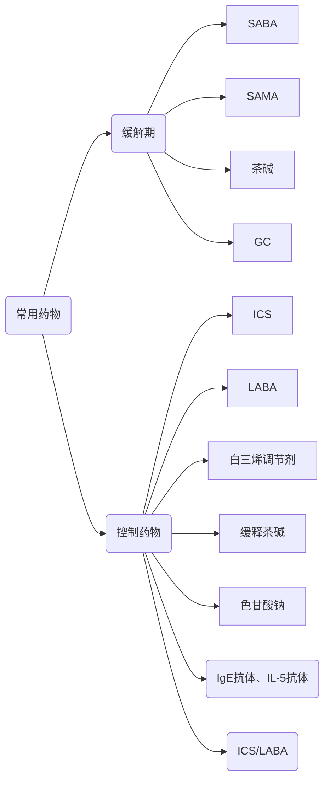
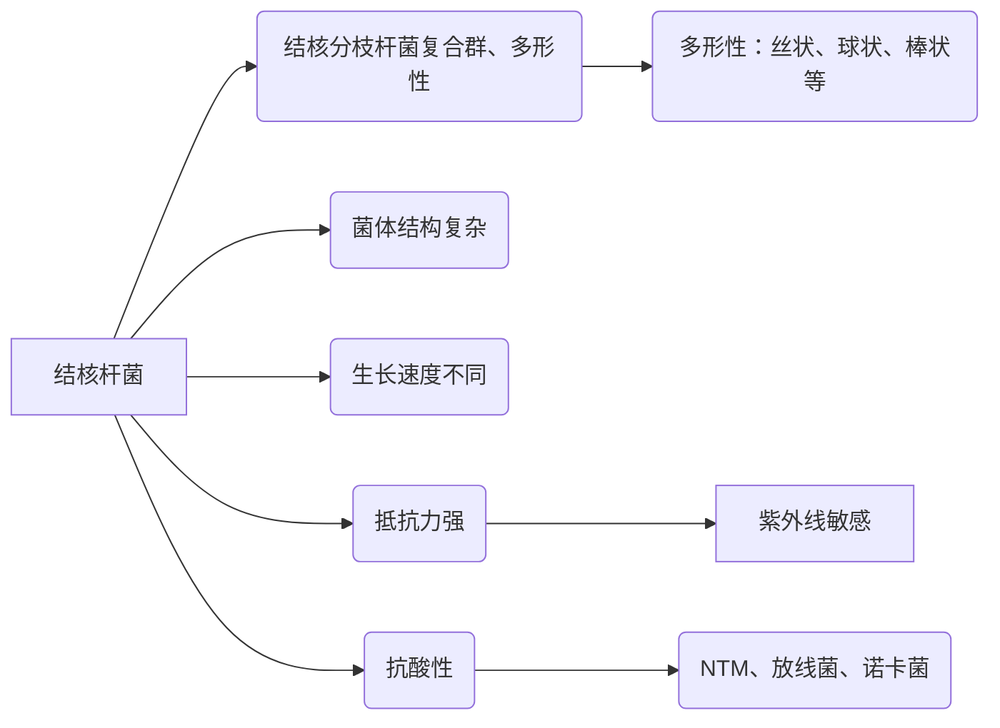
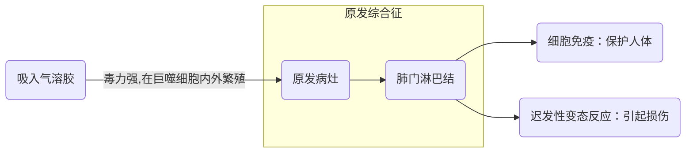
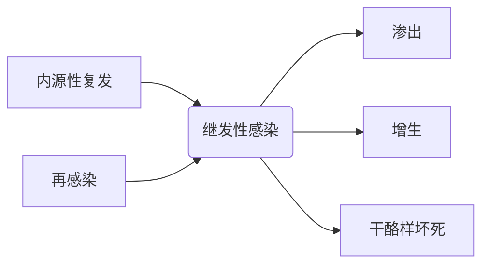
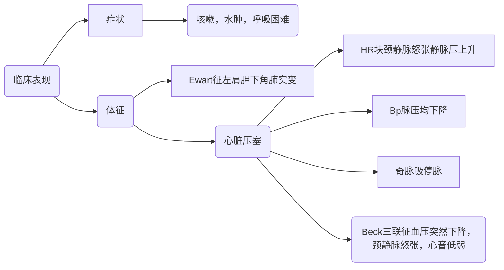
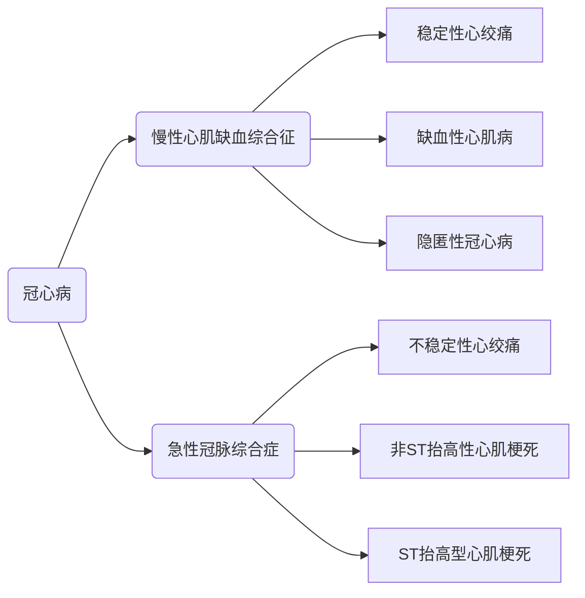
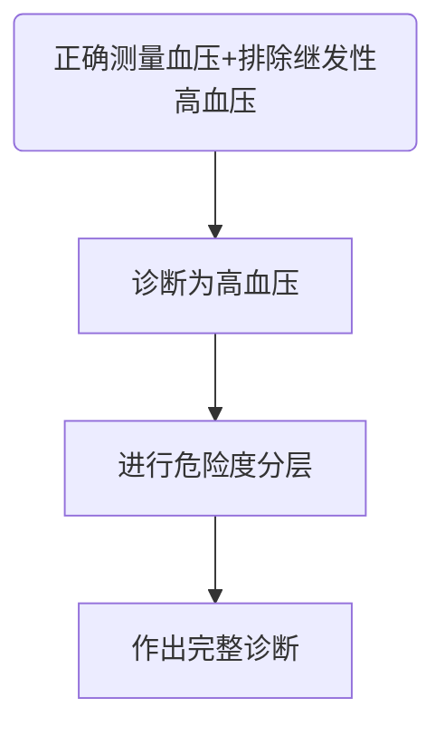

[大纲](https://sunyatsen-my.sharepoint.cn/:w:/g/personal/mazy25_ms_sysu_edu_cn/EQK-A-KBRxxApSTPXM9oAbcBTF4ApUAnxKGbt-7brF5mnw?e=TA2qqw)
# 肺部疾病
## 支气管哮喘
[课件1](https://sunyatsen-my.sharepoint.cn/:p:/g/personal/mazy25_ms_sysu_edu_cn/ER9ttINNPNZDs4bfpJD5AowBlfODnghbPlxQAcYk5LDyng?e=qu76A0)
[课件2](https://sunyatsen-my.sharepoint.cn/:p:/g/personal/mazy25_ms_sysu_edu_cn/EVAIA3vSzDtChNDqMzFaOtAB5d1E_k0DYcfH6ZvIGFKeBQ?e=R346Jx)
### 要求
+ 了解：支气管哮喘的流行病学、病因、病理特点以及哮喘的教育与管理。
+ 熟悉：支气管哮喘的发病机制和鉴别诊断要点。
+ 掌握：支气管哮喘的概念，临床表现，诊断标准及其分期和哮喘控制水平分级，控制用药和缓解用药的种类及其特点，分期、分级治疗的方法。
### 定义
伴有可变的气流受限和气道高反应性，随着病程的延长可导致一系列气道结构的改变，即气道重构，气道慢性炎症性异质性疾病
### 临床表现
+ 症状：发作性呼吸困难或胸闷、咳嗽；支气管舒张药或自行缓解；夜间及凌晨发作和加重。 
+ 体征：胸腔过度充气、广泛哮鸣音、呼气音延长、心率增快、奇脉、发绀等。
### 诊断
+ 典型哮喘的临床症状和体征
+ 可变气流受限的客观检查
+ 咳嗽变异性哮喘
  + 咳嗽作为惟一或主要症状，无喘息、气急等典型哮喘的症状和体征，同时具备可变气流受限客观检查中的任一条，除外其他疾病所引起的咳嗽。
+ 胸闷变异性哮喘
  + 胸闷作为惟一或主要症状，无喘息、气急等典型哮喘的症状和体征，同时具备可变气流受限客观检查中的任一条，除外其他疾病所引起的胸闷。
+ 隐匿性哮喘
  + 指无反复发作喘息、气急、胸闷或咳嗽的表现，但长期存在气道反应性增高者。随访发现有14～58%的无症状气道反应性增高者可发展为有症状的哮喘。
### 分期
+ 急性发作期：症状突然发生或加重，常有呼吸困难，因接触刺激物或治疗不当所知，多数需要治疗（轻、中、重、危重）；
+ 慢性持续期：虽然没有急性发作，但相当长的时间内仍有不同频度、不同程度症状，肺功能下降。（间歇性、轻、中、重度持续）（良好控制、部分控制、未控制）；
+ 临床缓解期：症状消失肺功能恢复到发作前水平，并维持1年以上。
### 治疗目标和原则
+ 确定并减少危险因素接触
+ 药物治疗



+ 药物
  + GC：
    + ICS：二丙酸倍氯米松（BDP）、布地奈德 （BUD）、丙酸氟替卡松（FP）
    + 口服给药：ICS无效，轻中度哮喘发作，静脉后序贯
    + 静脉用药：氢化可的松，甲泼尼龙，地塞米松。
  + SABA 
    + 沙丁胺醇和特布他林
  + LABA
    + 沙美特罗气雾剂迟效
    + 福莫特罗干粉吸入剂速效

## 肺炎
[课件1](https://sunyatsen-my.sharepoint.cn/:p:/g/personal/mazy25_ms_sysu_edu_cn/EfR19FbbhQ5Djlvp9JdwPxsBCxZnuD_4GZRklQ8APk2nAA?e=qjrVWw)
[课件2](https://sunyatsen-my.sharepoint.cn/:p:/g/personal/mazy25_ms_sysu_edu_cn/EfdzE9N7jR5AixwMYrRHHBMB4Y35yhA3BvWsO8nB9H4vNw?e=WNJivl)
### 要求
+ 掌握：肺炎的分类及其特点，诊断与鉴别诊断（肺炎的诊断程序），重症肺炎的诊断。肺炎链球菌肺炎的临床表现、诊断和治疗
+ 熟悉：肺炎的临床表现和治疗原则，常见肺炎的症状、体征和 X 线特征；葡萄球菌肺炎和支原体肺炎的临床特点、诊断和治疗。
###


## 肺结核
[课件](https://sunyatsen-my.sharepoint.cn/:b:/g/personal/mazy25_ms_sysu_edu_cn/EVG755EIlGFIua6686LK0TYBC5yf6eJHOWZCLlJt5Ygl2g?e=blNoVf)
### 大纲要求
+ 掌握
	结核的病因和发生与发展、临床表现、诊断、鉴别诊断要点，抗痨原则和方法，抗痨药物的正确使用，大咯血的处理。 
+ 熟悉
	肺结核的X线特点与病理变化的关系，痰结核菌的检查方法、 结核菌素试验、卡介苗接种。
+ 了解
	肺结核的流行病学和结核分枝杆菌的特点。
### 病因



感染途径：**呼吸道**、消化道感染
感染人群：普遍易感，免疫力低下者尤甚
### 发生发展
#### 原发感染

#### 继发感染


|病变类型|时机|特点
| ---| :---: | :---: |
|渗出|炎症初期阶段或病变恶化复发时|充血水肿，中性粒细胞、淋巴细胞和巨噬细胞浸润，纤维蛋白渗出，少量类上皮细胞、多核巨细胞，发现结核杆菌。
| 增生||上皮样细胞成层状排列和包绕，淋巴细胞和浆细胞分布和覆盖，朗汉斯巨细胞|
|干酪样坏死|机体抵抗力降低、菌量过多、变态反应强烈|坏死组织呈黄色，似乳酪样的半固体或固体物质|

### 临床表现

 1. 症状
    + 呼吸系统：
       - 咳嗽咳痰两周以上/痰中带血
       - 胸痛（累及胸膜）
       - 呼吸困难
       - 大咯血：窒息、休克、肺不张、肺感染、结核菌播散
     + 全身症状
       - 午后低热、盗汗、体重减轻、倦怠乏力
 2. 体征
    + 较小：无体征
    + 较大：肺实变
    + 纤维条索形成：气管患侧移位、胸廓塌陷、对侧代偿肺气肿征
    + 胸膜炎致胸腔积液
### 诊断
   1. 病史和症状体征
      + 浸润性肺结核
         - 渗出性：小斑片状，密度不均，边缘模糊不清局部肺小叶间隔的增厚、支气管血管束增粗和支气管管壁增厚
         - 增殖性：密度增高，呈斑点状影， 边界较清晰，排列成“梅花状”或“树芽状”
       + 干酪样肺炎：斑片状阴影，内密度不均，多发的虫蚀样空洞/小的不规则空洞
       + 空洞性肺结核
         - 虫蚀样空洞——干酪病变溶解，洞壁不明显
         - 薄壁空洞——周围有浸润性病灶
         - 张力性空洞——支气管堵塞，形成活瓣
        + 纤维空洞性肺结核：病程长、反复进展恶化、肺组织破坏重，肺功能受损严重。
   2. 影像学
   X：上叶多发，多态性：浸润增殖干酪纤维钙化
   3. 结核菌的检查：痰涂、集菌、培养（**金标准**）、PCR
   4. 纤维支气管镜检查
   5. 结核菌素试验（无法区分卡介苗），硬结直径
  
|直径(mm)|结果
|----|----
5|-
5-9|+
10-19|++
|>20|+++|

   7. γ-干扰素释放试验
 #### 分类
 1. 原发型肺结核
     原发综合征
 2. 血行播散型肺结核
     多见婴幼儿青少年，多伴有原发性肺结核，中毒症状重
     急性：三均：大小密度分布均匀
     亚急性慢性：大小密度分布不均
 3. 继发型肺结核
     + 浸润性肺结核：多发生在肺尖锁骨下
     + 空洞性肺结核
     + 结核球
     + 干酪性肺炎
     + 纤维空洞性肺结核
 4. 结核性胸膜炎
 5. 其他肺外结核
 6. 菌阴肺结核：为三次痰涂片及一次培养均阴性的肺结核，其诊断标准为：
     1. 典型肺结核临床症状和胸部X线表现：
     2. 抗结核治疗有效；
     3. 临床可排除其他非结核性肺部疾病；
     4. PPD（5 IU）强阳性,血清抗结核抗体阳性；
     5. 痰结核菌PCR和探针检测呈阳性；
     6. 肺外组织病理证实结核病变；
     7. 支气管肺泡灌洗（BAL）液中检出抗酸分枝杆菌；
     8. 支气管或肺部组织病理证实结核病变。
     9. 具备1-6中3项或78中任何1项可确诊。
  
  #### 标准程序

```mermaid
graph LR
可疑症状 --> 胸部影像学检查 --> 痰检 --> 确定有无活动性 --> 分类 -->治疗
 ``` 
 
 #### 记录
 >类型：
 >病变部位及范围
 >痰菌检查：涂（+），涂（－），培（+），培（－） 
 >化疗史 
 >1. 初治：未开始治疗者；正在治疗但未满疗程者； 不规则化疗未满一月者。
 >2. 复治：初治失败者；规则化疗后痰菌又复阳者； 不规则化疗超过一月者；慢性排菌者。
 >
 >并发症： 自发性气胸、肺不张等
 >并存病： 尘肺、肺曲霉菌病、糖尿病等
 >手术： 肺叶切除术后、胸廓成形术后
### 鉴别诊断

|病名|特点
|:---:|:---:
肺炎|起病急、发热咳嗽、咳痰、WBC增高   <br> 密度淡均匀片状阴影，支气管通气征 <br> 抗菌后体温迅速下降、阴影吸收
慢阻肺|咳嗽咳痰，少咯血，冬季多发，急性加重可发热，阻塞性通气障碍
支气管扩张|反复咳嗽、咳脓痰、反复咯血 <br> X：卷发样改变，CT：支气管腔扩大
肺癌|长期吸烟史，刺激性咳嗽，痰中带血、胸痛消瘦 <br> CT：癌肿分叶状，毛刺，偏心厚壁空洞 <br> 痰脱落细胞和结核杆菌检测，活检
肺脓肿|高热、大量脓臭痰 <br> 液平面空洞

### 抗痨

#### 原则 ：早期、联合、适量、规律、全程
1. 早期：杀菌或抑菌 A 菌群
2. 联合：减少耐药菌出现
3. 适量：达到有效杀菌浓度，剂量不宜过少或过大
4. 规律、全程：杀A 菌群，灭B、C 菌群，减少复发
强化期、巩固期

#### 方案
初治涂阳方案 
+ 每日用药方案：2HRZE/4HR
+ 间歇用药方案：2H~3~R~3~Z~3~E~3~/4H~3~R~3~
复治涂阳方案
+ 每日用药方案： 2HRZSE/6~10HRE
+ 间歇用药方案：2H~3~R~3~Z~3~S~3~E~3~/6-10H~3~R~3~E~3~

例：2H~3~R~3~Z~3~E~3~/4H~3~R~3~
2：2个月
3：每周三次药
4：4个月
强化期/巩固期

|一线药物|二线药物
|:---:|:---:
 异烟肼（isoniazid, H）|阿米卡星、卡那霉素
利福平（rifampin, R）| 莫西沙星、左氧氟沙星
吡嗪酰胺（pyrazinamide, Z）| 乙硫异烟胺、丙硫异烟胺 
乙胺丁醇（ethambutol, E）|对氨基水杨酸
链霉素（streptomycin, S） | 氯法齐明、利奈唑胺

#### 用药原则
+ 了解既往用药史
+ 地区常用抗痨药及耐药流行情况
+ 尽量做药物敏感试验
+ 根据病情可选择氟喹诺酮
+ 至少用4种二线的敏感药物
+ 加强期9-12个月，总疗程20个月或更长

### 咯血处理
+ 卧床休息、体位、镇静、止血（垂体后叶素）
+ 咯血窒息是咯血致死的主要原因
+  开放气道，必要时气管插管 
+ 介入治疗——支气管动脉栓塞术

## 7.肺癌
[课件](https://sunyatsen-my.sharepoint.cn/:p:/g/personal/mazy25_ms_sysu_edu_cn/ETO5A2FcMnZDoftmnEwtSVcBHk7F0yseXCkEa8KsmC6ynw?e=PDFCdd)

### 课堂要求
+ 掌握 临床表现，影像学特征，诊断步骤，鉴别诊断和治疗原则
+ 熟悉 病理和分类，临床分期和辅助检查
+ 了解 流行病学，病因和发病机制，预防和预后
### 临床表现
```mermaid
graph TD
A(原发肿瘤引起的症状和体征) --> 咳嗽
A --> 痰血咯血
A --> B("气短、喘鸣")
A --> 胸痛
A --> 发热
A --> 消瘦
A
D(肿瘤局部扩散引起症状体征)--> 声音嘶哑
D --> 吞咽困难
D --> 胸腔积液
D --> 心包积液
D --> 上腔静脉阻塞综合征
D --> Horner综合征
C(肿瘤远处转移引起的症状和体征) --> 中枢转移 --> E("头痛、恶心、呕吐、眩晕、共济失调、癫痫……")
C --> F("骨转移：病理性骨折")
C --> G("腹部转移：局部疼痛")
C --> 淋巴结转移
H(胸外表现) --> I(副癌综合症) --> 内分泌综合征
I --> 骨骼-结缔组织综合征
I --> 血液学异常和其他

```
+ 咳嗽：早期症状，无痰/少痰，**金属音**
+ 气短喘鸣：气道阻塞或胸腔积液、膈肌麻痹、上腔静脉阻塞
+ 胸痛：转移或胸壁侵犯
+ 发热：坏死## `标题`，阻塞性肺炎，**抗感染效果不佳**
+ 上腔静脉阻塞综合征：纵隔侵犯或淋巴结肿大
+ Horner综合征：颈交感神经压迫导致上睑下垂、瞳孔缩小、眼球内陷、少汗无汗
+ 内分泌综合征：抗利尿激素分泌异常、库欣综合征、高钙血症、类癌综合征
+ 骨骼-结缔组织综合征：原发性肥大性骨关节病、神经-肌病综合征
### 影像学特征
X：
直接征象：肿块
间接征象：局限性肺气肿、阻塞性肺炎、肺不张、继发性肺脓肿、右肺反S征
CT：
###  辅助检查
痰液脱落细胞
胸腔积液细胞
呼吸内镜
针吸
开胸活检
### 诊断步骤

### 鉴别
同肺结核鉴别诊断
### 治疗原则
+ 治疗方案
    - 病理学类型，侵及范围
    - MDT模式，个体化治疗
+ 治疗手段
    手术、药物、放疗综合
+ 治疗目的
    根治或控制肿瘤，改善生活质量延长生存期
+ NSCLC
    手术、药物放疗、综合治疗
+ SCLC
    化疗、化疗、综合治疗
+ 手术治疗：早期肺癌最佳方法，分根治性与姑息性
+ NSCLC
    1. I、II期：手术
    2. IIIA期：MDT模式综合治疗
    3. II-III期手术后辅助化疗
    4. 辅助化疗、不能手术病人降期而手术
+ SCLC
    1. 一般确诊即有转移，不推荐手术
    2. T1-2N0考虑肺叶切除和淋巴结清扫，术后化疗4-6疗程
## 8.肺动脉高压和肺心病
[课件](https://sunyatsen-my.sharepoint.cn/:p:/g/personal/mazy25_ms_sysu_edu_cn/EXhd4_p5WZRCmv2gPnoEgJcBqXrqjIvmL9kfQulT_KtL1A?e=MIzOss)
### 要求
+ 了解：肺动脉高压的分类，特发性肺动脉高压的临床表现、实验室检查和药物治疗，慢性肺心病的流行病学和预防措施。
+ 熟悉：肺动脉高压的形成机制，慢性肺心病的鉴别诊断。
+ 掌握：肺动脉高压的定义和诊断标准，慢性肺心病的病因、临床表现、诊断方法、并发症及急性加重期的治疗原则
### 肺动脉高压定义和标准
**定义**由多种已知或未知原因引起的肺动脉压异常增高的一种病理生理状态。
**诊断标准**：海平面静息状态下，右心导管检测肺动脉平均压 ≥ 25 mmHg

---
*分类*
定义|特点|临床类型
:---:|:---:|:---:
肺动脉高压|PAPm≥25mmHg|所有类型
毛细血管前肺动脉高压|PAPm≥25mmHg<br>PAWP≤15mmHg|1. 动脉性肺动脉高压<br>3. 肺部疾病所致肺动脉高压<br>4. 慢性血栓栓塞性肺动脉高压<br>5.未明和/或多因素所致肺动脉高压
毛细血管后肺动脉高压|PAPm≥25mmHg|2. 左心疾病所致肺动脉高压
单纯毛细血管后肺动脉高压（Ipc-PH）|PAWP＞15mmHg<br>PG＜7mmHg和/或 PVR≤3WU|5. 未明和/或多因素所致肺动脉高压
混合性毛细血管前和毛细血管后肺动脉高压（Cpc-PH）|DPG≥7mmHg和/或 PVR＞3WU|
---

### 肺心病
#### 病因
支气管、肺疾病、胸廓运动障碍、肺血管、睡眠呼吸暂停OSAS
#### 临床表现
1. 代偿期
    + 慢性支气管炎症状
    + 肺气肿、肺动脉高压：P~2~亢进、分裂
    + 右心室增大
2. 失代偿期
   + 呼吸衰竭
   + 心力衰竭

辅助检查：
X线
肺动脉高压：
+ 右下肺A干增宽，横径≥15mm；
+ 右下肺A干与气管横径比值≥1.07；
+ 肺A段明显突出或其高度≥3mm；
+ 右前斜位，肺A园锥部突出≥7mm。
右心室增大

#### 诊断
1. 慢性肺、胸廓、肺血管疾病史
2. 肺动脉高压、右心室增大：胸X线征、ECG、超声心动图
3. 右心功能不全：颈静脉怒张、肝肿大、下肢浮肿等
4. 排除其他心肺疾患

#### 治疗原则
控制感染、控制呼吸衰竭、通畅呼吸道，氧疗、控制心力衰竭

利尿、强心、扩管、

#### 并发症处理
- 肺性脑病
- 酸碱失衡和电解质紊乱
- 心律失常：各种心律失常，以房性为多见，可出现心跳      骤停。
- 休克：1、感染中毒性，2、失血性3、心源性
- 消化道出血
- DIC
- 深静脉血栓形成

## 呼吸衰竭
[课件](https://sunyatsen-my.sharepoint.cn/:p:/g/personal/mazy25_ms_sysu_edu_cn/EUPNzsjoPctNgJzVEzdxvBgBdwbfOF2SAhHhWBX2mOaQtA?e=OjY72q)
### 要求
+ 掌握：呼吸衰竭的定义和诊断标准、病因和分类；急性和慢性呼吸衰竭的临床表现、诊断及治疗
+ 熟悉：低氧血症和高碳酸血症的发生机制，急性和慢性呼吸衰竭的病因。
+ 低氧血症和高碳酸血症对机体的影响，常用的呼吸支持技术

### 定义
呼吸衰竭（respiratory failure)是指各种原因引起的肺通气和（或）换气功能严重障碍，使静息状态下亦不能维持足够的气体交换，导致低氧血症伴（或不伴）高碳酸血症,进而引起一系列病理生理改变和相应临床表现的综合征。
### 诊断标准
动脉血气分析：在海平面、静息状态、呼吸空气条件下，PaO2<**60mmHg**，伴 _(II型呼衰)_ 或不伴有 _(I型呼衰)_ PaCO2>**50mmHg**

低氧血症:
1. 轻度:80-60mmHg(10.7-8.0kPa)
2. 中度:60-40mmHg(8.0-5.3kPa)
3. 重度:<40mmHg(5.3kPa)

### 分类
I、II型：见[诊断标准](#诊断标准)

- 通气衰竭：表现为II型呼衰
- 换气衰竭：肺实质血管病变引起换气障碍：I型呼衰；气道阻塞：II型呼衰

### 急性呼衰
#### 临床表现
+ 呼吸困难：三凹征
+ 发绀
+ 神经精神症状：精神错乱、躁狂、昏迷，嗜睡、淡漠、扑翼样震颤，呼吸骤停
+ 循环系统：心动过速，心肌损害，周围循环衰竭、血压下降、心律失常、心搏停止
+ 消化和泌尿系统：丙氨酸氨基转移酶与血浆尿素氮升高，尿中可出现蛋白、红细胞和管型，胃肠道黏膜充血水肿、糜烂渗血或发生应激性溃疡，上消化道出血

#### 诊断
+ pH：7.35~7.45
+ PaCO2：35~45mmHg
+ PaO2： 95~100mmHg

#### 治疗
+ 呼吸支持,包括保持呼吸道通畅、纠正缺氧和改善通气等
+ 病因和诱因的治疗
+ 一般支持治疗
+ 对其他重要脏器功能的监测与支持

### 慢性呼衰
#### 临床表现
+ 呼吸困难
+ 神经症状：随PaCO2 升高表现为先兴奋后抑制现象
+ 循环系统表现
#### 治疗
+ 氧疗：CO2潴留患者氧疗时需注意保持低浓度吸氧，慢性高碳酸血症病人呼吸中枢的化学感受器对CO2反应性差，
+ 正压机械通气
+ 抗感染
+ 呼吸兴奋剂：刺激颈动脉体和主动脉体的化学感受器兴奋呼吸中枢
+ 纠正酸碱平衡失调：呼吸性酸中毒，代谢性碱中毒

## 胸腔积液
[课件](https://sunyatsen-my.sharepoint.cn/:p:/g/personal/mazy25_ms_sysu_edu_cn/EU1mdm2I3QlLog7ci9_Rm54BMNWUZaGn8InustBWSnIN9g?e=J5AfYw)
### 要求
+ 了解：胸腔积液的病因、发病原理；
+ 熟悉：胸腔积液的临床表现；
+ 掌握：胸腔积液的诊断、鉴别诊断和结核性胸膜炎的治疗方法；

### 胸腔积液诊断
1. 确定胸腔有无积液
   1. X线
   2. B超
   3. CT
   4. 症状：少量无反应，大量：呼吸困难、胸痛**积液量增加缓解**、咳嗽
   5. 体征：胸廓饱满、震颤减弱、浊音、呼吸音减低消失、气管纵隔移位
2. 确定积液属性
   1. Light标准：以下任意一条满足怀疑渗出液
      1. 胸腔积液：血清 蛋白比值>0.5
      2. 胸腔积液：血清 LDH比值>0.6
      3. 胸腔积液LDH水平>血清正常值高限$2 \over 3$
3. 寻找病因
   1. 渗出液
      + 心源性
      + 肝源性
      + 肾源性
      + 营养不良
   2. 渗出液
      + 类肺炎性
      + 结核性
      + 恶性
      + 风湿性

### 胸腔积液治疗方法

1. 漏出性
   + 纠正病因
2. 渗出性
   1. 结核性胸膜炎
       + 一般治疗：补充营养、休息、对症
       + 抽液治疗：抽取胸腔积液首次<700ml,以后每次1000<
       + [肺结核治疗](#抗痨)
       + 激素治疗：全身毒性症状严重时，疗效不稳定
   2. 类肺炎性胸腔积液
       + 有效抗生素
       + 抽取积液
       + 引流(pH<7.2) 
   3. 脓胸
       + 支持治疗
       + 控制感染
       + 引流
   4. 恶性胸腔积液
       + 原发病治疗
       + 胸腔积液治疗
         - 反复胸腔穿刺抽液
         - 化学性胸膜固定术
         - 胸腔内插管持续引流
         - 胸-腹腔分流术或胸膜切除术

## 气胸
[课件](https://sunyatsen-my.sharepoint.cn/:p:/g/personal/mazy25_ms_sysu_edu_cn/ETk43krlcDNLtkD38xGm1rAB1aF6P5doNr7QbuT0MkZgbw?e=QymKSg)
### 要求
掌握：气胸的临床类型、诊断、鉴别诊断、治疗原则及方法。
熟悉：气胸病因和发病机制。
了解：气胸的并发症和处理方法。

### 临床类型

1. 闭合性（单纯性）气胸:破口闭合,空气不再进入胸腔,抽气后压力不复升
2. 交通性（开放性）气胸:破口持续开放,空气自由进出,抽气后压力复升
3. 张力性（高压性）气胸:破口呈单向活瓣，气体有进无出:胸腔内气体↑↑ → 压力↑↑ →压迫肺脏及心脏

### 诊断
1. 诱因
   + 持重物、剧咳、屏气、大笑
2. 症状
    + 突发一侧胸痛，继之胸闷、呼吸困难
    + 不能平卧，侧卧被迫患侧朝上
    + 张力性气胸：烦躁不安，意识不清，迅速出现严重呼吸循环障碍
3. 体征
    + 患侧胸壁隆起
    + 呼吸运动与触觉语颤减弱气管向健侧偏移
    + 过清音或鼓音，心或肝浊音界缩小或消失
    + 患侧呼吸音减弱或消失
4. 影像学检查
    + 肺纹理消失

### 鉴别诊断
1. 支气管哮喘和阻塞性肺气肿
    + 相同点：呼吸困难、叩诊过清音、听诊呼吸音减弱
    + 不同点：病史、X线
2. 急性心肌梗死
    + 相同点：突发胸痛、胸闷、呼吸困难、休克
    + 不同点：病史、体征、心电图、X线、血清酶学
3. 肺血栓栓塞
    + 相同点：突发呼吸困难、胸痛、烦躁不安、濒死感
    + 不同点：病史、体检、X线
4. 肺大疱
    + 相同点：呼吸音减弱、普通X线见透亮影
    + 不同点：CT检查
5. 其他：消化性溃疡穿孔、胸膜炎、肺癌

### 治疗
促进患侧肺复张，消除病因，减少复发

1. 保守治疗：首发症状较轻的闭合性气胸、稳定型小量气胸；严格卧床，镇静镇痛，氧疗
2. 排气疗法：
   1. 胸腔穿刺抽气：小量闭合性气胸（20%以下）、心肺功能良好、呼吸困难较轻
   2. 胸腔闭式引流：不稳定气胸、呼吸困难明显、肺压缩程度较重、交通性或张力性气胸、反复发生气胸 
3. 化学性胸膜固定术：持续或复发性气胸、双侧气胸、合并肺大疱、肺功能不全、无法耐受手术 
4. 支气管内封堵
5. 手术   

## 肺脓肿
[课件](https://sunyatsen-my.sharepoint.cn/:p:/g/personal/mazy25_ms_sysu_edu_cn/EX7EvqrL4TpEt-4hlVJWpacB7aDoxOjhZk66Za0IWljd1g?e=3881bA)
### 分类
根据病因：
1. 吸入性
2. 继发性
3. 血源性
根据发病时长
4. 急性
5. 慢性
### 病因和发病机理
仰卧：好发于上叶后段或下叶背段
坐位：好发下叶后基底段
右侧卧位：好发右上叶
#### 临床表现
吸入性：脓臭痰坏死物质、呼吸道症状
血源性：脓毒症、肺部症状较轻
#### 治疗
引流脓液、抗生素
#### 预防
重视口腔、上呼吸道慢性感染治疗

---
# 心脏疾病
[课件](https://sunyatsen-my.sharepoint.cn/:p:/g/personal/mazy25_ms_sysu_edu_cn/EXJwBOtJzllKiUOprEQWYMcBpwWtsyaoZ__7OBc9RhT6wQ?e=AeXMpM)
## 心包疾病
### 要求
掌握：心包炎分类、临床表现、实验室检查、诊断和鉴别诊断、治疗；心脏压塞临床表现和诊断要点
#### 心包炎分类
1. **急性心包炎**
2. 慢性心包炎
3. 粘连性心包炎
4. 亚急性渗出性缩窄性心包炎
5. **慢性缩窄性心包炎**
### 临床表现
心前区疼痛：
1. 部位：心前区、胸骨后
2. 放射：左肩左臂颈部
3. 性质：针刺样、尖锐痛、程度不一
4. 诱因：吸气、咳嗽、转换体位
5. 渗出增多可致呼吸困难
心包摩擦音
1. 部位：心前区（胸骨左缘3、4肋间）
2. 性质粗糙
3. 前倾加压易听
 
### 实验室检查
化验、心电图：ST抬高、心率快；心影增大
### 诊断和鉴别诊断
急性起病、胸痛、胸痛、心包摩擦音
### 治疗
对因治疗、引流、心包开窗、对症支持
### 心脏压塞
临床表现：

**[抗结核治疗](#抗痨)**

## 心力衰竭
[课件](https://sunyatsen-my.sharepoint.cn/:p:/g/personal/mazy25_ms_sysu_edu_cn/Eb8rFKLxF7hOqjkqx4QMx7IB33ErHP3HNCWeXzIM0JqMDA?e=vM1woo)
### 要求
+ 掌握:
  + 心力衰竭的定义、病因、病理生理和类型。
  + 慢性心力衰竭的治疗原则，着重掌握利尿剂、血管紧张素转换酶抑制剂、β受体阻滞剂和洋地黄制剂的应用，
  + 急性左心衰竭的常见病因、发生机制、临床表现、诊断、鉴别诊断和治疗原则。
+ 了解:慢性心力衰竭的流行病学，掌握慢性心力衰竭的临床表现、实验室检查、诊断和鉴别诊断。舒张性心力衰竭的治疗。
### 心衰定义
心力衰竭是各种心脏疾病导致心功能不全的一种临床综合征，绝大多数情况下是指心肌收缩力下降，使心排血量不能满足机体代谢需要，器官、组织血液灌注不足，同时出现肺循环和（或）体循环淤血的表现
### 病因
+ 心肌病变（损害）（汽车马力不够）
  + 心肌收缩功能障碍：心肌结构损害、心肌代谢障碍
  + 心肌舒张功能障碍：心肌肥厚
+ 负荷过重（汽车载荷过大）
  + 压力负荷过重（后负荷） 
  + 容量负荷过重（前负荷）
+ 心室前负荷不足（心室充盈不足或受限）
### 分类
+ 按发生过程：急性和慢性
+ 按部位：左心、右心、全心功能不全
+ 按舒缩时相：收缩性和舒张性
### 病生
- Frank-Starling机制（增加前负荷）
- 心肌肥厚（为对抗后负荷增加心肌异常增厚-“虚胖”）
- 神经体液激活代偿机制（心脏排血量不足，心房压力增高时）
- 心肌重构
### 治疗原则
1. 减少或消除心衰诱因
2. 积极处理病因
3. 有效纠正血流动力学异常
4. 阻止或延缓心室重塑

### 药物使用
+ 心衰治疗 “金三角”
  + ACEI/ARB
  + 醛固酮受体抑制剂
  + B受体阻滞剂
+ 新“金三角”
  + ARNI
  + 醛固酮受体抑制剂
  + B受体阻滞剂
+ 心衰治疗“四驾马车”
  + ARNI
  + 达格列净
  + 醛固酮受体抑制剂
  + B受体阻滞剂

1. 利尿剂：长期小剂量维持
   1. **唯一**能够最充分控制心衰的液体潴留
   2. 噻嗪类利尿剂：氢氯噻嗪
   3. 袢利尿剂：呋塞米
   4. 螺内酯
   5. 保钠利尿剂：AVP（精氨酸加压素）受体拮抗剂
2. ACEI/ARB：拮抗神经体液机制，抑制心室重塑
   1. 可明显降低死亡率，改善预后，心衰治疗的基石
   2. 副作用：低血压、高钾、BUN、咳嗽、血管性水肿
3. 醛固酮受体拮抗剂：抑制心血管的重构，改善慢性心力衰竭的远期预后
   1. 必须与襻利尿剂合用，并停用钾盐
4. $\beta$-阻滞剂:抑制交感神经过度兴奋
   1. 注意事项：由禁忌证变为适应证可减轻心衰症状，降低住院率，降低死亡率适用于慢性心功能不全，心功能Ⅱ-Ⅳ级，病情稳定由小剂量开始，逐渐加量，症状的改善常在2～3月后靶剂量：清晨静息心率达55～60次/分
   2.  副作用：心动过缓、低血压、心功能恶化
   3.  禁忌证：支气管痉挛性疾病、心动过缓、二度及以上房室传导阻滞
   4.  临床试验证实有效的-阻滞剂 ：美托洛尔，比索洛尔（ $\beta$ 1选择性）卡维地洛（ $\beta\alpha$ 受体阻滞剂）
5. 洋地黄类
   1. 抑制Na＋-K＋-ATPase，Na＋-Ca＋＋交换增加，强心,可改善症状，但不能降低死亡率
## 心律失常
[课件_室早之前](https://sunyatsen-my.sharepoint.cn/:p:/g/personal/mazy25_ms_sysu_edu_cn/EczYJobL6CZGhKwhJXug1Q0BGyd4sFn5Ckr92GILyAJB6A?e=yff2SR)
[课件_室早之后](https://sunyatsen-my.sharepoint.cn/:p:/g/personal/mazy25_ms_sysu_edu_cn/ESpwzzL0tnZDosTMIpRBgdIBFATOqyHpLGIy8cDkVnu_mg?e=wAGMZS)
### 要求
+ 掌握：掌握常见心律失常的心电图特点、心律失常临床意义和处理原则
+ 熟悉：心律失常分类、病因、临床表现
+ 了解：发生H机制

+ 掌握：掌握室性期前收缩的病因、临床表现、心电图特点、诊断和治疗原则。掌握室性心动过速的病因、临床表现、心电图特点、诊断和治疗原则。心室扑动、心室颤动的心电图特点和临床意义

### 分类
+ 发生部位：室上性|室性
+ 心率：快速型|缓慢型
+ 机制：冲动异常|传导异常
### 心律失常各论
#### 窦性失常
##### 窦性心律过速
+ 心电图
	+ QRS心率>100
+ 处理：
	+ 去除病因
		+ 心力衰竭
		+ 贫血
		+ 甲亢
	+ 使用BC（伊伐布雷定候选）
##### 窦性心动过缓
+ 心电图
	+ QRS频率<60
+ 处理
	+ 阿托品|异丙肾上腺素
	+ 起搏
##### 病窦综合症
+ 心电图
  + 窦性停搏
  + 窦房阻滞与房室阻滞同时并存
  + 慢-快综合征，心动过缓与房性快速性心律失常交替发作
+ 处理
  + 病因：缺血、电解质紊乱、药物
  + 药物：阿托品、异丙肾上腺素
  + 起搏器
  + 射频消融
#### 房性失常
##### 房性期前收缩
+ 心电图
  + P波提前发生，与窦性P波形态不同；
  + P-R间期＞120毫秒；
  + QRS波群呈室上性，部分可有室内差异性传导；
  + 多为不完全代偿间歇
+ 治疗
  + 房性期前收缩通常无需治疗。
  + 当有明显症状或因房性期前收缩触发室上性心动过速时，应给予治疗。
  + 治疗药物包括BC、普罗帕酮和胺碘酮等
##### 房性心动过速
+ 心电图
  + 心房率通常为150～200次/分
  + P波形态与窦性P波不同
  + 当房率加快时可出现二度Ⅰ型或Ⅱ型房室阻滞，可呈现2∶1房室传导
+ 多源性房性心动过速
  + 通常有3种或以上形态各异的P波，PR间期各不相同；
  + 大多数P波能下传心室
+ 治疗
  + 基础疾病治疗
  + 停用洋地黄
  + 警惕低血钾
  + BC、腺苷、胺碘酮、异步利特控制心率
  + 转复窦性心律
    + IA、IC、III类药物
    + 电
    + 消融
##### 心房扑动
+ 心电图
  + 窦性P波消失，代之以振幅、间距相同的有规律的锯齿状扑动波，称为F波，扑动波之间的等电线消失，频率常为250～350次/分。
  + 心室率规则或不规则
+ 治疗
  + BC、转率IA、IC、III，维持可用胺碘酮、多非利特或索他洛尔
  + 电：最有效
  + 食道挑博
  + 消融：根治
+ 抗凝
##### 房颤
+ 心电图
  + f波
  + 心室率不规则
+ 分类
分类名称|临 床 特 点
:---:|:---:
首诊房颤|首次确诊(首次发作或首次发现)
阵发性房颤|持续时间 ≤7天 (常≤48小时)，**能**自行终止
持续性房颤|持续时间 ＞7天，**非自限性**
长期持续性房颤|持续时间 ≥1年，患者**有**转复愿望
永久性房颤|持续时间＞1年，**不能终止**或终止后又复发
+ 危害
  + 心悸心慌、胸闷气短、体力下降
  + 左房（耳）血栓脱落，导致脑梗
  + 减少心搏出量，加重心功能不全
+ 治疗
  + 原则
    + 转复维持
    + 抗凝
    + 控制心室率
  + 抗凝
    + 华法林
    + 口服抗凝药物


    + 转复
      + 药物见[房扑](#房颤)
      + 电
      + 控制心率
#### 房室交界区
##### 房室交界区性期前收缩
+ 心电图
  + 提前发生的QRS波群与逆行P波；
+ 通常不需治疗

##### 房室交界区性逸搏与心律
+ 心电图
  + 在长于正常PP间期的间歇后出现一个正常的QRS波群，P波缺失，或逆行P波位于QRS波群之前或之后。
  + 房室交界区性逸搏连续发生形成的节律，
+ 一般无需治疗。必要时可起搏治疗

##### 非阵发性房室交接区性心动过速
QRS波群正常，节律规则，  心率70~150次/分或更快

##### 房室交界区相关的折返性心动过速
1. 房室结折返性心动过速
   + 心电图
     + P波与QRS波关系固定，逆行性P波
     + 心率150～250次/分
   + 治疗
     + 刺激迷走神经：颈动脉窦按摩、Valsalva动作
     + 药物治疗：首选腺苷，维拉帕米静注
       + 次选B、洋地黄、普罗帕酮
     + 食管心房调搏术
     + 电
     + 消融
2. 房室折返性心动过速
   1. A型预激综合征
      + 心电图
        + PR间期<0.12s；
        + QRS波群始部分见δ波，终末部分正常；
        + QRS波群>0.12s，ST-T波呈继发性改变。胸导联主波向上
   2. B型为QRS波群在V1导联主波向下，V5、V6导联主波向上。
   + 消融
#### 室性心律失常
##### 室性期前收缩
+ 定义：希氏束分叉以下部位过早发生的，提前使心肌除极的心搏，最常见的心律失常
+ 病因
  + 正常人可见
  + 机械、电、化学刺激
  + 药物：洋地黄奎尼丁、**三环类抗抑郁药**
  + 其他
  + 基础心脏疾病
+ 临床表现
	+ 早搏多≠有症状
	+ 停跳感：代偿间歇后有力收缩
+ 心电图
	+ 提前发生的，宽大畸形QRS波，时限多超3小格
	+ 完全代偿
	+ ST-T方向和QRS主波方向相反
		+ 二联律三联律
		+ 成对
		+ 单源/多源
+ 治疗
	+ 无器质性心脏病
		+ 无症状：无须治疗
		+ B、非二氢吡啶CCB、普罗帕酮
	+ 器质性心脏病
		+ 处理原发疾病、B、非二氢吡啶CCB、胺碘酮
		+ 避免使用IA、IC
	+ 导管消融
##### 室性心动过速
+ 症状：取决于心室率、持续时间、基础病和新功能
	+ 30s分解持续性和非持续性
	+ 多形性、尖端扭转发展为室颤
+ 心电图
	+ 3个以上室性期前收缩连续
	+ 心室率100-250次/分
	+ 节律规整或略不规整
	+ 室房分离
	+ 心室激动逆传夺获心房
  + 特殊波形
    + 心室夺获：某次心房传下来的窦性激动，偶然地落在了心室肌的可应期得以下传，则形成正常形态的QRS波群
    + 室性融合波：若夺获的激动下传心室的同时，室内异位激动又几乎同时激动心室的某一部分，则心室处于两个来源的激动同时除极的状态，心电图表现为该QRS波群的形态呈现出既像室上性又像室性的融合波形
    + 尖端扭转型室速：每3-10个心搏即围绕等电位线扭转极性一次**易发展为室颤，致死性**
      + 多有QTc间期延长、R on T诱发
        + R on T：下一次冲动的R波落在上一次的T波上
    + 加速性室性自主心率：通常无需特殊治疗
+ 诊断
  ```mermaid
  graph TD
  A(任意胸导联RS型) -- 是 --> B("任意胸导联间距>100ms") -- 否 --> C(房室分离) -- 否 --> D(QRS波形态符合室速) -- 是 --> 室速
  A -- 否 --> E(室速)
  B -- 是 --> F(室速)
  C -- 是 --> G(室速)
  D -- 否 --> 室上速
  ```
+ 治疗
  + 无器质性心脏病，非持续室速，同室性期前收缩
  + 器质性心脏病，或明确病因，针对病因或诱因治疗
  + 所有治疗心律失常的药物都会导致心律失常
  + 可选 I B 类，II 类，III 类部分药物
  + 持续性室速，首先终止室速！
  + 终止发作
    + 稳定：利多卡因、B、胺碘酮
    + 不稳定：电复律
  + 防复发
    + 找病因：心肌缺血、低血压、低血钾
    + 治疗心衰
    + 起搏
    + ICD、消融
##### 心室扑动、心室颤动
致死性

无极性正弦波

***快速除颤***

#### 心脏传导阻滞
+ 掌握：房室传导阻滞的分类、病因、临床表现、心电图特点、诊断和治疗原则。右束支阻滞、左束支阻滞的心电图特点
##### 房室阻滞
+ 病因
	+ 正常人可以发生，与迷走神经张力高有关
	+ 器质性心脏病
	+ 高钾血症、药物中毒、淀粉样变
	+ 老年人退行性病变
+ 表现
	+ 一度：无症状，S1减弱
	+ 二度：心搏脱漏，心悸，I型S1减弱脱漏，II型S1固定，间歇脱漏
	+ 三度：心室率慢，症状重
	+ 阿斯综合症：心率过慢导致脑供血不足，引起意识丧失
+ 心电图
	+ 一度
		+ PR>5小格
		+ QRS正常
	+ 二度
		+ 略
		+ I型RR间期缩短
	+ 三度
  	+ p波和QRS波各自节律
  	+ 房率快于室率
+ 治疗
  + 阻滞部位位于房室结，可应用阿托品
  + 任何部位阻滞，均可用异丙肾上腺素 
##### 室内阻滞
希氏束分叉以下部位的传导阻滞

###### 右束支阻滞
+ QRS波时限≥0.12秒（不完全性右束支阻滞除外）
+ V1、V2导联呈rsR’，R’粗钝（兔子）
+ V5、V6导联呈qRS波或RS波，S波宽
+ T波与主波方向相反
###### 左束支阻滞
+ QRS波时限≥0.12秒（不完全性右束支阻滞除外）
+ V1、V2导联呈宽QS波或rS波形，S波宽大（胡萝卜）
+ V5、V6导联R波宽大，前无q波，顶部有切迹
+ T波与主波方向相反

## 动脉粥样硬化
+ 熟悉 动脉粥样硬化的定义、危险因素、分期和分类、诊断和鉴别诊断以及防治原则
+ 了解 动脉粥样硬化的发病机制、病理解剖和病理生理、临床表现与实验室检查
### 定义
动脉管壁增厚变硬，失去弹性和管腔缩小
### 危险因素
四高一吸：高血压，高血糖，高血脂，肥胖，吸烟
### 分期
脂质点 脂质条纹 斑块前期 粥样斑块 纤维粥样斑块 复合病变
### 诊断
器官病变，危险因素，血管造影
### 防治
+ 饮食运动调节，控制危险因素
+ 药物治疗 调脂药，降血小板药
+ 手术
## 冠心病
+ 掌握 冠状动脉粥样硬化性心脏病（冠心病）的定义，冠心病的分型，稳定型心绞痛的定义、发病机制、临床表现（尤其胸痛特点）、心电图检查特点（静息时及心绞痛发作时心电图，心电图负荷试验，动态心电图）、诊断和鉴别诊断及防治原则（发作时治疗和缓解期治疗）
+ 熟悉 稳定型心绞痛病理解剖和病理生理、常用治疗药物（硝酸酯制剂，β受体阻断药，钙拮抗药）的作用机制和主要副作用
+ 了解 放射性核素检查、冠状动脉造影和其他检查
### 定义

+ 冠心病：冠状动脉(冠脉)发生粥样硬化引起管腔狭窄、闭塞导致心肌缺血缺氧或坏死而引起的心脏病
+ 稳定性心绞痛：在冠脉固定性严重狭窄基础上，由于心肌负荷的增加引起心肌急剧的、暂时缺血缺氧的临床综合征
+ 
### 分型



### 慢性心肌缺血
#### 临床表现
紧压闷烧，不针尖扎
+ 紧缩 压迫 发闷 烧灼
+ 不针刺 尖锐 刀扎

时间短，不超过半个小时，硝酸酯类有效

+ 心电图
+ I，II，III，avf，V<sub>4</sub> -V<sub>6</sub> ST下斜型压低

#### 诊断
1. 存在危险因素
2. 符合心绞痛发作特点
3. 体征：心率增快、血压升高；皮肤冷或出汗；表情焦虑；有时出现**第四或第三心音奔马律**
4. 符合心电图特征
5. 冠脉造影显示狭窄
6. 除外其他原因疾病
   1. 不稳定性心绞痛
      1. 相同：部位、性质、心电图改变
      2. 不同：诱因：此为体力劳动、情绪激动、饱食、寒冷、吸烟\程度、持续时间、伴随症状、1月内新发
   2. 急性心梗
      1. 症状：诱因、部位、性质、持续时间、缓解方式
      2. 伴随：呼吸困难、心悸、晕厥
      3. 体征：血压波动、双肺干湿啰音、心律失常、奔马律
      4. 辅助检查：心电图、心肌坏死标志物

分级
#### 治疗
+ 原则：提高生活质量、改善预后
+ 方法：
  + 休息
  + 发作：药物治疗：舌下含服硝酸甘油，扩血管、扩冠脉
  + 缓解：生活方式
    + 药物治疗：
      + 改善缺血，减轻症状
        + 硝酸酯类:注意给予足够的无药间期，以减少耐药性
        + B:用药后静息心率降至55~60次/分
        + C:与β受体阻滞剂不一样，β受体阻滞剂是冠脉痉挛的禁忌证
        + 扩张微循环
      + 预防梗死，改善善后
        + 抗板：阿司匹林、ADP受体拮抗剂：氯吡格雷，小出血可继续用
        + 降LDL-C：他汀、依折麦布
        + A
        + B
    + 血管重建：介入、搭桥

#### 隐匿型冠心病
没有心绞痛的临床症状，但有心肌缺血的客观证据（心电图、心肌血流灌注及心肌代谢等异常）的冠心病， 称隐匿型冠心病（latent coronary heart disease）或无症状性冠心病
#### 缺血性心肌病
缺血性心肌病（ischemic cardiomyopathy)是冠心病的一种特殊类型或晚期阶段，是指由冠状动脉粥样硬化引起长期心肌缺血，导致心肌弥漫性纤维化，产生与原发性扩张型心肌病类似的临床表现（左室扩大心力衰竭的鉴别诊断之一）

### 急性冠脉综合征
+ 掌握 不稳定型心绞痛的定义、发病机制、临床表现以及防治原则；心肌梗死的定义、临床表现、心电图检查、坏死心肌血清标记物检查、诊断、鉴别诊断、并发症以及治疗原则
+ 熟悉 急性心肌梗死的治疗方法
+ 了解 放射性核素检查、超声心动图的作用
#### 发病机制
由于动脉粥样斑块破裂或糜烂，伴有不同程度的表面血栓形成、血管痉挛及远端血管栓塞所导致的一组临床症状，血小板激活在其发病过程中起着非常重要的作用 
#### 不稳定性心绞痛UA
1. 静息型心绞痛：发作于休息时
2. 初发型心绞痛：通常在首发症状1～2个月内、很轻的体力活动可诱发（程度至少达CCSIII级）
3. 恶化型心绞痛：在相对稳定的劳力性心绞痛基础上心绞痛逐渐增强（疼痛更剧烈、时间更长或更频繁，按CCS分级至少增加I级水平，程度至少CCS III级）
4. 变异型心绞痛：特征为静息心绞痛（多在清晨或凌晨发作），表现为一过性ST段抬高，发病机制为冠状动脉痉挛 
#### 诊断
与稳定型心绞痛类似，但UA在静息/夜间出现心绞痛、持续时间更长、频率更高、疼痛常放射至新的部位、常伴随新的症状、舌下含服硝酸甘油无效；而NSTEMI情况更严重

**Wellens’综合征:以一部分不稳定性心绞痛患者心电图胸前导联T波的特征性改变为特点，病情进展较快，易发生广泛前壁心肌梗死的临床综合征，又称为前降支T波综合征。
#### 治疗
+ 低危组
  + 门诊随访观察
  + 抗缺血治疗
  + 调脂治疗
  + 抗血小板治疗
  + ACEI/ARB
+ 高危组
  + 住院观察（CCU）
  + 抗缺血治疗:硝酸酯类含服（3次）→静脉（每5-10分钟增加5-10ug/min）→口服、β受体阻滞剂（静脉艾司洛尔等→口服）
  + 调脂治疗
  + 抗血小板治疗（血小板糖蛋白IIb/IIIa受体拮抗剂）：阿司匹林、氯吡格雷、替格瑞洛负荷剂量、替罗非班（GP IIb/IIIa受体拮抗剂）
  + 抗凝治疗：普通肝素、低分子肝素、磺达肝癸钠、比伐卢定
  + ACEI/ARB
  + 高危患者主张积极早期有创治疗（介入）

紧急侵入治疗策略（<2h）|早期侵入治疗策略（<24h）|侵入治疗策略（<72h）
:---:|:---:|:---:
血流动力学不稳定或心源性休克|心肌梗死相关的肌钙蛋白上升或下降|糖尿病
药物治疗无效的反复发作或持续性胸痛|ST段或T波的动态改变（有或无症状）|肾功能不全[eGFR<60ml/(min· 1.73m2)]
致命性心律失常或心脏骤停|GRACE评分>140|LVEF<40%或充血性心力衰竭
心肌梗死合并机械并发症||早期心梗后心绞痛
急性心力衰竭||PCI史
反复的ST-T波动态改变尤其是伴随间歇性ST段抬高||CABG史
|||GRACE评分>109但<140

#### 预后和二级预防
ABCDE：
A：抗板
B：B
C：cigarettes，戒烟
D：diet，控制饮食
E：education，健康教育
#### 急性ST段抬高型心肌梗死
##### 定义
急性ST段抬高型心肌梗死是指在冠状动脉病变的基础上，发生冠状动脉血供急剧减少或中断，引起心肌严重而持久地急性缺血，造成心肌坏死
##### 冠状动脉非阻塞性心肌梗死
+ STEMI病人冠脉造影未见明显阻塞
+ 斑块破裂或斑块侵蚀
+ 冠脉血栓栓塞
+ 冠脉夹层
+ 痉挛
+ Takotsubo综合征：Takotsubo心肌病、应激性心肌病
##### 临床表现
+ 先兆：乏力、胸部不适、烦躁、心绞痛，多见于初发型和恶化型心绞痛
+ 胸痛：首发症状，清晨，伴恐惧出汗、濒死样感，安静时出现，
+ 全身症状：发热、白细胞、血沉
+ 胃肠道症状：频繁的恶心呕吐和上腹痛
+ 心律失常L室早多见，室颤主要死因
+ 低血压、心源性休克
##### 心电图
T -> ST -> Q -> ST -> T
##### 血液检查
+ 肌钙蛋白I、T时间长，恢复时间1-2周
+ CK-MB：时间短，恢复时间3-4天
##### 诊断
胸痛症状、典型心电图改变、心肌坏死标记明显增高
##### 治疗与预防
+ 治疗原则：尽快恢复心肌的血液灌注以挽救濒死心肌、防止心梗扩大、及时处理严重心律失常、泵衰竭和各种并发症，防止猝死
+ 省流：恢复灌注，治疗并发症、防止猝死


+ 监护和一般治疗
  + 休息
  + 体征监护
  + 吸氧
  + 护理：少食、多餐
  + 建立静脉通道
+ 解除疼痛
  + 吗啡
  + 硝酸酯类（下壁MI、可疑右室MI或明显低血压的病人(收缩压低于90mmHg) ，不适合使用）
  + β受体阻滞剂
+ 抗板
+ 抗凝
+ 介入再灌注心肌治疗
+ 溶栓
  + 禁忌症：
    + 既往出血性脑卒中，6月内缺血性脑卒中或脑血管事件
    + 神经系统受损、颅脑肿瘤畸形
    + 近期出血
    + 未排除夹层
    + 高血压
    + 抗凝或出血倾向
    + 近期外伤、首舒、大血管穿刺
+ ACEI
+ 调脂
+ 抗心律失常
## 心内膜炎


## 高血压
+ 掌握高血压的分类和定义，了解高血压的流行病学特点和病因，熟悉高血压的发病机制和病理变化。
+ 掌握高血压的临床表现与并发症。
+ 熟悉高血压实验室检查：基本项目、推荐项目及选择项目。
+ 掌握高血压的诊断和鉴别诊断，尤其是诊断步骤、掌握继发性高血压的鉴别诊断，熟悉高血压的预后，掌握高血压患者心血管危险分层标准。
+ 掌握高血压的治疗目的和原则。掌握五大类主要药物（利尿药，β受体阻滞断药，钙拮抗药，血管紧张素转换酶抑制剂，血管紧张素Ⅱ受体阻滞剂）作用特点、主要适应证及禁忌证、主要副作用。
+ 熟悉高血压急症、亚急症的定义和治疗。了解特殊类型高血压的处理；了解顽固性高血压的定义和治疗；了解高血压伴并发症、合并症的药物治疗。
### 定义
高血压是指动脉血压异常增高


### 临床表现与并发症
+ 大多数高血压没有明显症状
+ 有的高血压患者会出现头晕头痛、失眠视物模糊、鼻出血
+ 体征
  + 血压升高
  + A2亢进、收缩期杂音（二尖瓣区及主动脉瓣区）、收缩早期喀喇音
  + 颈部或腹部血管杂音
+ 并发症
  + 脑血管病：脑出血、脑血栓形成、TIA
  + 心力衰竭和冠心病
  + 慢性肾衰竭
  + 主动脉夹层
### 诊断步骤


危险度分层：血压级别+危险因素、靶器官损害、临床病患


### 治疗
+ 目标
  + 达标降压治疗的最终目的是减少高血压病人心、脑血管病的发生率和死亡率
+ 生活方式干预
+ 药物：小剂量、长效、联合、个体化
#### 用药
+ 利尿剂
  + 酚噻嗪、袢利尿剂、保钾利尿剂
  + 痛风禁用酚噻嗪
  + 肾功能不全禁用保钾利尿剂
+ A
  + 妊娠妇女、高钾血症、双侧肾动脉狭窄、重度肾功能不全（血肌酐≧3mg/dl）禁用

+ B
  + 禁用：支气管哮喘、病窦综合征、房室传导阻滞、心力衰竭
+ C
  + 心力衰竭禁用短效二氢吡啶类
  + 心力衰竭、病窦、房室传导阻滞禁用非二氢吡啶类CCB

## 心肌疾病
+ 掌握心肌病的定义与分类。掌握扩张型心肌病的临床表现、实验室检查、诊断要点和治疗原则。掌握心肌炎的病因、病理特点和临床表现，熟悉诊断、治疗原则。
+ 熟悉肥厚型心肌病的病因和病理特点，掌握临床表现和实验室检查（尤其是超声心动图特点）、诊断要点、治疗原则。
+ 了解限制型心肌病的病理和病理生理特点、临床表现和诊断要点。了解致心律失常型右室心肌病的病理和病理生理特点、临床表现和诊断要点。

### 定义
心肌病是一组异质性心肌疾病，由不同病因（遗传性病因较多见）引起的（原发性）心肌病变导致心肌机械和（或）心电功能障碍，常表现为心肌肥厚或扩张
### 分类
+ 遗传性心肌病
+ 混合性心肌病
+ 获得性心肌病
### 扩张型心肌病
#### 定义
一类以左心室或双心室扩大伴收缩功能障碍为特点的心肌病
#### 临床表现
+ 心力衰竭、心脏扩大、心律失常、血栓
+ 辅助检查
  + 心胸比>50%
  + 肺淤血、肺水肿
  + 胸腔积液
+ 心电图
  + 病理性Q波
  + QRS增宽提示预后不良
+ 超声
  + 一大两小三薄四弱
    + 一大：心腔扩大
    + 二小：瓣膜开放幅度变小
    + 三薄：室壁相对变薄
    + 四弱：心室壁运动普遍减弱
+ 辅助检查
  + 心肌核素显像
  + 冠状动脉CT检查（CTA）
  + 血液和血清学检查BNP，或NT-proBNP
  + 冠状动脉造影和心导管检查
  + 心内膜活检少用
#### 治疗
+ 病因及加重诱因的治疗
+ 针对心力衰竭的药物治疗
+ 心力衰竭的心脏再同步化治疗（CRT）
+ 心力衰竭的其他治疗：心脏移植
+ 抗凝治疗：华法林，NOAC（利伐沙班等）
+ 心律失常和心脏性猝死的防治
#### 特殊病变
+ 致心律失常右心室心肌病（ARVC）：一种常染色体显性遗传性心肌病，特征：右心室心肌逐渐被脂肪及纤维组织替代，左心室亦可受累青少年发病亦称致心律失常右室发育不良
+ 心脏气球样变（应激性心肌病）：Tskotsubo常常表现为左心室的一块心肌突然变薄，收缩期被血液冲击得像气球一样鼓起来
### 肥厚性心肌病
常染色体显性遗传性心肌病，具有遗传异质性解剖特点：心室非对称性肥厚根据左心室流出道有无梗阻，临床分为梗阻型和非梗阻型HCM预后差异大

收缩中后期，左心室血流快速通过狭窄的流出道产生负压，引起二尖瓣前叶前向运动，加重梗阻
#### 临床表现
+ 呼吸困难、乏力、老理性胸痛（心绞痛，另一个是冠心病），心悸，晕厥
+ 胸骨左缘第3-4肋间粗糙的喷射性收缩期杂音：流出道梗阻、心尖部收缩期杂音
+ 超声：心室不对称肥厚而无心室腔增大舒张期室间隔厚度15mm

#### 诊断
+ 根据病史及体格检查
+ 超声心动图或者心脏磁共振（CMR）示左室舒张期末期任意部位室
+ 壁厚度≥15mm
+ 阳性家族史
+ 基因检查
#### 治疗
+ 药物
  + 非二氢吡啶类钙通道阻滞剂
  + B
  + 丙吡胺
  + 房颤：
    + 胺碘酮
    + 抗凝
    + Β受体拮抗剂


### 限制性心肌病
以心室壁僵硬度增加、舒张功能降低、充盈受限而产生临床右心衰为特征的一类心肌病。

解剖特点：心房明显扩张，随着病情进展，心腔扩张

病理：心肌纤维化、炎症细胞浸润和心内膜面瘢痕形成

#### 临床表现
+ 泵功能下降，右心衰
+ 心电图
  + QRS低电压：肢体导联<0.5mV，胸导联<0.8mV
+ 超声
  + 四腔心
#### 诊断
根据运动耐力下降、水肿病史及右心衰等临床症状，如果病人心电图肢导联低电压，超声心动图见双房大、室壁不厚或增厚，左心室不扩大而充盈受阻，应考虑心肌淀粉样变、缩窄性心包炎
### 心肌炎（病毒性，柯萨奇B常见）
#### 机制
+ 病毒直接作用
+ 免疫反应作用
+ 细胞因子介导心肌损伤
#### 临床表现
+ 心悸，前有感染
+ CK-MB升高
#### 诊断
+ 临床诊断：依据>=3/依据=2，次要依据>=3
+ 疑似：依据=2/依据=1+次要=2/次要>=3
+ 依据
  + 心功能不全、心源性休克或心脑综合征
  + 心脏扩大
  + 血清心肌肌钙蛋白T或I（cTn T或cTn I)或血清肌酸激酶同工酶 (CK—MB)升高，伴动态变化
  + 显著心电图改变(心电图或24h动态心电图)
  + 心脏磁共振成像(CMR)呈现典型心肌炎症表现
+ 次要
  + 前驱感染史，如发病前1～3周内有上呼吸道 或胃肠道病毒感染史
  + 胸闷、胸痛、心悸、乏力、头晕、面色苍白、面色发灰、腹痛等症状(至少2项)，小婴儿可有拒乳、发绀、四肢凉等
  + 血清乳酸脱氢酶(LDH)、α- 羟丁酸脱氢酶(αHBDH)或天冬氨酸转氨酶 (AST)升高
  + 心电图轻度异常
  + 抗心肌抗体阳性
#### 病原学诊断
1．病原学确诊指标：自心内膜、心肌、心包(活 体组织检查、病理)或心包穿刺液检查发现以下之 一者可确诊，(1)分离到病毒；(2)用病毒核酸探针查到病毒核酸
2．病原学参考指标：有以下之一者结合临床表现可考虑心肌炎由病毒引起，(1)自粪便、咽拭子或血液中分离到病毒，且恢复期血清同型抗体滴度较第1份血清升高或降低4倍以上；(2)病程早期血清中特异性IgM抗体阳性；(3)用病毒核酸探针从患儿血液中查到病毒核酸

**省流：心：毒株，DNA|非心：抗体、毒株、核酸**
# 消化系统疾病
## 胃炎
### 要求
+ 了解：胃炎的分型。
+ 掌握：本病的临床表现和诊断要点。
+ 了解：本病的防治原则。
### 急性胃炎
+ 各种病因引起的胃黏膜急性炎症，可见**中性粒细胞浸润**
+ 包括急性糜烂出血性胃炎、单纯性胃炎
#### 病因
+ 应激：创伤、手术等
+ 药物：NSAIDS
+ 酒精
+ 创伤
+ 胆汁反流
+ Hp，一般不引起糜烂出血性胃炎
#### 临床表现
+ 急性起病，表现不一
	+ 单纯性：疼痛、消化不良
	+ 出血性+消化不良、呕血、黑便、脱水
	+ 沙门菌、金葡感染：腹泻发热
+ 内镜：充血水肿、糜烂、出血
#### 治疗
+ 去除病因：治疗原发病
+ 药物治疗：止血、促进修复：PPI、H2RA、胃黏膜保护剂
### 慢性胃炎
+ 多种病因引起的慢性胃黏膜炎症，病理上以淋巴细胞浸润为特点
+ 分类：
  + 慢性非萎缩性胃炎（浅表性胃炎）
  + 慢性萎缩性胃炎
#### 慢性萎缩性胃炎
##### 病因
+ Hp感染
  + Hp：幽门螺杆菌，
    + 能分解尿素产生NH3，既能保持细菌周围的中性环境，又能损伤上皮细胞膜
    + 空泡毒素损伤上皮细胞；细胞毒素相关基因CagA蛋白能引起强烈的炎症反应
    + 菌体胞壁可作为抗原产生免疫反应
+ 胃十二指肠反流
+ 药物毒物（酒精）
+ 自身免疫
+ 年龄
##### 内镜
+ 慢性非萎缩性胃炎：红斑（点、片状、条状），粘膜粗糙不平，出血点/斑
+ 慢性萎缩性胃炎：粘膜呈颗粒状，血管透露，色泽灰暗（白），皱襞细小
  + 化生性胃炎是指随着胃黏膜的萎缩性变化进展，出现肠上皮化生的状态。胃镜下，在背景萎缩胃黏膜中可见多发白色的平坦、扁平隆起
+ 病变进度：
  + C-l：萎缩界限局限在胃窦部
  + C-2：萎缩界限超过胃角
  + C-3：萎缩界限超过胃角且接近贲门
  + O-l：萎缩界限刚过贲门
  + O-2：萎缩界限已经遍及整个胃底
  + O-3：萎缩界限延伸到胃体


##### 治疗
+ 总体原则：胃镜和病理为依据。药物治疗为主，去除病因，疗程足够，定期随访
+ 轻度非萎缩性炎症、无糜烂，HP阴性，无症状，可不予药物治疗
+ 炎症波及黏膜全层或呈活动性炎，有消化不良症状，HP感染，药物治疗
+ 出现肠化、萎缩、异形增生，去除病因，药物治疗，内镜治疗，定期随访（胃镜、病理）


+ 疗程：萎缩性：8-12周，非萎缩4-8周
## 消化性溃疡
+ 了解：本病的病因和发病原理。
+ 掌握：本病的临床表现，诊断和鉴别诊断。
+ 熟悉：本病的治疗原则。

### 临床表现
1. 上腹痛：慢性反复周期节律
   1. 诱因：秋冬春交界，情绪波动、紧张、饮食不调、药物刺激
   2. 可为灼痛、胀痛、饥饿样痛等
2. 反酸、嗳气、恶心、呕吐、流涎
3. 失眠、缓脉、多汗

+ 并发症：出血、穿孔：腹膜炎——前壁，穿透性：——后壁、梗阻

### 辅助检查
+ 胃镜：金标准
+ Forrest分级：IIb级以上（出血、血管显露、血凝块）应内镜/外科手术处理

### 诊断
+ 结合病史、胃镜和病理、Hp检查、药物服用情况诊断
+ 鉴别：慢性肝胆疾病、功能性消化不良、胃癌、促胃泌素瘤

### 治疗
1. 消除病因、控制症状、愈合溃疡、防止复发、避免并发症


> Written with [StackEdit中文版](https://stackedit.cn/).
<!--stackedit_data:
eyJoaXN0b3J5IjpbNDg1Nzc4OTMyLC0xMzAyNjc2MTc3LDExMD
Q2NzE3MDUsMTU5NjQ1OTMwNywtMjA1ODQ3Nzc2MiwxMTU2MDM0
NjQwLC0xODMxMzA4Nzc2LDExMTg0ODg3ODAsLTExOTkwNTM2OT
MsMTcxMTQxMzc4OSwxNTc1NTg3NzYyLDE4MTgwNzE5MjksLTE2
NjI4NDQ0NDEsLTUzMzE4NTA4MywxNjk3NDM0OTE2LDkxMzQ1Nj
kzMCwzNTIyOTk4NDMsLTE4MTUzNzQxMDgsMjA0MDI5MDA0LC0z
MDc3MjE2MzddfQ==
-->