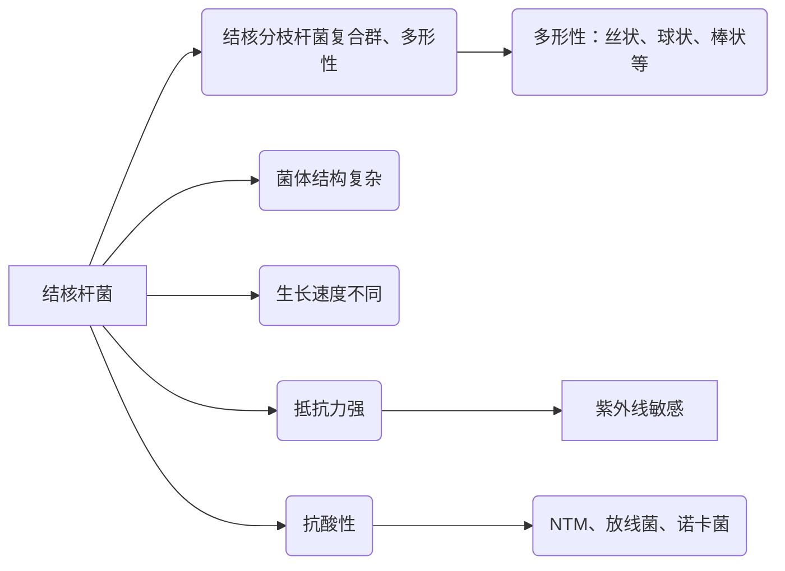
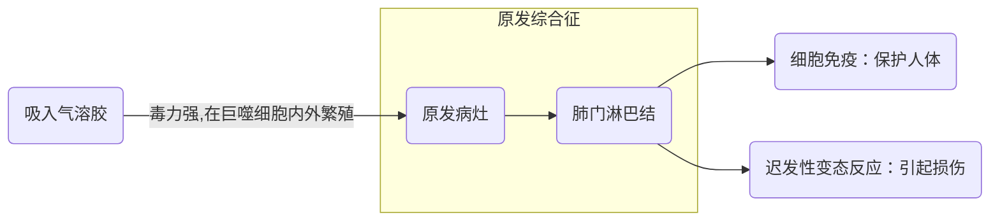
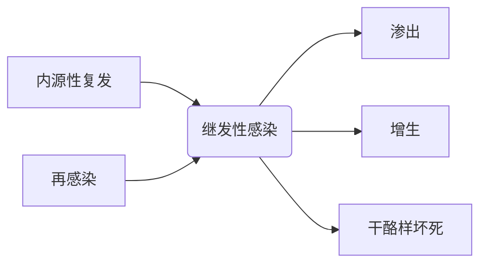

# 肺部疾病
## 6. 肺结核
### 大纲要求
+ 掌握
	结核的病因和发生与发展、临床表现、诊断、鉴别诊断要点，抗痨原则和方法，抗痨药物的正确使用，大咯血的处理。 
+ 熟悉
	肺结核的X线特点与病理变化的关系，痰结核菌的检查方法、 结核菌素试验、卡介苗接种。
+ 了解
	肺结核的流行病学和结核分枝杆菌的特点。
### 病因

```mermaid
graph LR
A[结核杆菌] --> B("结核分枝杆菌复合群、多形性") --> G("多形性：丝状、球状、棒状等")
A --> C("菌体结构复杂")
A --> D("生长速度不同")
A --> E("抵抗力强") --> 紫外线敏感
A --> F(抗酸性) --> H("NTM、放线菌、诺卡菌")
```
感染途径：**呼吸道**、消化道感染
感染人群：普遍易感，免疫力低下者尤甚
### 发生发展
#### 原发感染

```mermaid
graph LR
a(吸入气溶胶) -- 毒力强,在巨噬细胞内外繁殖 --> c(原发病灶) 
subgraph 原发综合征
c--> d(肺门淋巴结)
end
d --> e("细胞免疫：保护人体")
d --> f("迟发性变态反应：引起损伤")
```
#### 继发感染

```mermaid
graph LR
内源性复发 --> b(继发性感染)
再感染 --> b
b --> 渗出
b --> 增生
b --> 干酪样坏死
```

|病变类型|时机|特点
| ---| :---: | :---: |
|渗出|炎症初期阶段或病变恶化复发时|充血水肿，中性粒细胞、淋巴细胞和巨噬细胞浸润，纤维蛋白渗出，少量类上皮细胞、多核巨细胞，发现结核杆菌。
| 增生||上皮样细胞成层状排列和包绕，淋巴细胞和浆细胞分布和覆盖，朗汉斯巨细胞|
|干酪样坏死|机体抵抗力降低、菌量过多、变态反应强烈|坏死组织呈黄色，似乳酪样的半固体或固体物质|

### 临床表现

 1. 症状
    + 呼吸系统：
       - 咳嗽咳痰两周以上/痰中带血
       - 胸痛（累及胸膜）
       - 呼吸困难
       - 大咯血：窒息、休克、肺不张、肺感染、结核菌播散
     + 全身症状
       - 午后低热、盗汗、体重减轻、倦怠乏力
 2. 体征
    + 较小：无体征
    + 较大：肺实变
    + 纤维条索形成：气管患侧移位、胸廓塌陷、对侧代偿肺气肿征
    + 胸膜炎致胸腔积液
   ### 诊断
   1. 病史和症状体征
      + 浸润性肺结核
         - 渗出性：小斑片状，密度不均，边缘模糊不清局部肺小叶间隔的增厚、支气管血管束增粗和支气管管壁增厚
         - 增殖性：密度增高，呈斑点状影， 边界较清晰，排列成“梅花状”或“树芽状”
       + 干酪样肺炎：斑片状阴影，内密度不均，多发的虫蚀样空洞/小的不规则空洞
       + 空洞性肺结核
         - 虫蚀样空洞——干酪病变溶解，洞壁不明显
         - 薄壁空洞——周围有浸润性病灶
         - 张力性空洞——支气管堵塞，形成活瓣
        + 纤维空洞性肺结核：病程长、反复进展恶化、肺组织破坏重，肺功能受损严重。
   2. 影像学
   3. 结核菌的检查：痰涂、集菌、培养（**金标准**）、PCR
   4. 纤维支气管镜检查
   5. 结核菌素试验（无法区分卡介苗），硬结直径
  
|直径(mm)|结果
|----|----
5|-
5-9|+
10-19|++
>20|+++
   7. γ-干扰素释放试验
  
  #### 标准程序
 ``` mermaid
graph LR
可疑症状 --> 胸部影像学检查 --> 痰检 --> 确定有无活动性 --> 分类 -->治疗
 ``` 
 #### 记录
 >类型：
 >病变部位及范围
 >痰菌检查：涂（+），涂（－），培（+），培（－） 
 >化疗史 
 >1. 初治：未开始治疗者；正在治疗但未满疗程者； 不规则化疗未满一月者。
 >2. 复治：初治失败者；规则化疗后痰菌又复阳者； 不规则化疗超过一月者；慢性排菌者。
 >
 >并发症： 自发性气胸、肺不张等
 >并存病： 尘肺、肺曲霉菌病、糖尿病等
 >手术： 肺叶切除术后、胸廓成形术后
 ### 鉴别诊断

|病名|特点
|:---:|:---:
肺炎|起病急、发热咳嗽、咳痰、WBC增高   <br> 密度淡均匀片状阴影，支气管通气征 <br> 抗菌后体温迅速下降、阴影吸收
慢阻肺|咳嗽咳痰，少咯血，冬季多发，急性加重可发热，阻塞性通气障碍
支气管扩张|反复咳嗽、咳脓痰、反复咯血 <br> X：卷发样改变，CT：支气管腔扩大
肺癌|长期吸烟史，刺激性咳嗽，痰中带血、胸痛消瘦 <br> CT：癌肿分叶状，毛刺，偏心厚壁空洞 <br> 痰脱落细胞和结核杆菌检测，活检
肺脓肿|高热、大量脓chou


> Written with [StackEdit中文版](https://stackedit.cn/).
<!--stackedit_data:
eyJoaXN0b3J5IjpbMzMzNzE0Mjc0LDkzNTI4NzMyMSw4NDUyNj
UwMTUsLTEwOTQ1MDQwMSwtNzg0NTkzMTU2LDI1NjI4MzE4MSwt
MTkwMTc0ODkxMCwtMTE2MjQzMTQ2MywtOTY0NTI1ODc2XX0=
-->