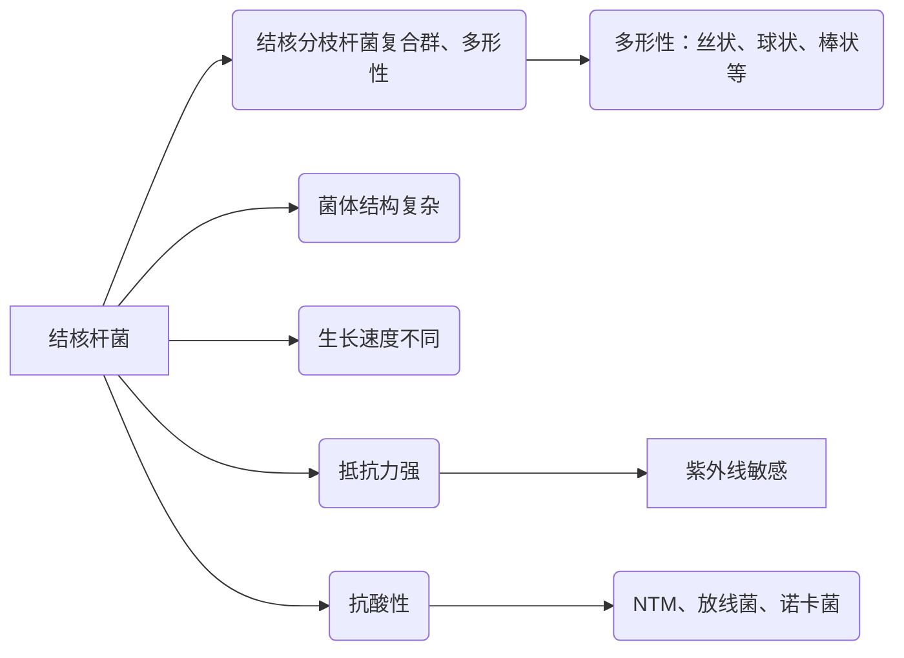
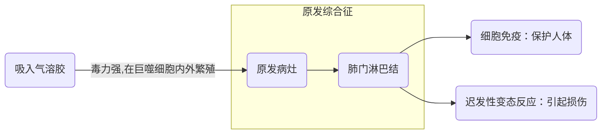
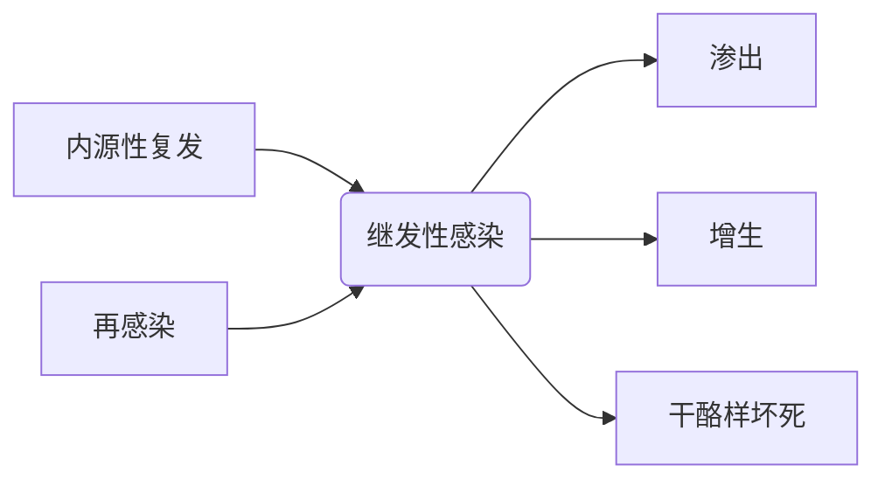

# 肺部疾病
## 6. 肺结核
### 大纲要求
+ 掌握
	结核的病因和发生与发展、临床表现、诊断、鉴别诊断要点，抗痨原则和方法，抗痨药物的正确使用，大咯血的处理。 
+ 熟悉
	肺结核的X线特点与病理变化的关系，痰结核菌的检查方法、 结核菌素试验、卡介苗接种。
+ 了解
	肺结核的流行病学和结核分枝杆菌的特点。
### 病因

```mermaid
graph LR
A[结核杆菌] --> B("结核分枝杆菌复合群、多形性") --> G("多形性：丝状、球状、棒状等")
A --> C("菌体结构复杂")
A --> D("生长速度不同")
A --> E("抵抗力强") --> 紫外线敏感
A --> F(抗酸性) --> H("NTM、放线菌、诺卡菌")
```
感染途径：**呼吸道**、消化道感染
感染人群：普遍易感，免疫力低下者尤甚
### 发生发展
#### 原发感染

```mermaid
graph LR
a(吸入气溶胶) -- 毒力强,在巨噬细胞内外繁殖 --> c(原发病灶) 
subgraph 原发综合征
c--> d(肺门淋巴结)
end
d --> e("细胞免疫：保护人体")
d --> f("迟发性变态反应：引起损伤")
```
#### 继发感染

```mermaid
graph LR
内源性复发 --> b(继发性感染)
再感染 --> b
b --> 渗出
b --> 增生
b --> 干酪样坏死
```

|病变类型|时机|特点
| ---| :---: | :---: |
|渗出|炎症初期阶段或病变恶化复发时|充血水肿，中性粒细胞、淋巴细胞和巨噬细胞浸润，纤维蛋白渗出，少量类上皮细胞、多核巨细胞，发现结核杆菌。
| 增生||上皮样细胞成层状排列和包绕，淋巴细胞和浆细胞分布和覆盖，朗汉斯巨细胞|
|干酪样坏死|机体抵抗力降低、菌量过多、变态反应强烈|坏死组织呈黄色，似乳酪样的半固体或固体物质|

### 临床表现

 1. 症状
    + 呼吸系统：
       - 咳嗽咳痰两周以上/痰中带血
       - 胸痛（累及胸膜）
       - 大咯血：窒息、休克、肺不张、肺感染、结核菌播散
     + 全身症状
       - 午后低热、盗汗、体重减轻、倦怠乏力
 2. 体征
    + 较小：无体征
    + 较大：肺实变
    + 纤维条索形成：气管患侧移位、胸廓塌陷
    + 胸膜炎致胸腔积液：

> Written with [StackEdit中文版](https://stackedit.cn/).
<!--stackedit_data:
eyJoaXN0b3J5IjpbMTAyOTQ0MzM3OCwtMTA5NDUwNDAxLC03OD
Q1OTMxNTYsMjU2MjgzMTgxLC0xOTAxNzQ4OTEwLC0xMTYyNDMx
NDYzLC05NjQ1MjU4NzZdfQ==
-->