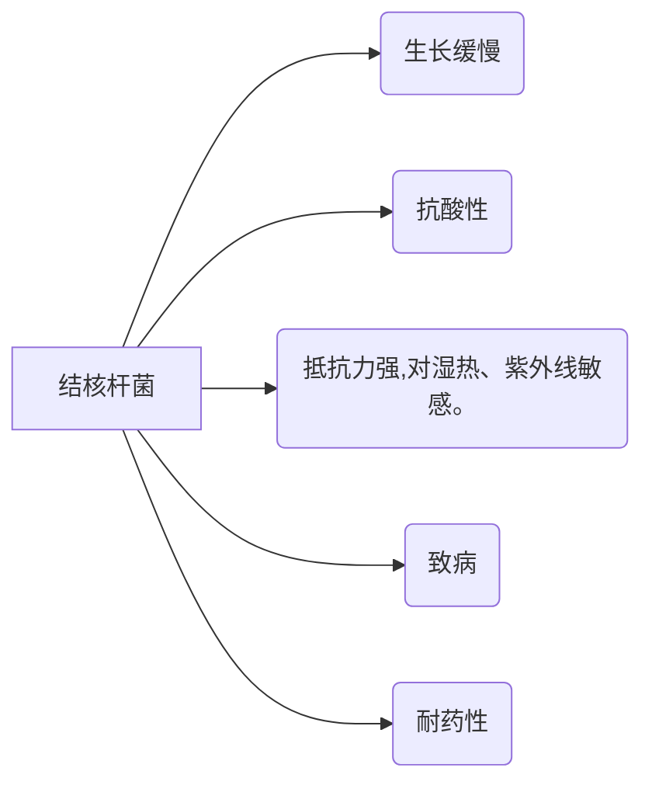

# 肺部疾病
## 6. 肺结核
### 大纲要求
+ 掌握
	结核的病因和发生与发展、临床表现、诊断、鉴别诊断要点，抗痨原则和方法，抗痨药物的正确使用，大咯血的处理。 
+ 熟悉
	肺结核的X线特点与病理变化的关系，痰结核菌的检查方法、 结核菌素试验、卡介苗接种。
+ 了解
	肺结核的流行病学和结核分枝杆菌的特点。
### 病因

```mermaid
graph LR
A[结核杆菌] --> B(生长缓慢)
A --> C("抗酸性")
A --> D("抵抗力强,对湿热、紫外线敏感。")
A --> E("致病")
A --> F(耐药性)
```
**呼吸道**、消化道感染
pu
结核杆菌：

> Written with [StackEdit中文版](https://stackedit.cn/).
<!--stackedit_data:
eyJoaXN0b3J5IjpbMTgyNTQyOTYyMywtMTE2MjQzMTQ2MywtOT
Y0NTI1ODc2XX0=
-->