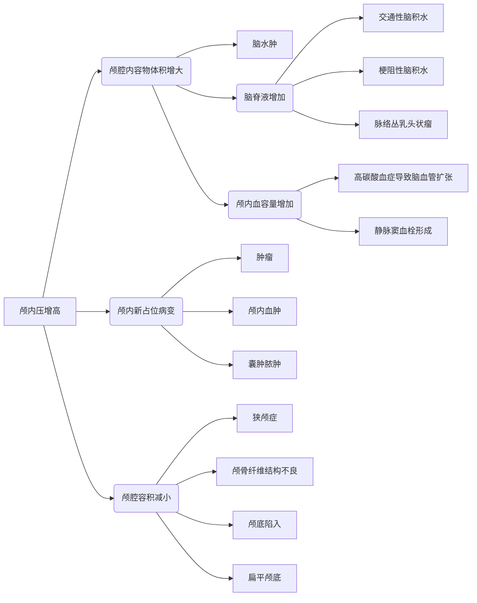
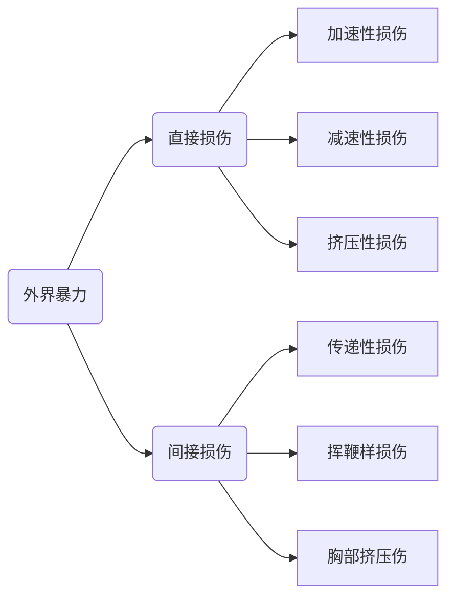
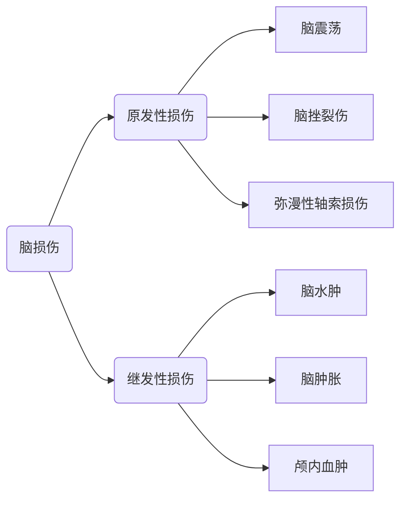
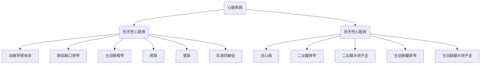
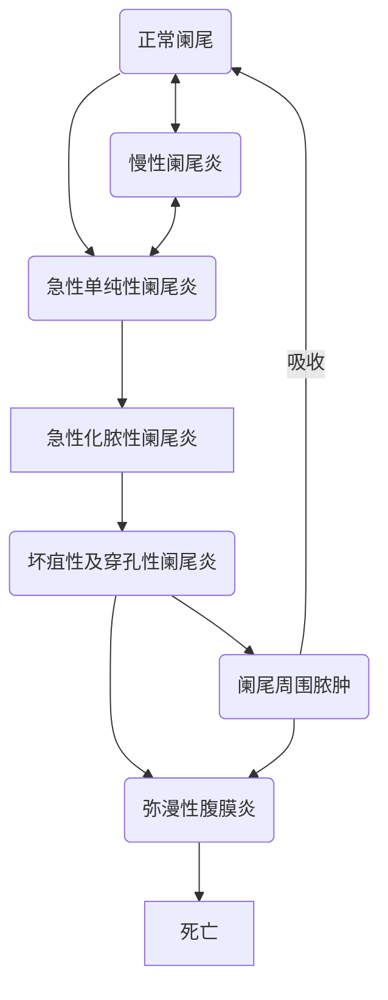

## 创伤
### 诊断和治疗
+ 诊断：根据受伤史、体格检查、辅助检查诊断，注意**检查不可耽误急救时机**
  + 受伤史：伤前情况、受损情况、伤后表现及演变过程
  + 体格检查：
    + 初次评估：
      + A:Airway
      + B:Breathing
      + C:Circulation
      + D:Disability
      + E:Exposure&Environment
      + F:Fracture
    + 二次评估：心跳-呼吸-腹部-脊柱-头部-盆部-肢体-动脉-神经
    + 伤口检查
  + 辅助检查
    + 实验室检查
    + 穿刺和导管
    + 影像学检查：
    + 生命体征不平稳患者不应无监护和保护独自检查
    + 中轴线暴力创伤要考虑力的传导
  + 重视症状明显部位，同时仔细寻找隐蔽损伤
  + 不可忽视异常安静的病人

+ 急救： 复苏、通气、止血、包扎、固定、搬运
  + 止血：指压法：用手指压迫动脉经过骨骼表面的位置
  	+ 加压包扎：使用无菌纱布或者敷料填塞伤口后外加纱布垫压再以绷带加压包扎
  	+ 填塞止血法：使用无菌纱布或敷料覆盖伤口，纱布条或者绷带填充，加压包扎
  	+ 缝扎止血法：多在手术中使用，急救时少用
  	+ 止血带止血：四肢大出血，包扎无法止血；***每隔一小时松开一两分钟，不超过4小时***
	+ 包扎：三点一走行
  	+ 起点
  	+ 止点
  	+ 着力点
  	+ 走行方向顺序
+ 开放性创伤处理
  + 清洁伤口：直接缝合
  + 污染伤口（有细菌污染但无感染）：清创后缝合
  + 感染伤口：清创引流，暂不缝合

+ 浅部小刺伤：止血后消毒，包以无菌敷料，保持局部干燥1-2天
+ 浅部切割上：清洁创面，消毒

### 批量伤员救治
1. 红色重伤：威胁生命，紧急救治
2. 黄色中伤：伤势较重，暂无生命危险
3. 绿色轻伤：伤势较轻，独自处理
4. 黑色死亡&濒死
## 烧伤、冻伤
[课件](https://sunyatsen-my.sharepoint.cn/:p:/g/personal/mazy25_ms_sysu_edu_cn/ERoRiJDEKKhOoomL2ynvK24BuH_291uUMsVqHRXVAsccKQ?e=qrHL48)
### 课程要求
掌握：热力烧伤、电烧伤、化学烧伤的诊断和处理
熟悉：休克的诊断和防治、烧伤感染的诊断防治
### 烧伤伤情判断
烧伤面积估算：

三三三，五六七；

十三十三会阴一；

五七十三二十一。

女性臀部足部六六

儿童头：9+12-年龄，下肢：46-12+年龄

|烧伤分度|深度|病理|表现|愈合|
|:---:|:---:|:---:|:---:|:---:|
I度|表皮角质层、透明层、颗粒层|血管扩张充血|疼痛灼烧感、无水泡|3-5天表皮脱落愈合
浅II度|真皮浅层|血浆样液体渗出|感觉过敏、水泡|2周痊愈、有色素沉着
深II度|真皮**乳头层**下，皮肤附件残留|神经部分破坏，组织坏死|痛觉迟钝，**拔毛痛**|3-4周愈合，疤痕明显
III度|皮肤全层|皮肤坏死蛋白凝固|痛觉消失，无弹性干燥皮革状，蜡白、焦黄、**拔毛不痛**、血栓|3-4周溶痂

48h内诊断

|烧伤分级|定义|
|:---:|:---:|
 轻度烧伤|面积10%以下的Ⅱ度烧伤。
中度烧伤|总面积11%～30%的Ⅱ度烧伤，或Ⅲ度烧伤面积不足10%。
重度烧伤|烧伤面积在31%～50%，或Ⅲ度烧伤面积在11%～20%之间，或烧伤面积虽不到上述百分比，但有下列情况之一者：①全身情况较重或已有休克；②较重的复合伤；③中、重度吸入性损伤。
特重烧伤|总面积50%以上；或Ⅲ度面积20%以上。 

诊断：
+ 烧伤后48h通过创底情况：外观、毛细血管充盈情况、触摸针刺敏感性确定深度
+ 烧伤诊断
	+ 部位、面积、深度、原因
	+ 面、手、吸入性、消化道烧伤单独列
+ 诊断并发症：休克、感染、器官功能不全
+ 并存疾病诊断
### 吸入性烧伤
+ 见于封闭火灾现场
+ 密闭室内发生
+ 面颈前胸部烧伤口鼻周围
+ 刺激性咳嗽、痰中碳屑
+ 声音嘶哑、吞咽困难疼痛
+ 呼吸困难或哮鸣
+ 纤支镜最直接最准确

### 烧伤分期
体液渗出期：毛细血管通透性增加导致
急性感染期
创面修复期
康复期
### 救治
现场救治
  1. 去除原因
  2. 及时处理危及生命情况
  3. 保护创面：注意避免使用有色药物涂抹以增加烧伤深度判定困难
  4. 呼吸道通畅
  5. 抗休克
  6. 转送：早期避免长途转送，休克控制后再转送

 治疗原则
小面积：清创保护防感染
大面积：
  1. 一般治疗：抗休克、保持气道、抗感染
  2. 创面治疗：切痂、削痂、植皮
  3. 并发症治疗
  4. 康复治疗
  
    
### 电烧伤
分为入口出口，都为三度烧伤，入口较出口严重
易并发感染
血管外露、出血

治疗：
急救
液体复苏，注意肌溶解、防肾衰
切开减张、防大出血
全身应用抗生素，警惕厌氧菌感染，早期足量，注射破伤风抗毒素

### 化学烧伤
可继续侵入引起局部损害或中毒
#### 处理原则
+ 脱：脱去衣物脱离环境
+ 冲：大量清水冲洗，注意眼部冲洗
+ 中和：慎用中和剂
+ 排：输液、利尿排出毒性物质
+ 解：选用解毒剂或对抗剂
#### 酸烧伤
+ 常见硫酸盐酸硝酸烧伤
+ 一般无水泡，硫酸深棕色、硝酸黄褐色、盐酸黄色
+ 创面处理同一般烧伤
#### 碱烧伤
+ 氢氧化钠、氨、石灰、电石
+ 尽早冲洗，至少30min
+ 不主张用中和剂，可用2%硼酸湿敷冲洗
+ 暴露疗法，尽早切痂植皮
#### 磷烧伤
+ 磷自燃引起
+ 浸入水中在水下移除磷；1%硫酸铜中和形成无毒磷化铜
+ 尽早切痂植皮、受侵犯肌肉广泛切除

## 泌尿、男生殖系统先天疾病
[课件](https://sunyatsen-my.sharepoint.cn/:b:/g/personal/mazy25_ms_sysu_edu_cn/ESWSJ7VuhShPpO1iRVWDXtcBQ_QAGzf8CjMd7LKZCko-Yg?e=McVSGP)
### 要求
掌握：睾丸松解固定术的适应症、嵌顿包茎手法复位及 包皮背侧切开术
熟悉：症状、诊断和处理原则、多囊肾、蹄铁形肾、重复肾盂－输尿管异位肾、尿道下裂、输尿管异位开口、先天性睾丸发育不全综合征、异位睾丸等
了解：各种先天性畸形的成因
### 尿道下裂
+ 分型
	+ 阴茎头型
	+ 阴茎型
	+ 阴囊型
	+ 会阴型

+ 手术目的：矫正下曲畸形、尿道重建
### 隐睾
睾丸下降异常，使睾丸不能降至阴囊而停留在腹膜后、腹股沟管或阴囊入口处

### 包茎
+ 包皮：外口过小，紧箍阴茎头部不能向上外翻
+ 包皮过长：影响阴茎正常发育，包皮垢积聚引起炎症
+ 性交疼痛、包皮嵌顿
+ 诱发癌症

## 颅内压增高与脑疝
[课件](https://sunyatsen-my.sharepoint.cn/:p:/g/personal/mazy25_ms_sysu_edu_cn/ETShVgRrkklPtBzDP9hCGp8B7Rdwo_7oFKP1r6mmSII7Zg?e=usDdgr)
### 要求
掌握：
+ 颅内压增高的定义和分类及常见病因、临床表现、诊断及治疗原则；脑疝的定义、临床表现、诊断及处理原则。
+ 熟悉：颅内压增高的病理生理过程与其产生后果的逻辑关系。
+ 了解：颅内压的形成、调节与代偿机制；脑疝的解剖学基础及发生机制。
### 颅内压
+ 颅腔内容物：脑、脑脊液、血液
+ 颅内压是颅内容物对颅腔壁产生的压力
+ 成人70-100mmH2O；成人50-100H2O
### 颅内压增高
神经外科最常见临床综合征，是~~脑肿瘤、脑外伤、脑出血、脑炎~~等多种疾病导致；颅内压持续超过正常上限引起相应综合征
#### 分型
+ 弥漫性
+ 局限性
+ 急性
+ 亚急性
+ 慢性
#### 常见病因

#### 临床表现
+ 头痛、呕吐、视乳头水肿
+ 意识障碍、**cushing综合征：血压增高、脉搏缓慢、呼吸深慢
#### 诊断
+ 临床表现、颅内病变考虑颅内压增高
+ 辅助检查：X片、CT、MRI、脑血管；腰穿（明显症状小心脑疝，禁忌）
#### 治疗
+ 非手术：
	+ 观察、监测、避免进一步恶化：体位、保持气道、补液、排便通畅
	+ 利尿脱水
	+ 激素
	+ 抗感染
	+ 过度换气
	+ 冬眠低温治疗
	+ 对症：镇痛、抗癫痫、谨慎镇静
+ 手术治疗
	+ 手术切除病灶
	+ 脑脊液引流、分流
	+ 减压术
### 脑疝
 颅内压增高时部分脑组织受压并经过一些解剖裂隙从高压区向低压区移位、发生嵌顿，产生相应表现
 + 小脑幕切迹疝：海马回、钩回疝入小脑幕裂孔下方
 + 枕骨大孔：小脑扁桃体、延髓经枕骨大孔挤向椎管
 + 大脑镰下疝：一侧扣带回向另一侧
#### 临床表现
+ 小脑幕切迹疝
	+ 颅内压增高
	+ 意识障碍：昏迷
	+ 瞳孔改变：先小后大
	+  对侧肢体运动障碍
	+ 动眼神经：眼睑下垂眼睑歪斜
	+ 呼吸循环衰竭
+ 枕骨大孔疝
	+ 头痛呕吐
	+ 颈硬颈痛
	+ 生命体征不稳
	+ 意识障碍
	+ 早期无瞳孔改变
#### 治疗
+ 及时发现、及时处理，先脱水缓解，明确诊断、处理病因
+ 姑息性手术
+ 脑室膜腔分流术
+ 颅脑减压术

## 颅脑损伤
### 要求
1.了解：颅脑损伤的格拉斯哥昏迷分级（GCS）及伤情分类标准；颅脑损伤的概况；头皮、颅骨及脑各部分的解剖。
2.熟悉：脑损伤的原因、方式和机理；颅脑损伤的一般处理原则，特殊病情的处理；头皮损伤、颅底骨折的诊断和处理原则。
3.掌握：脑震荡、脑挫裂伤及开放性颅脑损伤的病理、临床表现、诊断及处理原则；颅内出血及血肿的病理、临床表现、诊断步骤及处理原则。

### 概述
颅脑损伤定义：暴力作用于头部引起的软组织、颅骨、脑损伤

分度：

脑损伤分类和发生机制

### 脑震荡
[课件](https://sunyatsen-my.sharepoint.cn/:p:/g/personal/mazy25_ms_sysu_edu_cn/Ed1KsfvDUWpHp1BPZBLAkv4B26v5khYOKzqZuGq_2cCwBQ?e=S9aQ1I)
+ 病理
     网状结构受损，颅内压骤然变化、脑血管功能紊乱，最轻的弥漫性轴索损伤
+ 临床表现
    1. 短暂意识障碍<30min 
    2. 逆行性遗忘
    3. 头痛头晕乏力
    4. 神经系统体征、CT阴性
 + 诊断：CT、MRI、腰穿
 + 处理：
     1. 体位：休息5-7天、镇静镇痛
### 脑挫裂伤
+ 病理：脑组织出血揉碎、坏死、血肿等
+ 临床表现：
    1. 意识障碍
    2. 头痛呕吐
    3. 生命体征改变
    4. 局灶性症状和体征
+ 诊断：
    1. 临床表现：意识障碍+局灶症状+头痛、恶心、呕吐
    2. CT：高低密度混杂影
    3. 腰穿慎用
+ 治疗：非手术治疗、手术治疗（宁多勿少）
### 颅内出血
#### 硬脑膜外血肿
+ 病因：**脑膜中动脉**、静脉窦、板障出血
+ 临床特点：
    意识障碍

    颅内压增高
    瞳孔改变
    神经系统体征

+ 诊断：外伤病史+CT双凸镜形高密度
+ 治疗和预后：治疗：手术、监测
#### 硬脑膜下血肿
+ 病因：皮层血管撕裂
+ 临床特点：损伤重、颅内高压、瞳孔改变、神经系统体征
+ 诊断：病史+临床，CT高密度或混合密度新月型、半月形影
+ 治疗：开颅清除血肿、去骨减压
> 慢性硬脑膜下血肿
> 老年多见，轻微头外伤
> + 临床特点：慢性颅内高压、精神异常、CT低密度新月型影
> + 治疗：引流
#### 脑内血肿
常合并脑挫裂伤
### 开放性颅脑损伤
非火器性或火器性致伤物造成头皮（黏膜）颅骨、硬脑膜同时破裂，脑脊液流出，脑组织与外界相通的创伤。
治疗：防治休克，致伤物处理、防感染、清创手术，抗生素

## 颈部疾病
### 要求
掌握：结节性甲状腺肿、原发和继发性甲亢诊断和治疗、甲亢术前准备和并发症
### 结节性甲状腺肿
+ 诊断：检查发现甲状腺重大和结节，根据病史检查确定性质
+ 治疗：
	1. 生理性可增加碘摄入
	2. 20岁一下弥漫性单纯甲状腺肿可以使用小量甲状腺素或优甲乐
	3. 气管、食管、神经受压引起临床症状、胸骨后甲状腺肿、巨大影响生活、结节性甲状腺肿继发甲亢、恶变者应大部切除
### 甲亢
#### 诊断
根据临床表现，测定：
+ 基础代谢率：脉压+脉率-111，正常：10、轻度甲亢：20-30、中度甲亢：30-60
+ 甲状腺摄碘：正常20-40%/24h，25%/2h或50%/d甲亢
 T3 T4含量测定
#### 治疗         
+ 手术适应症：中度及以上甲亢、继发性甲亢、高功能性腺瘤、压迫症状；胸骨后甲状腺肿、药物及碘131治疗失败、妊娠早中期有指征
+ 手术禁忌症：青少年、轻症、老年人或严重器质性病变

#### 术前准备
+ 一般准备：
	+ 镇静：镇静剂、安眠药
	+ 心率快：心得安；
	+ 心衰：洋地黄
+ 术前检查：
	+ 颈部摄片
	+ 心电图
	+ 喉镜检查
	+ 基础代谢率测定
+ 药物准备：
	+ 抗甲状腺药+碘
	+ 单用碘
	+ 普萘洛尔

#### 术后并发症：
1. 呼吸困难：切口出血压迫、喉头水肿、气管塌陷：清除血肿、止血、气管插管
2. 喉上神经：内呛外声低：理疗恢复
3. 喉返神经：手术所致、血肿压迫所致
4. 甲减
5. 甲状腺危象：术前准备不足；甲亢未控制

## 乳腺疾病
### 要求
1. 了解：乳房的解剖、林巴引流途径。
2. 熟悉：急性乳房炎、乳房囊性增生病的诊断和外科治疗原则；乳腺癌的治疗。
3. 掌握：乳房的正确检查方法；掌握乳房肿块的鉴别诊断要点。
### 乳房检查方法
视诊：乳房形状、大小、对称性、隆起凹陷、皮肤红肿、橘皮样改变、浅表静脉、乳头是否同一水平、内陷、糜烂
扪诊：肿块：大小硬度表面边界活动度粘连、炎症溢液
淋巴结：短径10mm，注意大小质地压痛融合活动度

影像学检查：
+ X线：密度增高肿块、边缘不规整、毛刺征、钙化
+ B超：钼靶
+ MRI：有效
活检

### 不同乳腺肿块鉴别
1. 纤维腺瘤：无症状，肿块生长缓慢，质硬，弹性感，表面光滑易推动
2. 乳管内乳头状瘤：乳晕区数毫米小结节，质软可推动，按压溢液，出血
3. 乳房肉瘤：乳房肿块，体积大，边界明显，活动度好，皮肤静脉扩张
4. 乳腺癌：肿块质硬、表面不光滑、与组织分界不很清楚，不易推动

+ 酒窝征：癌变累及cooper韧带，肿瘤表面皮肤凹陷
+ 橘皮样：淋巴回流障碍，真皮水肿
+ 乳头湿疹样：乳头乳晕皮肤粗糙、糜烂如湿疹样，进有溃疡

## 胸部外伤
[课件](https://sunyatsen-my.sharepoint.cn/:p:/g/personal/mazy25_ms_sysu_edu_cn/ER3Ov3pH93tHmDMIlZB5jsoB2mtsuxTXu22xPjWxLscKbw?e=udU7bA)
### 要求
+ 掌握：胸部损伤临床表现、诊断、急救处理原则；肋骨骨折、气胸、血胸的临床表现和治疗方法
+ 熟悉：肋骨骨折等病因和病理生理变化
### 临床特点
+ 快速致命性：现场死亡，主动脉破裂、心脏破裂、心脏骤停
+ 早发致命性：1-2h危及生命；张力性气胸、血胸、心肺挫伤
+ 潜在迟发致命性：连枷胸、食管破裂、膈肌破裂、心肺挫伤

+ 穿透伤：损伤机制清除、出血，需要开胸
+ 钝性伤：机制复杂、表现隐匿、不需开胸

### 急救
1. 基本生命支持：呼吸、循环、对症、固定、迅速
2. 快速致命性：
	1. 气道梗阻：清理气道
	2. 张力性气胸：闭式引流
	3. 开放性气胸：闭合
	4. 连枷胸：镇痛+辅助呼吸
3. 手术指征：
	1. 出血、心脏损伤、胸壁缺损、大异物（初一必涨）
	2. 穿透性胸伤重度休克
	3. 穿透胸伤濒死
### 肋骨骨折
最常见，4-7肋骨折常见
#### 临床表现
+ 肋间神经刺激
+ 肺组织刺裂挫伤
+ 肋间血管失血
+ 连枷胸
+ 腹内脏器破裂
#### 诊断
+ 胸痛
+ 胸片
+ 胸部三维重建CT
#### 治疗
+ 镇痛
+ 肺部理疗
+ 早期活动
### [气胸](./内科学.md#气胸)
穿刺减压、闭式引流、抗感染

### 血胸
#### 临床表现
胸闷气促休克
低血容量表现
胸膜腔积液
#### 进行性血胸
1. 持续性脉搏加快、扩容血压不稳定
2. 胸腔引流超过3x200ml
3. 血红蛋白、红细胞计数、红细胞压积进行性降低
#### 治疗
1. 清除已出的血
2. 止住未出的血
3. 防治并发症

## 心脏疾病
[课件](https://sunyatsen-my.sharepoint.cn/:p:/g/personal/mazy25_ms_sysu_edu_cn/EUFQNAFEWQ9NmyIngeNS7skBmWfkSraGrbK16Aag061T6g?e=ZWE4af)
### 要求
+ 了解：心脏疾病外科治疗进展概况；先天性心脏病 L-R 分流，紫绀型先天性心脏病的病理的意义与手术指征；缩窄性心包炎的病因风湿性。
+ 熟悉：各种后天性心脏病、心瓣膜病的病理生理。
+ 掌握：各种心脏疾病的手术治疗。 
### 心脏病的分类

### 动脉导管未闭
+ 艾森曼格综合症：肺动脉压大于主动脉压：右向左分流，发绀、杵状指
+ 差异性发绀：右向左分流，下半身发绀杵状指
+ 诊断：胸骨左缘第二肋间闻及粗糙的连续性机器样杂音、左心室肥大、肺血增多

+ 手术：
	+ 反复发生肺炎、呼吸窘迫；
	+ 无明显症状者伴有肺充血、心影增大：择期手术
	+ 艾森曼格综合征：不适合手术
	+ 主动脉弓离断、肺动脉闭锁等不可单独结扎
+ 手术方法：结扎、封闭、切断缝合
	+ 套管封堵
### 室间隔缺损
+ 症状：肺感染、心衰、喂养困难、活动耐力差、劳累气促
+ 胸骨左缘2-4肋间杂音、伴震颤广泛传导；P2亢进、二尖瓣区舒张期杂音

+ 膜部缺损
+ 漏斗部缺损
+ 叽部缺损

||小型室缺|中型室缺|大型室缺
:---:|:---:|:---:|:---:
缺损直径|小于主动脉瓣环1/3|1/3-2/3|大于2/3
分流大小|少|中等|大
症状|无|有|明显
肺血管|无影响|有影响|肺高压
手术|择期手术|尽早手术|积极手术

### 房间隔缺损
继发孔型可无症状
原发孔型症状出现早、病情进展快
+ 体征：胸骨左缘2、3肋间柔和的收缩期杂音
+ 心电图：心电轴右偏、右心肥大、**不完全性右束支传导阻滞**
+ X线：主动脉影缩小
+ 手术
	+ 肺动脉高压尽早手术、合并房颤改善后手术
	+ 房缺修补
### 法洛四联症
+ 症状：发育迟缓、喜欢蹲踞、阵发性缺氧
+ 体征：P2减弱、粗糙喷射性杂音，严重时杂音不明显
+ X线：靴形心、两肺纹理减少

手术：
+ 根治手术：
	+ 左心室发育好
	+ 肺动脉发育好
	+ 室缺修补+右室及肺动脉疏通
+ 姑息手术：体肺分流术

### 二尖瓣狭窄
+ 症状：咳嗽气促、房颤
+ 体征：二尖瓣面容、心尖区舒张中期隆隆样杂音
+ 隔膜型狭窄：病变较轻，开瓣音
	+ 球囊扩张
+ 漏斗型狭窄：较重
	+ 换瓣
### 二尖瓣关闭不全
+ 症状：活动后心悸气促、虚弱乏力
+ 体征：心尖区全收缩期吹风样杂音，腋下传导
+ 心电图：左偏、左室肥大
+ X线：左房左室扩大、食管后移
+ 手术
	+ 二尖瓣修复成形术：首选
	+ 换瓣
### 主动脉瓣狭窄
+ 主动脉瓣狭窄三联征：心衰、心绞痛、昏厥
+ 体征：收缩期递增-递减型喷射样杂音，颈部传导
+ 有症状者手术：体外循环下换瓣、经心尖或经皮支架瓣膜植入
### 主动脉瓣关闭不全
+ 手术：换瓣
### 冠心病
+ 介入治疗
+ 手术治疗
	+ 搭桥

## 腹外疝

[课件](https://sunyatsen-my.sharepoint.cn/:b:/g/personal/mazy25_ms_sysu_edu_cn/Eeh1EVwOukpGivForHGsC9EBB9i5tZLWIiYgS4tuAO8OHQ?e=LcPiuz)
### 要求
+ 掌握：腹外疝基本概念（名解）、腹股沟区解剖层次、腹股沟疝的诊断及直疝和斜疝的鉴别（问答）、腹股沟疝的治疗
+ 熟悉：腹外疝的病理解剖和临床类型、股疝的临床表现和治疗
### 基本概念
腹外疝：腹内脏器或组织连同腹膜壁层经腹壁薄弱点或孔隙向体表突出
腹内疝：腹内脏器或组织不正常进入原有的或因病变或手术形成的腹内孔隙

Littre疝：疝内容物为憩食
Amyand疝：内容物为阑尾
### 诊断
#### 斜疝
易复性：可复性，增加腹压后突出，平卧时手还纳
难复性：不能完全回纳；消化不良便秘
嵌顿性：腹内压骤增时出，不能回纳，增大、质地硬，伴疼痛和触痛、肠梗阻表现
绞窄性：缺血坏死、感染、腹膜炎、全身中毒
#### 直疝
年老体弱者，腹股沟肿物在直疝三角突出、平卧小时、极少嵌顿

### 鉴别

-|斜疝|直疝
:---:|:---:|:---:
发病年龄|儿童青壮年|老年
突出途径|腹股沟管|直三角
外形|椭圆梨形，上有蒂|半球形
回纳疝块后压住深环|不再突出|仍突出
精索与疝囊关系|后方|前外方
与腹壁下动脉关系|外侧|内侧
嵌顿|多|少
### 治疗
1. 手术
	1. 疝囊高位结扎：婴幼儿斜疝、绞窄性疝
	2. 传统疝修补术
	3. 无张力修补

## 阑尾疾病

[课件](https://sunyatsen-my.sharepoint.cn/:b:/g/personal/mazy25_ms_sysu_edu_cn/Eeh1EVwOukpGivForHGsC9EBB9i5tZLWIiYgS4tuAO8OHQ?e=LcPiuz)
### 要求
掌握：急性阑尾炎临床病理分型，诊断和鉴别 诊断、手术步骤和术后并发症
熟悉：特殊性阑尾炎特点和处理原则、阑尾炎周围脓肿处理原则
### 急性阑尾炎
#### 病理分型

#### 诊断
+ **转移性右下腹痛**：阑尾炎症侵及浆膜，壁层腹膜受刺激引起的体神经定位疼痛
+ 穿孔性压力减小，疼痛减轻，腹膜炎后加重
+ 右下腹固定压痛
+ 腹膜刺激征
+ 右下腹包块：提示脓肿形成
#### 鉴别诊断
+ 胃十二指肠穿孔
	+ 溃疡病史
	+ 突发腹痛
	+ 板状腹
	+ 游离气体
+ 宫外孕
	+ 育龄女性
	+ HCG+
	+ 停经史、不规则流血
	+ 失血症状、腹腔出血
+ 输尿管结石
	+ 放射性绞痛但无体征
	+ 尿检红细胞
#### 手术
+ 开放性阑尾切除
+ 腹腔镜下阑尾切除术
+ 探查：排除结肠肿瘤、回肠憩室炎、回肠末端炎
+ 盲肠水肿不宜荷包缝合
#### 并发症
1. 腹腔脓肿：引流
2. 内外萎：手术处理
3. 门静脉炎：抗生素

+ 出血、切口感染、黏连性肠梗阻 ：手术共性
+ 阑尾残株炎：阑尾残端保留过长
+ 粪萎：结扎线脱落等原因，非手术治疗可自愈
## 腹部损伤

[课件](https://sunyatsen-my.sharepoint.cn/:p:/g/personal/mazy25_ms_sysu_edu_cn/EbqURsAEeb5Lv2egwhqB0iMB3h-9zYfXqU3x7sy7Hy-8Cw?e=e0DopM)
### 要求
+ 掌握：腹部闭合损伤的急救和手术治疗原则
+ 熟悉：实质性和空腔性脏器损伤的临床表现、腹部闭合性损伤诊断步骤和辅助诊断方法、肝脾肠破裂诊断和辅助治疗
### 急救
1. 心肺复苏
2. 控制大出血
3. 消除气胸
4. 恢复血容量、纠正休克
5. 创伤救治
## 急性化脓性腹膜炎

[课件](https://sunyatsen-my.sharepoint.cn/:p:/g/personal/mazy25_ms_sysu_edu_cn/ETPTHVJOJQdItXLbBFK-GPUBnGKHYJg08exYqEIgkuaHhA?e=MZoM03)
### 要求
+ 掌握：急性弥漫性腹膜炎的诊断方法和治疗原则
+ 熟悉：急性弥漫性腹膜炎的病因病理、临床表现和病程演变
### 病因
+ 腹内脏器损伤
+ 腹内脏器炎症扩散
+ 手术
+ 梗阻
+ 感染
+ 由其他部位扩散
### 病理
炎症反应-->脓液-->脱水休克
### 临床表现
+ 腹痛
+ 恶心、呕吐
+ 体温、脉搏
+ 感染中毒
+ 腹部体征
### 诊断
+ 病史
+ 临床表现症状、体征
+ 实验室检查、辅助检查
+ 直肠指检、穿刺
### 治疗
+ 非手术
	+ 体位
	+ 禁食、胃肠减压
	+ 抗休克
	+ 抗生素
	+ 支持
	+ 镇痛
+ 手术
	+ 保守治疗无缓解或加重
	+ 原发病严重
	+ 腹腔炎症重、大量积液
	+ 病因不明确、无局限趋势
	+ 原则
		+ 全麻
		+ 处理原发病
		+ 清洁腹腔
		+ 引流
		+ 术后处理
	
## 消化道疾病

[课件](https://sunyatsen-my.sharepoint.cn/:p:/g/personal/mazy25_ms_sysu_edu_cn/EadLJFvGDMVIuyn3Dahr2LIBxLWqLo6k-pw2x7kleiqLEA?e=NnP47Q)

1.  熟悉：胃、十二指肠溃疡手术适应症；急性大出血，幽门梗阻的临床表现，诊断和治疗原则；胃肠道间质瘤（GIST）的概念和危险度分级。
2. 掌握：胃、十二指肠溃疡急性穿孔的外科治疗；胃、十二指肠溃疡术式选择和术后并发症；胃癌的诊断和治疗。	
### 胃十二指肠溃疡
+ 胃、十二指肠全层黏膜缺损
+ 与糜烂性胃炎区别：

- |糜烂性胃炎|胃溃疡
 :---:|:---:|:---:
病变深度|一般不超过黏膜层|到黏膜下层甚至肌层浆膜层
病变数量及部位|多点、片状、散在|单个
并发症|少量出血|多发生出血，与血管大小有关
癌变|否|是
 
#### 特点
+ 药物治疗效果好
+ 外科主要针对溃疡并发症
+ 胃癌变几率高，十二指肠少
+ 胃溃疡处理积极

### 穿孔
+ 常见急腹症
+ 常见胃十二指肠溃疡并发症
+ 急快重
+ 球部前壁、胃小弯
+ 化学性腹膜炎->化脓性腹膜炎
+ 腹腔液渗出、毒素吸收、休克
#### 临床表现和体征
+ 临床表现
	+ 溃疡病史/NSAIDs/GCs+诱因
	+ 刀割样上腹部剧痛
	+ 面色苍白血压下降
	+ 恶心呕吐
+ 体征
	+ 痛苦面容
	+ 腹式呼吸减弱消失
	+ 全腹压痛、板状腹
	+ 气腹
	+ 肠鸣音减弱消失
#### 诊断鉴别诊断
+ 诊断：病史+体征+辅助检查
+ 鉴别诊断：
	+ 急性胆囊炎：Morfe阳性
	+ 急性胰腺炎：淀粉酶+
	+ 急性阑尾炎：无游离气体
#### 手术
1. 穿孔缝合术：腹腔镜：轻微
	2. 开腹：严重
2. 彻底手术：胃大部切除
3. 迷走神经切断：很少用
4. 手术并发症：倾倒综合症：胃大部切除后食糜直接进入小肠，刺激胰岛素分泌；食糜渗透压导致肠液渗出
### 溃疡大出血
+ 血管破裂出血，动脉出血
+ 好发球后壁、胃小弯侧
#### 临床特点
+ 临床表现：取决于出血量和速度
	+ 黑便：50-80
	+ 呕血、便血：大量快速
	+ 休克：短期>800ml
+ 体征：肠鸣音增强
+ 鉴别诊断：胃底静脉曲张破裂出血：肝硬化+蜘蛛痣
#### 治疗
+ 非手术治疗 
	+ 补充血容量
	+ 放置胃管
	+ 止血制酸及应用生长抑素
	+ 胃镜治疗
+ 手术治疗
	+ 非手术治疗无效
	+ 出血块
	+ 动脉硬化
	+ 再次出血风险大
+ 手术方式
	+ 出血部位贯穿缝扎术
		+ 球后壁溃疡、高龄体弱难耐长时间手术
		+ 胃大部切除
### 瘢痕性幽门梗阻
+ 分型
	+ 痉挛性、水肿性：暂时
	+ 瘢痕性：永久
+ 保守治疗
	+ 放置胃管、减压引流
	+ 洗胃
	+ 补液
+ 手术治疗：胃大部切除
### 各种手术方式
1. 穿孔修补术
	+ 适应症：穿孔
	+ 方法：纵轴进针，全层缝合
	+ 注意：怀疑恶性：病理检查
		+ 不要缝到对面胃壁
		+ 打结适度
2. 胃大部切除

+并发症
	1. 术后出血
	2. 胃瘫
	3. 缺血坏死、缝合口破裂或漏
	4. 十二指肠残端破裂
	5. 术后肠梗阻
+ 远期并发症
	1. 倾倒综合征
	2. 碱性反流性胃炎
	3. 溃疡复发
	4. 营养性并发症
	5. 残胃癌：原因：酸性环境缺失
### 胃癌
+ 检查方法
	+ 电子胃镜：最有效方法
	+ X线
	+ CT
+ 治疗
	+ 早期：内镜 直径<2cm+无溃疡+分化权+粘膜内癌
	+ 手术治疗
		+ 姑息性手术：原发灶无法切除伴并发症
		+ 根治性手术：原发灶+D2淋巴结清扫+消化道重建
### 胃肠道间质瘤
+ 起源：胃肠道未定向分化的间质细胞
+ 病理特点：膨胀性生长，球形或分叶状，单发或多发，质韧，边界清楚，瘤体内出血
+ 一般不清扫淋巴结
## 小肠疾病

[课件](https://sunyatsen-my.sharepoint.cn/:p:/g/personal/mazy25_ms_sysu_edu_cn/EVfhFthMQYlKlG4Q87tQyAMBc2aX84Oeq5V-m6C3bBeCWQ?e=i6ZI2c)

### 要求
1. 掌握：小肠的解剖生理；肠梗阻的诊断、治疗
2. 熟悉：肠梗阻的病因分类、病理生理变化；短肠综合征的概念；肠系膜血管缺血性疾病
3. 了解：小肠肿瘤、肠结核、克罗恩病的临床表现和治疗
#### 解剖：略
#### 生理
+ 吸收营养物质：内源性8000ml，生理需要2000ml

#### 肠梗阻
任何原因引起肠内容物通过障碍统称肠梗阻，**最常见的外科急腹症**
##### 病因与分类
+ 按原因分类
  + 机械性：机械因素
    + 肠外因素：肿瘤、腹腔粘连、腹疝
    + 肠壁因素：肠套叠、肠扭转、肿瘤、结核、crohn病
    + 肠腔内因素：异物、蛔虫梗阻、异物、粪块、胆石堵塞
  + 动力性
    + 麻痹性肠梗阻：常见腹腔大手术或者创伤、弥漫性腹膜炎病人、腹膜后血肿或感染、严重的低钾血症
    + 痉挛性：少见：发生于急性肠炎、肠道功能紊乱、慢性铅中毒
  + 血运性
    + 肠系膜血管栓塞或血栓形成，使肠管血运障碍，失去蠕动能力，迅速进展肠坏死
+ 按肠壁是否发生血运障碍
  + 单纯性
  + 绞窄型
+ 梗阻部位
  + 高位小肠梗阻（空肠）
  + 低位小肠梗阻（回肠）
  + 结肠梗阻（闭袢性肠梗阻：梗阻肠管两端完全阻塞）
##### 症状
+ 痛
  + 机械性：阵发绞痛，缓解不消失、高亢肠鸣音、气过水声
  + 绞窄性：持续痛阵发性加剧，肠鸣音减弱或消失
  + 麻痹性：持续胀痛，肠鸣音减弱或消失
+ 吐
  + 高位：胃、十二指肠内容物、常含胆汁*梗阻部位愈高，呕吐愈早、愈频繁*
  + 低位：肠内容物，粪样腐臭内容物*棕褐色或者血性提示肠管血运障碍*
+ 胀：与梗阻的部位有关
  + 高位肠梗阻：腹胀不明显，可见胃型
  + 低位及麻痹性肠梗阻：全腹胀，甚至出现肠型
  + 闭袢性肠梗阻：高低不平、不对称，腹胀不均匀对称
+ 停
  + 排便排气停止
##### 诊断
+ 是不是肠梗阻？
+ 机械性还是动力性 ？
+ 单纯还是绞窄？
  + 腹痛剧  阵发重 发展快  休克早 腹膜炎  细胞高 腹胀偏  有包块 呕吐早  血性液 腹部片  见肠袢 积极医  无改善

+ 高位还是低位？
+ 完全还是不完全？
+ 急性还是慢性？
+ 原因？
  + 有腹部手术史者粘连性肠梗阻最常见
  + 嵌顿性和绞窄性腹外疝是肠梗阻常见的原因
  + 新生儿以先天性畸形多见
  + 2岁以下幼儿以肠套叠多见
  + 儿童以蛔虫性肠梗阻多见
  + 老年：肿瘤或粪块梗阻多见

##### 治疗
+ 基础治疗
  + 胃肠减压
  + 纠正水、电解质及酸碱平衡失调
  + 防治感染：菌群移位、肺部感染
  + 其他：基础支持、减少胃肠液分泌
+ 手术
  + 解除梗阻—粘连松解、复位、异物取出
  + 肠切除肠吻合—肿瘤、炎症性狭窄、肠坏死
  + 短路手术
  + 肠造口术
## 结直肠和肛管疾病
[课件](https://sunyatsen-my.sharepoint.cn/:b:/g/personal/mazy25_ms_sysu_edu_cn/EaSSQ4lSCYpHucPgl8qYqZEBLdFyTrgDIwHPBh9Hp7Hi5Q?e=SumAZF)
### 要求
+ 掌握：结、直肠癌的临床表现、诊断、治疗及处理方法
+ 熟悉：直肠、肛管的解剖、生理及检查方法 肛裂、肛周脓肿、肛瘘、痔、直肠息肉的诊断和处理原则
+ 了解：先天性巨结肠的诊断和处理原则

### 结肠癌
#### 临床表现
+ 排便习惯与粪便性状改变：梗阻前期、肿瘤侵入血管
+ 腹痛：梗阻？穿孔？
+ 腹部肿块：大肿瘤？梗阻？
+ 肠梗阻症状：环周生长并狭窄，粪便和肠镜不能通过
+ 全身症状：恶液质、肝转移、腹膜转移等导致
+ *直肠刺激征*
+ *周围侵犯症状*、

+ **左右差异**
  + 右
    + 肿瘤特点：
      + 肠腔大、壁薄
      + 内容物多呈液状
      + 肿瘤易坏死及感染
    + 右半常见症状：
      + 右腹痛
      + 右腹部肿块
      + 发热
    + 左
      + 左半肿瘤特点：
        + 肠腔细
        + 内容物多呈固体
        + 肠腔狭窄、梗阻
      + 左半常见症状：
        + 排便习惯改变
        + 便血
        + 肠梗阻症状

#### 诊断
+ 肠镜病理：金标准
+ 肿瘤家系：Lynch综合征（MMR基因突变）；家族性腺瘤样息肉病（APC基因突变）
+ 鉴别诊断：炎症、感染和其他肿瘤

#### 治疗
切除：根治性手术 
	+ 整块切除 en bloc resection 
    	+ 肿瘤及近远端肠管
    	+ 相应的肠系膜血管和淋巴结
  	+ 基本步骤
    	+ 标本与周围组织的游离 mobilization
    	+ 标本的离断与取出 extraction
    	+ 剩余肠管的吻合 anastomos

## 肝脏疾病
[课件](https://sunyatsen-my.sharepoint.cn/:p:/g/personal/mazy25_ms_sysu_edu_cn/ESkif4Rc_aVCvt910FQ-4HwBap6YexJEBYRoJhHzEJnKZg?e=2jdSGA)
### 要求
+ 了解：肝脏的解剖生理概要；肝棘球蚴病的病因、病理、诊断和治疗；肝囊肿的诊断和治疗。
+ 熟悉：肝脓肿的病因、诊断、鉴别诊断和治疗；转移性肝癌的治疗。
+ 掌握：原发性肝癌的诊断、鉴别诊断和治疗。

### 肝脓肿
#### 表现
寒战高热、肝大

胆道梗阻、出现黄疸
#### 检查
B超首选

-|阿米巴性肝脓肿|细菌性肝脓肿
:---:|:---:|:---:
年龄（岁）|20-40|＞50
男女比例|大于10：1|1.5：1
病史|有阿米巴痢疾史，少见糖尿病病史|继发于胆道感染或其他化脓性疾病，多有糖尿病病史
症状|起病缓、病程长，可有高热或不规则发热、盗汗，黄疸少见|起病急骤、全身中毒症状明显、寒战、高热，部分可有黄疸
血液化验|WBC可增加、细菌培养阴性、阿米巴抗体阳性|WBC、中性粒明显升高、细菌培养阳性，可见胆红素升高
粪便检查|可找到阿米巴滋养体或包囊|无特殊发现
脓液|巧克力色、无臭、可找到滋养体，培养涂片无细菌|黄白色脓液、培养涂片可发现细菌
诊断性治疗|抗阿米巴有效|抗阿米巴无效
脓肿|较大、多数为单发、位于肝右叶|较小、常多发

### 肝癌
#### 诊断
1. 病史
   1. 肝炎病史
   2. 肝癌家族史
2. 症状体征
3. 辅助检查
   1. 血清学
   2. 影像学
   3. 病理学 

----
# 略

## 上消化道大出血的诊断与外科学
### 要求
掌握：上消化道大出血的概念
熟悉：原因、临床表现、诊断、治疗原则
了解：上下消化道大出血的鉴别诊断
### 上消化道大出血定义
发生于食管、胃、十二指肠、空肠近段和胆道的出血，出血量超过成年人全身总血量的20-30%（800-1200ml）发生休克症状和体征，引起收缩压<100mmHg，脉率>100次/分
### 原因
+ 胃十二指肠溃疡
+ 胃癌
+ 胆道出血
+ 门静脉高压
+ 急性糜烂性胃炎

少见原因：**Mallory-Weiss综合征：酒后呕吐导致撕裂在食道胃连接处的长轴黏膜撕裂伤伴出血**
### 临床表现
+ 呕血、黑便
+ 失血性周边循环衰竭
+ 贫血、血象变化
+ 发热
+ 氮质血症（尿中尿素氮、肌酐、尿酸等非蛋白氮含量显著升高）
	+ 肠源性：出血后蛋白分解产物
	+ 肾前性：循环衰竭，滤过率下降
	+ 一般出血后数小时上升，24-48小时高峰，3-4天后恢复正常，否则出血未停止
+ 食管或胃底静脉曲张出血猛，500-1000m/次、呕血
+ 溃疡、糜烂、胃癌：急，500ml/次，呕血或黑便，休克少
+ 胆道出血：不多，黑便为主，周期性
### 出血量
1. 大便隐血：5-10ml/24h
2. 黑便：50-100ml/24h
3. 呕血：250-300ml
4. 神经症状：>500ml
5. 低血容量休克：>1000ml
### 危重表现
+ 心动过速
+ 收缩压<90mmHg同肺炎
+ 体位性低血压
+ 四肢厥冷
### 诊断
病史、临床表现、胃镜（重要）、血常规肝功能、钡餐（可能加重出血，不推荐）、动脉造影、核素扫描

排除：口鼻咽喉出血、呼吸道出血、进食动物血制品
### 上下消化道大出血鉴别

|鉴别|上消化道出血|下消化道出血|
:---:|:---:|:---:
既往史|溃疡病，肝病，呕血|下腹痛、排便异常、便秘史
先兆|上腹不适|中下腹部不适
出血方式|呕血、柏油样便|鲜血
便形态|柏油样便|暗红、鲜红稀

### 治疗
+ 一般急救措施：体位、呼吸、体液、生命检测
+ 补血容量、抗休克
+ 止血

## 45 周围血管和淋巴管病
### 要求
+ 掌握：单纯性下肢静脉曲张和原发性下肢深静脉瓣膜关闭不全的检查、诊断和治疗适应症；下肢深静脉血栓形成的致病因素和治疗原则
+ 熟悉：动脉栓塞临床表现、诊断及治疗原则；血栓闭塞性脉管炎及下肢动脉硬化闭塞症的临床分期和治疗原则
+ 了解：血管疾病的检查方法；腹主动脉瘤临床表现及治疗原则

### 动脉硬化闭塞症
+ 病因
	+ 内膜损伤
	+ 脂质代谢
	+ 血流冲击
+ 分型
	+ 主-髂-股动脉型
	+ 主-髂动脉型
	+  多节段型
+ 临床表现
	+ 早期：冷感、苍白、间歇性跛行
	+ 皮肤、附件营养性改变
	+ 动脉搏动感减弱或者消失
+ 检查
	+ 一般检查
		+ 触诊听诊
		+ 温度
		+ 间歇性跛行
		+ 肢体抬高试验，Burger：患者平卧，患肢抬高45°，3分钟后，观察足部皮肤色泽变化；然后让病人坐起，下肢垂于床旁，观察肤色变化。若抬高后足趾和足底皮肤呈苍白或腊黄色，下垂后足部皮肤为潮红或出现斑块状紫绀时，称为阳性结果。
+ Fontaine分期
	+ I期：无明显临床症状
	+ II期：间歇性跛行
		+ a：>200m
		+ b：<200m
	+ 静息痛
	+ 坏疽
+ 治疗
	+ 非手术
		+ 控制生活方式
		+ 高压氧仓
		+ 扩管
		+ 抗板
	+ 手术
### 血栓闭塞性脉管炎
+ 因素
	+ 外来因素 吸烟 寒冷与潮湿的生活环境 慢性损伤和感染
	+ 内在因素 自身免疫功能紊乱 性激素和前列腺素失调 遗传因素
+ 表现
	+ 对比阻塞：复发性游走性浅静脉炎
+ 诊断

### 原发性下肢静脉曲张
#### 表现
+ 下肢浅静脉扩张伸长迂曲
+ 交通静脉瓣膜破坏，踝部轻度肿胀、足靴区皮肤营养性变化
+ 下肢酸、胀、沉、痛，易疲劳，站立后明显
> **足靴区：小腿下$1\over3$**
#### 检查
+ 大隐静脉瓣膜功能试验（Trendelenburg  屈氏试验）：患者取仰卧位，抬高患肢，使曲张静脉空虚，在大腿上1/3处扎一根橡皮止血带，阻止大隐静脉血液倒流。然后让患者站立30 秒，松解止血带，密切观察大隐静脉曲张的充盈情况。1. 松解止血带前，大隐静脉萎陷空虚，当松解止血带时，大隐静脉立即自上而下充盈，提示大隐静脉瓣膜功能不全，而大隐静脉与深静脉之间的交通支瓣膜功能正常。
+ 深静脉通畅试验（Perthes  扑氏试验）：嘱病人连续用力踢腿或做下蹲活动十余次，随着小腿肌泵收缩迫使浅静脉血向深静脉回流而排空。若在活动后浅静脉曲张更为明显、张力增高，甚至出现胀痛，提示为深静脉不通畅。
交通静脉瓣膜功能试验(Pratt试验)
#### 治疗
+ 非手术治疗：弹力袜或弹力绷带
+ 硬化剂注射和压迫疗法
+ 手术治疗：高位结扎隐静脉，隐静脉主干及曲张静脉剥脱，结扎功能不全的交通静脉，激光和射频进行静脉闭合手术
### 原发性下肢深静脉瓣膜功能不全
#### 临床表现
+ 轻度：久站后下肢沉重不适，踝部轻度水肿
+ 中度：轻度皮肤色素沉着及皮下组织纤维化，单个小溃疡
+ 重度： 水肿累及小腿，广泛色素沉着、湿疹或多个、复发性溃疡
#### 诊断
+ 静脉造影：根据造影剂向远侧逆流的范围分为五级，逆流超过膝关节平面（III级）以上表示瓣膜关闭功能明显损害
+ 下肢活动静脉压测定：深静脉瓣膜关闭不全时，高达55 ～ 85mmHg
+ 超声检查
#### 治疗:诊断明确，瓣膜功能不全II 级以上者，行深静脉瓣膜重建术
### 深静脉血栓形成
#### 病因
+ 血管壁损伤
+ 血液高凝
+ 血流缓慢
#### 预防和治疗
+ 非手术治疗：一般处理  祛聚药物  抗凝治疗 溶栓治疗
+ 手术疗法： 取栓术（ thrombectomy ）经导管直接溶栓术（ catheter-directed thrombolysis, CDT ）：

## 泌尿系统疾病
+ 肾绞痛：肾盂输尿管连接处或输尿管梗阻扩张引起，阵发性绞痛，剧痛难忍辗转不安大汗、恶心呕吐
+ 下尿路/膀胱刺激症状：尿急、尿频、尿痛
+ 下尿路症状，梗阻：
	+ 排尿困难：前列腺增生
	+ 尿流中断：结石
	+ 尿储留
+ 尿失禁：
|-|临床表现|常见原因
|:---:|:---:|:---:|
持续性尿失禁|尿液持续流出，膀胱空虚|膀胱尿道括约肌损伤
充溢性尿失禁|过度充盈后尿失禁|尿储留，前列腺增生
急迫性尿失禁|尿频尿急而膀胱不受意识控制排尿|膀胱炎、神经源性膀胱、重度膀胱出口梗阻
压力性尿失禁|腹内压突然增高时尿液不随意流出|解剖关系异常|盆底肌松弛

+ 尿三杯试验：前段：尿道；后段：膀胱颈或后尿道；全段：膀胱颈或上尿路

### 泌尿系统损伤
#### 要求
+ 掌握：肾损伤的病理分型；临床表现；治疗方法；并发症处理；膀胱破裂的分型：腹膜外型膀胱破裂和腹膜内型膀胱破裂；前尿道损伤和后尿道损伤的病因、临床表现。
+ 熟悉：膀胱损伤的病因、诊断和处理原则；尿道损伤的处理原则
+ 输尿管损伤的原因和处理原则；尿道损伤并发症的处理
#### 肾损伤
+ 类型
  + 开放性损伤
  + 闭合性损伤
    + 直接暴力损伤
    + 间接暴力损伤
  + 自发性肾破裂
  + 医源性损伤
+ 病理分型
  + 肾挫伤：部分损伤症状轻、少量血尿
  + 肾部分裂伤：肾实质部分裂伤，无需手术绝对卧床+止血
  + 肾全层裂伤：肾实质深度裂伤，累及包膜肾盂肾盏，手术治疗
  + 肾蒂血管伤：当场死亡

##### 临床表现
血尿、疼痛、休克、腰腹部肿块、发热（血肿、尿外渗继发感染）

诊断：CT首选、B超非首选、尿常规筛查

##### 治疗
+ 多数保守治疗
+ 紧急治疗：先行补液输血，紧急探查
+ 保守治疗：绝对卧床，密切观察，及时补液，早期运用抗生素、止痛
+ 手术治疗

#### 膀胱破裂
+ 分型
  + 腹膜外型：占60%，伴骨盆骨折，多由于膀胱前壁破裂，建议保守治疗
  + 腹膜内型：30%，发生在膀胱充盈外力打击。后壁顶部损伤，手术治疗
  + 混合型
#### 尿道损伤
+ 前尿道损伤：骑跨伤，阴茎、球部（前骑球）
+ 后尿道损伤：骨盆骨折，膜部、前列腺部（后骨膜）

+ 临床表现

|-|前尿道损伤|后尿道损伤|
:---:|:---:|:---:
尿外渗|会阴阴茎阴囊|耻骨后间隙、膀胱后
尿道出血|+|+
排尿困难|+|+
局部血肿|+|+
休克|无|常有

### 泌尿系统感染
#### 要求
+ 掌握：泌尿、男生殖系感染的常见致病菌、诱发因素及感染途径*
+ 熟悉：泌尿系、男生殖系统感染的诊断和治疗原则*
#### 常见致病菌
+ G-：大肠埃希菌**最常见**
+ G+：葡萄球菌、链球菌

#### 诱发因素
+ 梗阻因素：UPJO、结石、肿瘤、狭窄，前列腺增生等
+ 机体抵抗力减弱：糖尿病、贫血、慢性肝病、肾病、肿瘤晚期等
+ 医源性因素：留置导尿管、造瘘管、前列腺穿刺、膀胱镜检等
+ 其他：女性尿道短、宽，更易出现感染，尿道旁腺炎、阴道炎、经期、更年期等

#### 感染途径
+ 上行感染
+ 血行感染
+ 淋巴感染
+ 直接感染

#### 诊断
+ 尿频尿急尿痛排尿困难
+ 尿液采集、镜检
+ 细菌培养**主要依据**
  + <104：样本污染
  + >105：感染
+ 感染定位：症状、尿镜检、培养、免疫荧光、膀胱镜检
+ 影像学

#### 治疗原则
1. 明确感染性质和致病菌
2. 鉴别上下尿路感染
3. 明确感染途径
4. 有无梗阻
5. 有无诱发因素
6. 测定尿pH
7. 正确使用药物

### 尿路梗阻
+ 了解：梗阻引起的泌尿系病理生理改变*；认识感染、结石等与梗阻的相互关系。
+ 熟悉：肾积水的临床表现及诊断*；急性尿潴留的临床表现及治疗。
+ 掌握：前列腺增生症的临床表现、诊断、鉴别诊断与处理原则*。
#### 泌尿系梗阻的病理过程
+ 梗阻受损阶段：尿路梗阻发生初期，梗阻近端的管腔即扩张，血循环受到影响而产生阻性充血，导致扩大的管腔出现微小的破损，在肾脏皮髓交界处及肾乳头表现尤为明显。临床上表现为轻度血尿。梗阻后8～14天时，破损处逐渐修复
+ 管道肌层肥厚代偿阶段：由于尿路梗阻的存在，梗阻以上的管道肌层加强收缩而逐渐增厚并扩张。
+ 代偿衰竭阶段：如尿路梗阻持续存在，管道肌层的增厚而增加的蠕动收缩力量不能克服梗阻时，近端管道继续扩张，管道肌层肌张力消失而出现肾输尿管积水，导致肾实质营养血管受压而致缺血性萎缩。膀胱机能出现代偿衰竭后，最终亦导致两侧肾积水及肾功能损害。

#### 诊断
+ 临床表现：
  + 上尿路：患侧腰痛，肾积水有肿块，感染有发热，结石有血尿、肾功能不全。
  + 下尿路：排尿困难、充盈性尿失禁
+ 尿液检查：感染时有白细胞脓细胞细菌，结石有红细胞
+ 膀胱镜：下尿路梗阻病变检查
+ B超：上尿路梗阻检查积水
+ CT：结石、积水、肾厚度
+ MRI
+ 肾功
+ 尿动力学检查：下尿路梗阻最大尿流率降低，膀胱内压增高

#### 治疗原则
+ 病因治疗
+ 梗阻以上造瘘
+ 肾切除

#### 肾积水
尿液在肾脏内淤积，肾盂肾盏潴留的尿液超过正常容量时，称为肾积水

巨大肾积水：当肾积水容量超过1000ml，或在小儿超过24小时尿量时称为巨大肾积水
##### 诊断
肾积水的诊断主要依靠各种影像学检查方法，但是肾积水的诊断不应只满足于了解积水的形态学改变，还要注意进行肾功能方面的检查。并且要详细了解和查明肾积水的病因、病变部位、梗阻程度等。
+ 影像检查
  + 尿路平片：了解尿路有无阳性结石及脊髓和骨盆有无骨转移等。
  + 排泄性静脉肾盂造影：了解肾盂、肾盏、膀胱形态和分肾功能情况。
  + MRI水成像检查：是近年新开发的影像学检查技术，肾积水导致肾功能损害时，排泄性静脉肾盂造影往往无助于对肾盂肾盏形态的了解，逆行肾盂造影是一种有创的检查方法，因此近年已逐渐被MRI水成像所替代。
  + B超检查：对确定有无肾积水最为简便，对病人无损害。
  + CT：肾积水一般不常规应用CT 进行诊断，但对了解腹腔，腹膜后或盆腔病变有帮助。 
+ 内窥镜检查
+ 肾功
+ 尿动力学检查

##### 治疗
+ 病因治疗，保留患肾
+ 感染无法处理病因时先行引流
+ 肾造瘘

#### 前列腺增生
##### 表现
+ 尿频、尿急：早期最常见的症状是尿频，且逐渐加重，尤其是夜尿次数增多。后期是由于增生前列腺引起尿道梗阻，使膀胱内残余尿增多而膀胱的有效容量减少所致。
+ 进行性排尿困难 ：主要表现为起尿缓慢、排尿费力，射尿无力，尿线细小，尿流滴沥，分段排尿及排尿不尽等。
+ 肾功能不全症状
+ 尿失禁
+ 急性尿潴留 ：在排尿困难的基础上，如有受凉、饮酒、劳累等诱因而引起腺体及膀胱颈部充血水肿时，即可发生急性尿潴留
+ 血尿 ：前列腺增生组织表面常有静脉血管扩张充血，破裂后可引起血尿。出血量不等多为间歇性，偶有大量出血，血块充满膀胱，须紧急处理。
##### 诊断
+ 直肠指诊
  + 直肠指诊是诊断前列腺增生症的重要步聚，可摸到前列腺肿大，表面光滑及中等硬度。按照腺体增生的程度可把前列腺增生症分为三度。
  + 因前列腺中叶增生或增大的腺体大部突入膀胱时，指诊不一定能触及增大的腺体，需用其他方法检查方能确诊。
+ 膀胱镜检查
  + 膀胱镜检查能直接观察前列腺各叶的增生情况，并可了解膀胱内有无其他病变，如肿瘤、结石、憩室等，从而决定手术治疗的方式。 
+ 残余尿的测定
+ 膀胱造影
+ B超
+ 尿动力学检查
+ 放射性同位素肾图

##### 鉴别
+ 恶性前列腺肿瘤
  + 前列腺特异抗原PSA
  + 磁共振
  + 前列腺活检穿刺
##### 治疗
+ 急性处理
  + α阻滞剂
  + 导尿
  + 造瘘
+ 激素治疗、药物治疗：α肾上腺素阻止、5α还原酶抑制剂
+ 手术治疗
  + 前列腺摘除
  + 睾丸切除
  + 激光治疗
  + 冷冻治疗

### 尿路结石
泌尿外科最常见的疾病之一

+ 了解：泌尿系结石形成的原理、病因及常见结石的成分。
+ 熟悉：尿石症所引起的病理变化*；泌尿系统各器官结石的主要症状和诊断要点*。
+ 掌握：泌尿系统各器官结石重点掌握上尿路结石的治疗原则和预防要点*。

#### 主要症状
+ 上尿路结石
  + 无症状
  + 疼痛:肾绞痛、胀疼、隐痛 
  + 肉眼或镜下血尿
  + 恶心呕吐:常见于肾绞痛时
  + 膀胱刺激症状
  + 寒战,发热
  + 无尿,尿毒症
+ 膀胱结石
  + 排尿中断
  + 尿痛
  + 排尿困难
  + 膀胱刺激症状
  + 血尿
  + 感染
+ 尿道结石
  + 急性尿潴留伴会阴剧痛
  + 排尿困难
  + 尿痛
  + 点滴状排尿

#### 诊断
+ 上尿路结石
  + 病史
  + 实验室检查
  + 影像学检查
  + 输尿管镜
+ 膀胱结石
  + X线检查
  + B超检查
  + 膀胱镜检查
  + 直肠指检,双合诊

#### 治疗
+ 上尿路结石
  + 排石疗法：适用于直径≤0.5cm的肾结石
  + 化学溶石：酸性结石
  + 体外冲击波碎石 ESWL ＜2.0cm 
    + 禁忌：出血、妊娠、感染、结石以下梗阻、育龄妇女输尿管下段结石、严重心脑血管病
  + 经皮肾镜取石
  + 输尿管镜取石术
  + 开放手术
+ 膀胱结石
  + 膀胱镜
  + 手术
+ 尿道结石
  + 前尿道结石：石蜡油润滑后钳出
  + 后尿道结石：石蜡油润滑后推回膀胱结石嵌顿时可利用尿道镜或输尿管镜碎石

## 骨折概论
+ 掌握：骨折愈合的标准、骨折的并发症、功能复位的标准
+ 熟悉：
  1. 骨折定义；骨折原因；骨折类型；骨愈合过程
  2. 影响骨折愈合因素
  3. 骨折临床愈合的标准
  4. 骨折的临床表现及诊断
  5. 骨折急救
  6. 骨折的治疗原则：复位、固定、功能锻炼
  7. 复位：复位时间；复位标准；复位方法
  8. 骨折的固定
  9. 功能锻炼
  10. 开放性骨折：定义及处理原则
### 骨折分类依据
1. 根据骨折处皮肤粘膜完整性
   1. 开放性骨折
   2. 闭合性骨折
2. 根据骨折程度形态
   1. 横行骨折
   2. 斜行骨折
   3. 螺旋骨折
   4. 嵌插骨折
   5. 压缩性骨折
   6. 粉碎性骨折
   7. 青枝骨折
   8. 骨骺损伤
3. 根据骨折端的稳定情况

   1. 稳定性骨折
   2. 不稳定性骨折

## 手外伤
1. 了解：手部解剖、功能特点；常见手外伤的处理（割伤及骨折）。
2. 熟悉：断肢（指）再植的手术原则和术后护理；显微外科技术。
3. 掌握：手部外伤（手部肌腱、神经、血管、骨与关节）损伤的检查和诊断方法。
### 手部外伤检查
1. 皮肤
   1. 创口的部位和性质
   2. 皮肤缺损的估计
   3. 皮肤活力的判断 
   4. 皮肤的颜色与温度
   5. 毛细血管回流试验
   6. 皮瓣的形状和大小
   7. 皮瓣的长宽比例
   8. 皮瓣的方向
   9. 皮肤边缘出血状况
2.  肌肉
    1. 伸腕
       1. 伸腕桡侧至尺侧
          1. 桡侧伸腕长、短肌(观察鼻烟窝是否变深，尺侧内陷)
          2. 尺侧伸腕肌
    2. 屈指
       1. 屈指浅肌(其它手指伸直，屈曲被检手指的PIP关节)
       2. 屈指深肌(固定每个手指的中节指骨，屈曲远节指骨)156
    3. 伸拇与屈拇
       1. 伸拇：桡侧拇外展桡侧至尺侧 拇长展肌 拇短伸肌 拇长伸肌 间隙是鼻烟窝，之内行走桡动脉
       2. 屈拇：屈拇长肌(固定拇指近节指骨，屈曲远节指骨)
3. 血管
   1. 颜色 
   2. 温度 
   3. 毛细血管回流试验 
   4. 血管搏动 
4. 神经
   1. 正中神经：感觉－桡侧半及食中指远节
      1. 运动－对掌，猿手畸形
   2. 尺神经：感觉－手部尺侧及尺侧一个半手指（小指）
      1. 运动－Froment征 爪形手, 4、5指屈曲
   3. 桡神经：感觉－手背桡侧、桡侧三个半手指近节背侧感觉消失（虎口区）

## 脊柱和脊髓损伤
### 要求
+ 了解：脊柱骨折及脊髓损伤诊断
+ 掌握：脊柱骨折及脊髓损伤处理方法
### 脊柱骨折分类
1. 颈椎骨折分类
   + 屈曲型损伤
     + 压缩型骨折
     + 骨折脱位
   + 垂直压缩型损伤
     + Jefferson骨折：寰椎前后弓双侧骨折
     + 爆裂性骨折
   + 过伸损伤
     + 无骨折-脱位的过伸损伤
     + 枢椎椎弓骨折
   + 齿状突骨折
     + I型：齿状突尖端撕脱
     + II型：齿状突基部、枢椎体上方骨折
     + III型：枢椎上部骨折，累及一侧/双侧枢椎上关节突
2. 胸腰椎骨折
   + 根据稳定性分类
     + 稳定：轻中度压缩骨折，后柱完整、单纯横突棘突椎板骨折
     + 不稳定：三柱中两柱骨折
       + 爆裂骨折：锥体后部骨折块突入椎管，有神经损伤可能性
       + 前中后三柱的骨折-脱位
   + 根据骨折形态
     + 压缩骨折
     + 爆裂骨折
     + chance骨折：可经过锥体椎弓和横突的横向骨折
     + 骨折-脱位
3. 无骨折脱位型脊髓损伤：影像学检查无骨折和脱位却有脊髓损伤表现
### 骨折诊断
+ 病史
  + 外伤史
  + 疼痛、肌肉痉挛、活动受限、腹胀腹痛
  + 合并损伤
+ 体征
  + 体位：能否站立行走等
  + 反射
  + 感觉
  + 肌力
  + 畸形：胸段脊柱骨折可见畸形
  + 压痛：如有说明后柱损伤
+ 影像学检查
  + x线：颈椎：正侧位、张口
  + CT
  + MRI：检查几岁损伤

诊断：

### 急救搬运
+ 滚动法、平托法

### 治疗

+ Jefferson骨折：Halo架固定|牵引治疗
+ 环枢椎脱位：牵引复位+环枢椎融合术
+ 齿状突骨折：I、III型非手术，II型一般手术
+ 枢椎椎弓骨折：无移位：保守治疗

+ 压缩性骨折：保守治疗、牵引
+ 爆裂骨折：手术
+ 骨折-脱位：切开复位内固定
+ 颈椎过伸性损伤：有椎管狭窄：椎管成形术

+ 保守治疗
  + 禁食、液体支持
  + 止血、抗骨质疏松
  + 通便
  + 卧硬板床
  + 腰枕
  + 防下肢静脉血栓
    + 阿司匹林
    + 鼓励下肢活动

### 脊髓损伤临床表现
+ 脊髓震荡
  + 先消失后恢复，无后遗症
+ 不完全损伤
+ 完全损伤

### 治疗
+ 非手术治疗
  + 药物：激素（泼尼松）冲击
  + 甘露醇脱水
  + 高压氧疗
  + 清除自由基、改善微循环...
+ 手术
  + 几乎没用

### 并发症
+ 延髓损伤
  + 呼吸衰竭、感染
  + 体温失调
+ 卧床
  + 压疮
+ 泌尿生殖感染、结石
## 骨盆、髋臼骨折
+ 了解：髋臼骨折诊断治疗
+ 熟悉：骨盆骨折治疗
+ 掌握：骨盆骨折并发症急救处理

### 并发症
+ 失血性休克和腹膜后血肿
+ 脂肪栓塞、静脉栓塞
+ 盆腔内脏损伤
+ 神经损伤
### 处理顺序
+ A：airway 呼吸道
+ B：bleeding 出血
+ C：central nervous system 中枢神经损伤
+ D：digest 消化系统损伤
+ E：excretion 泌尿生殖损伤
+ F：骨折处理
## 慢性软组织损伤
### 要求
+ 掌握：
  + 慢性软组织损伤的临床特点和治疗原则；
  + 狭窄性腱鞘炎、腱鞘囊肿、肱骨外上髁炎、粘连性肩关节炎的诊断和治疗
+ 熟悉：腰腿痛和颈肩痛的诊断和治疗原则 
+ 了解：骨和软骨慢性损伤的诊断和治疗原则 
### 临床特点
+ 疼痛，但无外伤史
+ 包块，伴有特殊体征
+ 无急性炎症表现
+ 有疼痛部位相关的过度活动史
+ 部分有不良姿势、工作习惯或职业史

### 治疗原则
+ 减少损伤因素
+ 理疗
+ 合理应用NSAIDs
+ 正确使用GC
+ 必要史采用手术治疗

### 狭窄性腱鞘炎
#### 临床表现
+ 弹响指
+ 晨起手指僵硬疼痛
+ 疼痛包块

+ 桡骨茎突狭窄性腱鞘炎
  + 腕关节桡侧疼痛，局部压痛
  + 握拳尺偏试验阳性（Finkelstein test +）**握拳尺偏，桡骨茎突出现疼痛**

#### 治疗
+ 充分休息，制动
+ 热敷等理疗
+ 注射GC（不可重复注射）
+ 手术，小儿先天性必须手术

### 腱鞘囊肿
#### 表现
病变部位缓慢长大肿物，圆形或椭圆形，小时无症状、长大一定程度活动关节时有酸胀感；囊壁为致密的结缔组织，囊内为透明胶冻状黏液；局部存在慢性劳损或炎症刺激导致黏液分泌增加，囊肿可能逐渐增大
#### 治疗
+ 大部分观察
+ 非手术：抽吸引流
+ 手术治疗

### 肱骨外上髁炎
#### 表现
+ 表现：用力抓握、提举重物时引起的肘关节外侧疼痛
+ 查体：肘关节外侧局限性压痛，Mills征+**手部握拳屈腕然后前臂旋前时做伸肘动作，肘外侧疼痛为阳性**

#### 治疗
+ 腕关节制动
+ 理疗
+ NSAIDs
+ 局部注射GC+利多卡因
+ 少数手术

## 椎间盘突出
### 要求
+ 掌握：腰椎间盘突出的病因病理，分型，诊断及鉴别诊断以及治疗原则
### 腰椎间盘突出
#### 病因
+ 腰椎间盘退变是根本原因：年龄增长，椎间盘逐渐发生退变，纤维环和髓核水分下降，髓核失去弹性，纤维环逐渐出现裂隙，髓核、纤s维环甚至终版向后突出，压迫神经产生症状
+ 损伤：积累损伤是椎间盘退变主要原因，急性外伤可作为椎间盘突出的诱发因素
+ 妊娠：妊娠期间韧带系统处于松弛状态，腰骶部承受更大的重力
+ 遗传因素：有色人种发病率较低，青少年32%有阳性家族史
+ 发育异常：腰椎骶化，骶椎腰化和关节突不对称，使下腰椎承受异常应力

#### 分型
+ 膨出型：纤维环部分破裂，但表层完整，此时髓核因压力向椎管内局限性隆起，表面光滑，大多可非手术治疗
+ 突出型：纤维环完全破裂，髓核突向椎管，后纵韧带仍完整，常需手术治疗
+ 脱出型：髓核穿破后纵韧带，形同菜花状，根部仍在椎间隙，需手术治疗
+ 游离型：大块纤维组织穿破纤维环和后纵韧带，完全突入椎管，与原椎间盘脱离，需手术治疗
+ 许莫氏结节和经骨突出型：大多数无症状，无需手术治疗

## 骨与关节化脓性感染
### 要求
+ 掌握：急性血源性骨髓炎、化脓性关节炎的早期诊断和治疗方法
+ 慢性骨髓炎诊断和治疗原则、手术指征
+ 急性血源性骨髓炎发病机理、关节穿刺化验临床意义

#### 急性血源性骨髓炎
由化脓性细菌引起的病变，包括骨膜、骨皮质、骨松质及骨髓的炎症
#### *感染途径*
+ *血源性感染，常见于长骨干骺端，常见金葡菌、乙型溶血性链球菌感染*
+ *创伤后感染*
+ *邻近感染播散*

#### 临床表现
+ 全身症状
  + 寒战高热、呕吐脓毒症
  + 儿童有烦躁、不宁、惊厥
  + 昏迷、感染性休克
+ 局部早期症状
  + 疼痛
  + 活动受限
  + 皮温升高但肿胀不明显
  + 肌肉痉挛、压痛
+ 局部后期症状
  + 肿胀
  + 红肿热压痛
  + 病理性骨折
  + 窦道形成、流脓
#### 实验室检查
+ 白细胞升高
+ 血沉加快
+ C反应蛋白增高，价值高于血沉
+ 血培养40%-50%阳性，金标准
+ 局部脓肿分层穿刺

#### 影像学检查
+ X光早期阳性率低；软组织肿胀、骨质破坏、死骨
+ CT：较早发现骨破坏；死骨形成、脓肿及骨破坏
+ MR最敏感，早期发现无损伤，首选

#### 诊断
+ 起病急，高热脓毒血症
+ 疼痛不愿活动患肢
+ 压痛
+ WBC升高
+ 抽到脓液
#### 治疗
+ 目的：控制炎症，防止慢性转化，提高生存率尽量保留肢体功能
+ 方法
  + 抗生素治疗：早期足量联合有效
    + 全身局部症状消失，不需要手术，担任需要持续用抗生素
    + 全身症状消退但是局部加重或均不消退需要手术治疗
  + 手术治疗
    + 引流脓液减少脓毒症
    + 阻止慢性发展
  + 全身支持治疗
    + 纠正贫血、低蛋白血症
    + 降温维持水电解质及酸碱平衡
  + 局部辅助治疗
    + 局部制动、固定

### 化脓性关节炎
+ 由化脓性细菌感染引起关节破坏及功能丧失的关节炎，又称细菌性关节炎或败血症性关节炎
#### 临床表现
+ 外伤诱发病史
+ 寒战高热
+ 关节疼痛、功能障碍
+ 关节腔积液
+ 蜂窝织炎和瘘管

#### 辅助检查
同急性化脓性骨髓炎，加关节液检查

#### 治疗
+ 早期足量全身性使用抗生素
+ 关节腔内注射抗生素
+ 关节镜+关节腔灌洗
+ 关节切开引流
+ 患肢固定(石膏或皮牵引)
+ 关节功能康复，持续性关节被动活动
+ 后遗症的处理：矫形手术

### 慢性化脓性骨髓炎治疗原则
清除死骨、炎性肉芽组织、消灭死腔
## 骨关节结核
对比内科结核章节
### 要求
+ 掌 握：
  + 骨与关节结核的发病概况，临床表现
  + 骨关节结核的治疗原则及常用的治疗方法
+ 熟 悉：
  + 骨与关节结核的实验室检查与影像学检查
  + 脊柱结核的临床表现
  + 病灶清除术的手术适应症
### 骨结核
#### 临床表现
+畸形、活动障碍、疼痛 冷脓肿

**冷脓肿：局部病灶进展周围积聚大量脓液、结核性肉芽组织、死骨和干酪样坏死组织，没有普通脓肿的红热炎症反应，称为冷脓肿/寒性脓肿**

#### 治疗
+ 支持治疗
+ 抗结核药物治疗
+ 局部制动、局部注射：局部注射抗结核药物具有药量小、局部药物浓度高和全身反应小的优点最适用于关节部位的早期单纯性滑膜结核病例 、手术治疗

- 手术治疗：病灶清除术
  - 适应症
    - 保守治疗效果不佳
    - 明显死骨较大脓肿
    - 窦道流脓经久不愈
    - 脊柱结核严重畸形
  - 禁忌症
    - 其他脏器活动结核
    - 病情危重全身状态差
    - 合并其他疾病不能耐受手术

### 脊柱结核
#### 临床表现
+疼痛，休息后减轻 +局部压痛、活动受限和畸形
#### 治疗
目的：清除病灶，解除压迫，重建脊柱稳定性矫正畸形

+ 手术治疗原则：术前4-6周规范抗结核化疗，控制混合感染，术中彻底清除病灶，解除神经压迫，重建脊柱稳定性；术后继续完成规范化疗全程

## 骨肿瘤
发生在骨内或者起源于各种骨组织成分的肿瘤统称为骨肿瘤

掌握：良性与恶性骨肿瘤的鉴别；骨软骨瘤、骨巨细胞瘤、骨肉瘤的病理、临床表现及治疗原则

> Written with [StackEdit中文版](https://stackedit.cn/).
> 
<!--stackedit_data:
eyJoaXN0b3J5IjpbLTE0Njc4NjA5MzUsLTE3MjYxMjUyMzYsMj
IzNTY3NTk0LDk2OTkwMDQzNywtMTMwNDExMzQ1OCwtMzMyNDQ1
Mzk1LC0xMTM5OTg0NTY5LDQ0MjAxMzMyOSwtNTk5NTc0OTY5LD
Q4NzU0NzMxNSwtNjYxMzA1MjQsMTE5MzQxMzM1Nyw1NzM0MTY0
NzksMTgyNjYxNDg2NSwtMTg3NDE5OTMzLDkxMzEyMTY5MiwtNj
E3MDM1NDE5LDE1MTk2NjI0MTUsMTI0MDEzMzM5NiwzNDQ0OTA5
NDhdfQ==
-->