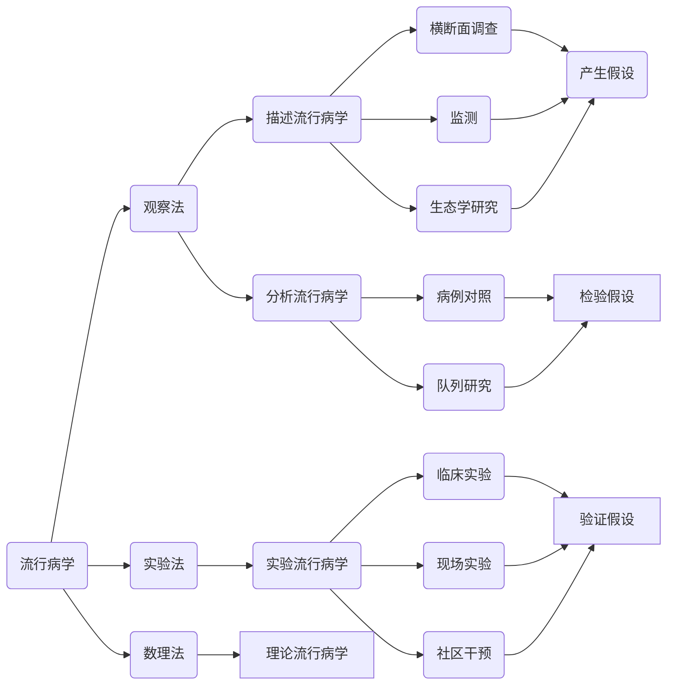
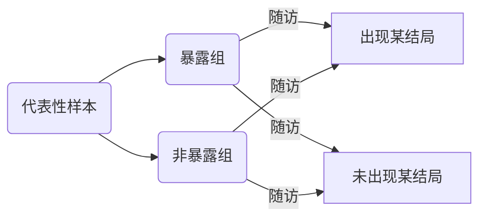

## 队列研究
[课件上](https://sunyatsen-my.sharepoint.cn/:b:/g/personal/mazy25_ms_sysu_edu_cn/EY-7aL8qCmtPvuNOGXBgnT8B4GVFz7dghXztI_UGFBIIkQ?e=EfaYh4)

[课件下](https://sunyatsen-my.sharepoint.cn/:b:/g/personal/mazy25_ms_sysu_edu_cn/EbG3Izx_bSZPu65nrM6u45QBqwCqC2etTnjcvHT0bYMHug?e=buGFy3)
### 课堂要求
掌握
+ 队列研究基本原理与方法
+ 队列研究的设计与资料整理
+ 队列研究中的偏倚与控制

熟悉
+ 队列研究的特点、类型及其实施
+ 队列研究的优缺点

### 基本原理
+ 将研究人群按是否暴露于某可疑因素及其暴露程度分为不同的亚组，即暴露组和非暴露组
+ 追踪一段时间，评估不同亚组之间健康/疾病结局的差异，从而判定暴露因素与结局之间有无因果关联及关联大小。


### *分类*
前瞻性队列研究
+ 优点
>时间顺序增强了病因推断的可信度
> 直接获得暴露与结局资料，真实可信
> 能获得发病率

- 缺点
> 若疾病的诱导期、潜伏期长，则随访观察的时间长，花费大

历史性队列研究
+ 优点
>短期内完成资料的收集和分析
>时间顺序仍是由因到果
>省时、省力、出结果快

- 缺点
>暴露资料和疾病结局资料均为历史记录，真实性较差
>资料积累时未受到研究者的控制，内容上未必符合要求，如常常因不能获得混杂因素的资料而影响资料的分析。
>

双向性队列研究
兼有两者优点，弥补不足

### 方法
```mermaid
graph LR
A(确定研究因素) --> B(确定研究结局) --> C(确定研究现场和研究人群) --> 计算样本量 --> 资料收集 --> 质量控制
 ``` 
研究因素：
- 确定暴露因素（在描述性研究和病例对照研究基础上）
- 可能影响结局的因素（固定不变 时间依赖）
- 因素定义（定性 定量）
- 测量方法（方法）
  >敏感、精确、简单、可靠
 
 结局：
- 预期的结果事件
- 发病、死亡、健康状况和生命质量
- 标准明确、统一

研究现场：
- 研究对象多
- 群众基础好
- 有条件
- 发病率高
- 有代表性

研究人群
- 职业人群
- 特殊暴露人群
- 一般人群
- 团体

对照模式
- 内对照：同队列不暴露或水平低者
- 外对照：暴露人群以外的对照
- 一般人群对照：该地区全人口对照
> 优点：资料易得稳定
> 缺点：资料粗糙
> 注意时间地区相同，总人群暴露比例小
- 多重对照

样本量：
$N={(Z_\alpha\cdot\sqrt{2\bar{P}(1-\bar{P})}+Z_\beta \cdot\sqrt{p_1(1-P_1)+P_0(1-P_0)})^2\over (P_1-P_0)^2}$

$\bar{P}$：两个发病率平均
$P_1$：暴露组预期发病率
$P_0$：对照组预期发病率
$\alpha$：假阳性概率
$1-\beta$：把握度

### 资料整理分析
#### 人时计算
+ 精确法：以个体，日为单位计算暴露人年
+ 近似法：以年为单位，平均人数乘观察年数
+ 寿命表法：进入年人均0.5人年，开始终止年数各0。5年，同一年开始终止者9。25年，开始与终止年份间算1年
#### 率的计算
+ 累计发病率：$$\text{累积发病率} = {\text{观察时间内发病人数} \over \text{观察开始时人数} } 100%$$
报告时注明时间长短
+ 发病密度
$$ID={\text{观察期内发病、死亡人数} \over \text{观察人时数}}$$
适用：时间长、人口不稳定、失访
+ 标化死亡比
$$ SMR={\text{研究人群观察发病、死亡数}\over\text{标准人口预期发病、死亡数}}$$
被研究人群发生某病危险性是标准人群倍数
+ 标化比例死亡比
$$SPMR={\text{实际死亡数}\over\text{预期死亡数}}$$
#### 显著性检验
样本量较大：U检验、K^2^检验
样本较小：直接概率法、二项分布、泊松分布
#### 效应估计
+ 相对危险度$RR={暴露组发病率\over非暴露组发病率}$

RR|关联强度
|:---:|:---:|
0.9-1|无
0.7-0.8|弱
0.4-0.6|中
0.1-0.3|强
0.1|很强
+ 归因危险度$AR=\lvert I_e-I_0 \rvert$
暴露和非暴露人群比较增加的疾病发生数量
+ 归因危险度百分比$AR\% ={\lvert I_e-I_0 \rvert\over I_e}={RR-1\over RR}$
暴露人群中，发病、死亡归因于暴露的部分全部死亡占比
+ 人群归因危险度$I_t-I_0$
+ 人群归因危险度百分比$PAR\% = {I_t-I_0\over I_T}={P_e\cdot RR-1\over P_e\cdot (RR-1)+1}$
+ 剂量反应关系
#### 偏轶
选择偏倚
信息偏倚
混杂偏倚

## 病例对照研究
* 掌握：病例对照研究的概念、原理、应用、类型；选择病例和对照的基本原则和注意事项、匹配与匹配过头的概念
* 熟悉：样本量的计算条件和方法、OR值及可信区间计算、分层分析方法和意义

### 概念
按照有无阳性情况将研究对象分为病例组和对照组，回溯过往比较其暴露情况从而推测疾病与因素之间的关系

### 原理
若病例组暴露比例和对照组暴露比例差异有统计学意义，则认为暴露和疾病之间存在统计学关联

### 目的和用途
+ 广泛探索影响因素
+ 深入检验某个或者某几个病因假说
+ 研究健康状态等事件发生的影响因素
+ 疾病预后因素的研究
+ 临床疗效影响因素的研究

### 应用
管饭探索影响因素；深入检验某个、某几个病因假说；研究影响因素；疾病预后因素研究；临床疗效影响因素研究

### 类型


### 匹配
+ 又称配比，指对照在某些因素或特征上与病例保持一致
+ 匹配过头：将不起混杂作用的因素作为匹配变量进行匹配，不仅增加难度工作量，还丢失重要信息

### 病例基本原则
+ 选择原则：代表性、诊断明确、入选标准
+ 病例类型：
   + 新发病例：回忆清楚，信息可靠，不受生存因素影响；但是花费时间长，费用大
   + 现患病例：时间短费用低；易发生偏差，掺入病例迁移和存活因素
   + 死亡病例：费用低，出结果快；准确性差
### 对照的选择
+ 选择原则：代表性和可比性


---
---

## 实验流行病学
### 要求
+ 掌握：流行病学实验设计要点和评价实验效果的主要指标。
+ 熟悉流行病学实验的基本特点。
+ 了解流行病学实验的概念，主要类型和优缺点。
### 流行病学实验设计
+ 明确研究目的
+ 确定研究设计类型
	+ 临床随机对照
	+ 现场实验
	+ 社区干预实验
+ 选择研究现场
+ 选择对象
+ 随机分组
+ 确定干预措施
+ 确定对照方式
+ 应用盲法
+ 确定结局变量和测量方法
+ 确定观察期限
+ 资料收集
+ 确定统计分析方法
+ 质量控制措施
### 主要指标
+ 有效率=$\text{有效数}\over\text{总数}$
+ 治愈率=$\text{治愈数}\over\text{总数}$
+ N年生存率=$\text{N年存活数}\over\text{随访病例数数}$
+ 保护率=$\text{对照组发病率-实验组发病率}\over\text{对照组发病率}$
+ 效果指数=$\text{对照组发病率}\over\text{实验组发病率}$
+ 抗体阳转率=$\text{抗体阳性人数}\over\text{接种人数}$
+ 卫生经济学
	+ 成本效果分析
	+ 成本效用分析
	+ 成本效益分析
+ 慢性非传染病指标
	+ 人群认知、态度、行为改变
	+ 行为危险因素变化
	+ 生存质量变化


> Written with [StackEdit中文版](https://stackedit.cn/).
<!--stackedit_data:
eyJoaXN0b3J5IjpbLTE4NTMyMzE1NjUsMTQwODk1MTEzLDE4ND
UzMjE0NzcsLTEyMDgwMDk2NjYsLTcyNjYwMjU0MCwtMTMxMTQw
NzY2NiwtMTUwNTk0NTUxLDI3MzExMzY4NSwxNTg5NTczNDU1LD
Q0MzYxMzM4MCwtMTUwNTkzMTk1NywtNTU4MjAwMTIxLC0xMTI4
OTUwNjg4LC0yNTc4Nzg4NTUsMTA5MDcwODU4NywtOTU5NzIwNz
cxLDEzNjk4MzgzMTQsNzQ5OTI1ODM2LDExMTAzMjQ3NjYsODIy
MTQzNDQ4XX0=
-->