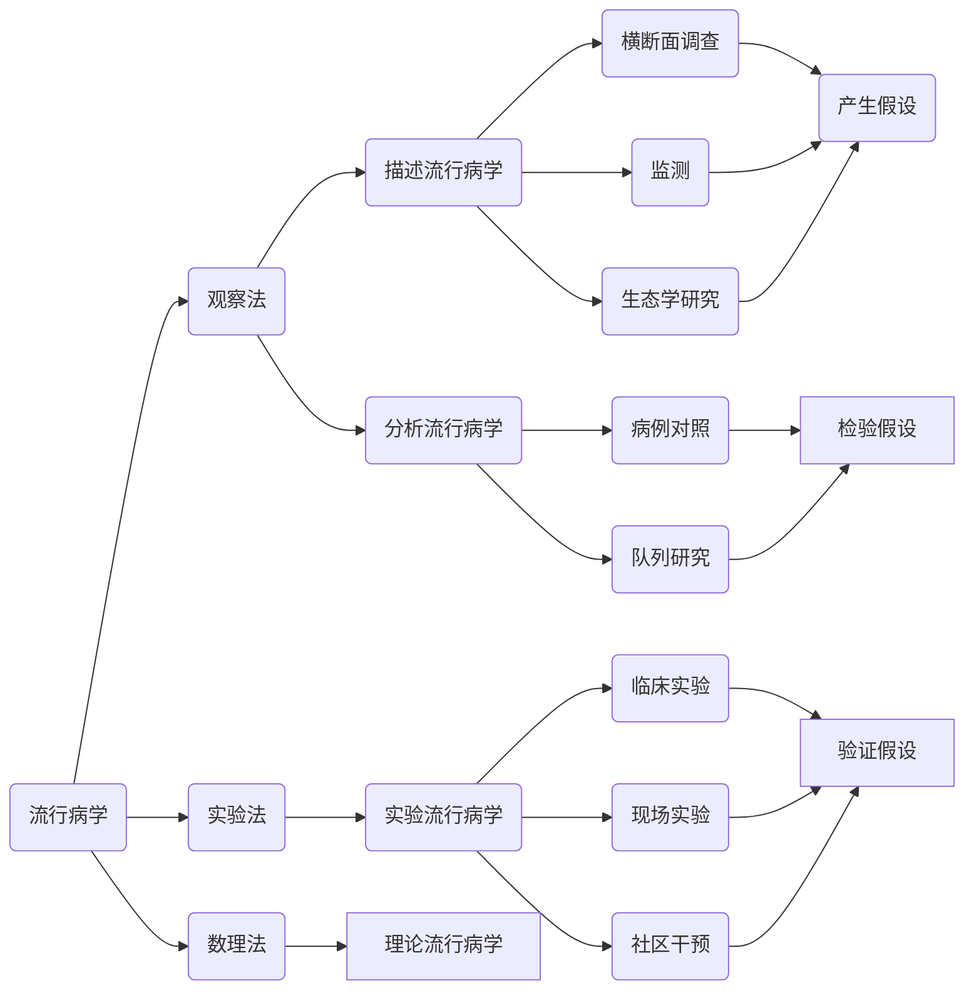
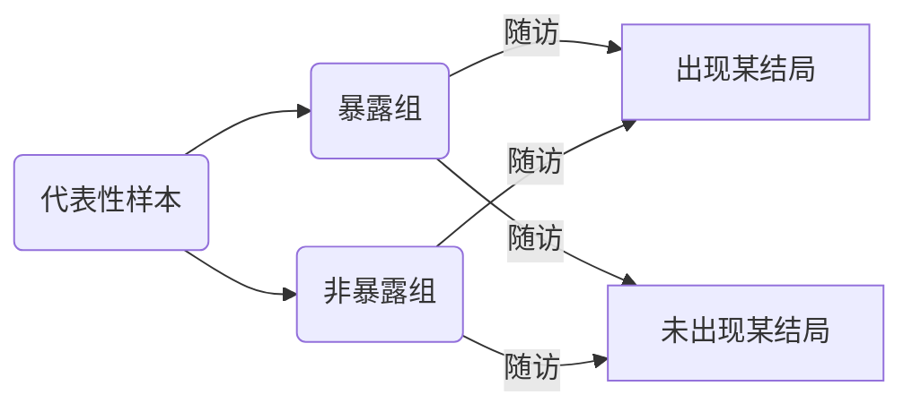

```mermaid
graph LR
A(流行病学) --> B(观察法)
A --> C(实验法)
A --> D(数理法)
B --> E(描述流行病学)
B --> F(分析流行病学)
C --> G(实验流行病学)
D --> 理论流行病学
E --> H(横断面调查)
E --> I(监测)
E --> J(生态学研究)
F --> K(病例对照)
F --> L(队列研究)
G --> M(临床实验)
G --> N(现场实验)
G --> O(社区干预)
H & I & J --> P(产生假设)
K & L --> 检验假设
M & N & O --> 验证假设 
```
## 队列研究
### 课堂要求
掌握
+ 队列研究基本原理与方法
+ 队列研究的设计与资料整理
+ 队列研究中的偏倚与控制
熟悉
+ 队列研究的特点、类型及其实施
+ 队列研究的优缺点

### 基本原理
+ 将研究人群按是否暴露于某可疑因素及其暴露程度分为不同的亚组，即暴露组和非暴露组
+ 追踪一段时间，评估不同亚组之间健康/疾病结局的差异，从而判定暴露因素与结局之间有无因果关联及关联大小。

```mermaid
graph LR
A(代表性样本) --> B(暴露组)
A --> C(非暴露组)
B & C -- 随访 --> 出现某结局
B & C -- 随访 --> 未出现某结局
```
### 方法

```mermaid
graph LR
A(确定研究因素) --> B(确定研究结局)
```
研究因素：
- 确定暴露因素（在描述性研究和病例对照研究基础上）
- 可能影响结局的因素（固定不变 时间依赖）
- 因素定义（定性 定量）
- 测量方法（方法）
  >敏感、精确、简单、可靠
 
 结局：
	- 预期的结果事件
	- 发病、死亡、健康状况和生命质量

> Written with [StackEdit中文版](https://stackedit.cn/).
<!--stackedit_data:
eyJoaXN0b3J5IjpbLTE1MzE0OTE5NzYsMTI3MTY3MjA3OSw0ND
A5MDU2MTldfQ==
-->