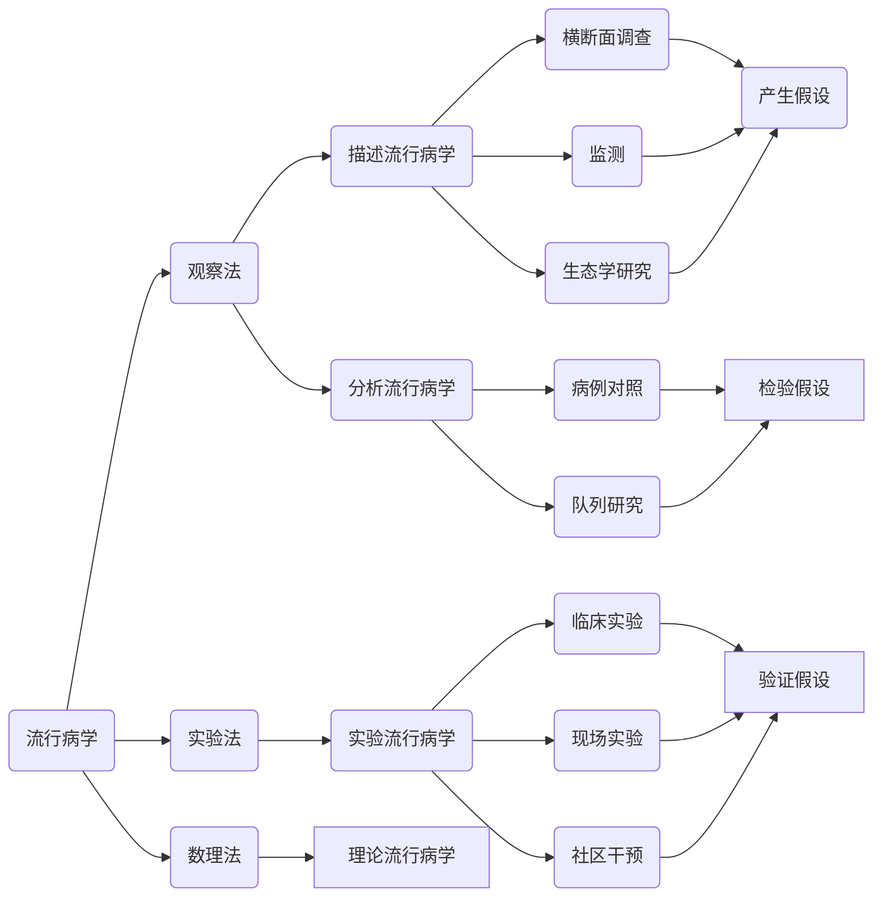
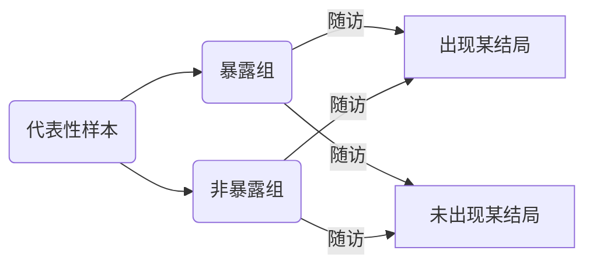

```mermaid
graph LR
A(流行病学) --> B(观察法)
A --> C(实验法)
A --> D(数理法)
B --> E(描述流行病学)
B --> F(分析流行病学)
C --> G(实验流行病学)
D --> 理论流行病学
E --> H(横断面调查)
E --> I(监测)
E --> J(生态学研究)
F --> K(病例对照)
F --> L(队列研究)
G --> M(临床实验)
G --> N(现场实验)
G --> O(社区干预)
H & I & J --> P(产生假设)
K & L --> 检验假设
M & N & O --> 验证假设 
```
## 队列研究
### 课堂要求
掌握
+ 队列研究基本原理与方法
+ 队列研究的设计与资料整理
+ 队列研究中的偏倚与控制

熟悉
+ 队列研究的特点、类型及其实施
+ 队列研究的优缺点

### 基本原理
+ 将研究人群按是否暴露于某可疑因素及其暴露程度分为不同的亚组，即暴露组和非暴露组
+ 追踪一段时间，评估不同亚组之间健康/疾病结局的差异，从而判定暴露因素与结局之间有无因果关联及关联大小。


```mermaid
graph LR
A(代表性样本) --> B(暴露组)
A --> C(非暴露组)
B & C -- 随访 --> 出现某结局
B & C -- 随访 --> 未出现某结局
```
### *分类*
前瞻性队列研究
+ 优点
>时间顺序增强了病因推断的可信度
> 直接获得暴露与结局资料，真实可信
> 能获得发病率

- 缺点
> 若疾病的诱导期、潜伏期长，则随访观察的时间长，花费大

历史性队列研究
+ 优点
>短期内完成资料的收集和分析
>时间顺序仍是由因到果
>省时、省力、出结果快

- 缺点
>暴露资料和疾病结局资料均为历史记录，真实性较差
>资料积累时未受到研究者的控制，内容上未必符合要求，如常常因不能获得混杂因素的资料而影响资料的分析。
>

双向性队列研究
兼有两者优点，弥补不足

### 方法
```mermaid
graph LR
A(确定研究因素) --> B(确定研究结局) --> C(确定研究现场和研究人群) --> 计算样本量 --> 资料收集 --> 质量控制
 ``` 
研究因素：
- 确定暴露因素（在描述性研究和病例对照研究基础上）
- 可能影响结局的因素（固定不变 时间依赖）
- 因素定义（定性 定量）
- 测量方法（方法）
  >敏感、精确、简单、可靠
 
 结局：
- 预期的结果事件
- 发病、死亡、健康状况和生命质量
- 标准明确、统一

研究现场：
- 研究对象多
- 群众基础好
- 有条件
- 发病率高
- 有代表性

研究人群
- 职业人群
- 特殊暴露人群
- 一般人群
- 团体

对照模式
- 内对照：同队列不暴露或水平低者
- 外对照：暴露人群以外的对照
- 一般人群对照：该地区全人口对照
> 优点：资料易得稳定
> 缺点：资料粗糙
> 注意时间地区相同，总人群暴露比例小
- 多重对照

样本量：
$N={(Z_\alpha\cdot\sqrt{2\bar{P}(1-\bar{P})}+Z_\beta \cdot\sqrt{p_1(1-P_1)+P_0(1-P_0)})^2\over (P_1-P_0)^2}$

$\bar{P}$：两个发病率平均
$P_1$：暴露组预期发病率
$P_0$：对照组预期发病率
$\alpha$：假阳性概率
$1-\beta$：把握度

### 资料整理分析
#### 人时计算
+ 精确法：以个体，日为单位计算暴露人年
+ 近似法：以年为单位，平均人数乘观察年数
+ 寿命表法：进入年人均0.5人年，开始终止年数各0。5年，同一年开始终止者9。25年，开始与终止年份间算1年
#### 率的计算
+ 累计发病率：$$\text{累积发病率} = {\text{观察时间内发病人数} \over \text{观察开始时人数} } 100%$$
报告时注明时间长短
+ 发病密度
$$ID={\text{观察期内发病、死亡人数} \over \text{观察人时数}}$$
适用：时间长、人口不稳定、失访
+ 标化死亡比
$$ SMR={\text{研究人群观察发病、死亡数}\over\text{标准人口预期发病、死亡数}}$$
被研究人群发生某病危险性是标准人群倍数
+ 标化比例死亡比
$$SPMR={\text{实际死亡数}\over\text{预期死亡数}}$$
#### 显著性检验
样本量较大：U检验、K^2^检验
样本较小：直接概率法、二项分布、泊松分布
#### 效应估计
+ 相对危险度$RR=$
> Written with [StackEdit中文版](https://stackedit.cn/).
<!--stackedit_data:
eyJoaXN0b3J5IjpbLTM4ODQzNjc5NiwtMTgwMDc0MjQwMiwxMD
IzNjYyNTcyLDM0OTU3NDQyNiwtMTMyMTM3MTE3MCw5NDM0MzU5
MjksMTM0MDQ3MjA2NSwxMTE0Mzk1NTA2LDEyNzE2NzIwNzksND
QwOTA1NjE5XX0=
-->