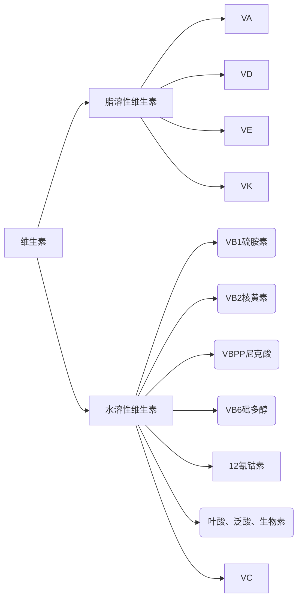

# 讨论课
## 实习1
### 要求
1．掌握职业病的诊断及处理原则
2．掌握职业中毒案例的分析方法
3．熟悉工作场所职业病危害调查与评价的方法
### 职业病诊断
1. 了解职业史
2. 现场卫生学调查
	1. 生产过程
	2. 劳动过程
	3. 生产环境
	4. 既往
3. 临床表现和实验室辅助检查
### 预防治疗原则
三级预防
   1. 病因学预防
   2. 早发现早诊断早治疗
   3. 临床预防：及时治疗
安全第一，预防为主
### 职业病处理
+ 去除有害因素
	+ 防止继续侵入人体
	+ 促进排出
	+ 消灭病因
+ 对症治疗
	+ 特效拮抗治疗
	+ 个体化治疗
	+ 支持治疗
### 中毒案例分析方法

# 理论课
## 职业环境与健康
### 职业病
#### 职业有害因素
#### 职业病特点
1. 特异性：只有接触因素后才可能患病
2. 量效关系
3. 群体性：非散发
4. 无特效治疗方法
5. 可干预
#### 职业性有害因素的损伤
+ 职业病
+ 工作有关疾病
+ 职业性外伤
### 刺激性气体中毒
掌握：刺激性气体中毒的毒理、临床表现、诊断、急救与治疗
刺激性气体（irritant gases）：是指对眼、呼吸道粘膜和皮肤具有刺激作用的一类有害气体，并产生炎症或肺水肿。多具有腐蚀性
#### 毒理
##### 化学角度
酸：从组织中吸出水分、凝固其蛋白质、使细胞坏死
碱：从细胞中吸出水分并皂化脂肪，使细胞发生溶解性坏死
氧化剂：直接或通过自由基氧化，导致细胞膜氧化损伤
##### 生理角度
损害方式——以局部损害为主
病变程度——吸入毒物的浓度、吸收速率和持续作用时间
病变部位和临床表现——毒物的水溶性
##### 物理角度
高水溶性：侵犯眼及上呼吸道，刺激性强，不易致化学性肺水肿。
中水溶性：低浓度时只侵犯眼和上呼吸道，而高浓度时可侵犯全呼吸道。
低水溶性：易进入呼吸道深部，刺激性弱，易致化学性肺水肿。
#### 临床表现
急性刺激作用
中毒性肺水肿
>肺间质及肺泡腔液体过多积聚为特征的病理过程，最终可导致急性呼吸功能衰竭，是最严重的职业危害和职业病

>发生机制
>+ 肺泡壁通透性增加
>+ 肺毛细血管壁通透性增加
>+ 肺毛细血管渗出增加
>+ 肺淋巴循环受阻
>
>分期
>1. 刺激期: 呼吸道炎症或合并有支气管肺炎
>2. 潜伏期（诱导期）: 自觉症状减轻或消失，病情相对稳定，但潜在的肺部病变仍在发展，实属“假象期”，1-24小时。
>3. 肺水肿期：症状突然加剧，剧烈咳嗽、胸闷、烦躁不安、大汗淋漓、咳大量粉红色泡沫样痰，紫绀、低氧血症、肺透光度降低，严重可发展成ARDS。
>4. 恢复期：如无并发症，经正确治疗，肺水 肿可在2～3天内得到控制，7～11天基本恢复。
>

急性呼吸窘迫综合征
>低氧血症为特征的急性呼吸衰竭

慢性健康损害

#### 氯气
##### 毒理
作用于气管、支气管、细支气管，可作用于肺泡。
低浓度时仅侵犯眼和上呼吸道，对局部粘膜有烧灼和刺激作用。
高浓度或接触时间过长，产生的氯化氢和次氯酸，可引起支气管痉挛。严重者可致心跳骤停或喉痉挛，出现电击样死亡。

##### 临床表现和诊断
刺激反应：眼和上呼吸道粘膜刺激症状
轻度中毒：支气管炎和支气管周围炎
中度中毒：支气管肺炎；间质性肺水肿；哮喘样发作
重度中毒：弥漫性肺泡性肺水肿或中央性肺水肿；ARDS；窒息；并发严重气胸、纵隔气肿或严重心肌损害；猝死

诊断原则：根据短期内吸入较大量氯气后迅速发病，结合临床症状、体征、胸部X线表现，参考现场劳动卫生学调查结果，综合分析，排除其他原因引起的呼吸系统疾病，方可诊断。
##### 治疗
+ 立即脱离接触，保持安静及保暖。出现刺激反应者，严密观察至少12 h，并予以对症处理。吸入量较多者应卧床休息，并应用喷雾剂、吸氧；必要时静脉注射糖皮质激素
+ 合理氧疗
+ 应用糖皮质激素
+ 维持呼吸道通畅
+ 预防发生继发性感染
+ 维持血压稳定
+ 中毒患者治愈后，可恢复原工作。中毒后如常有哮喘样发作，应调离刺激性气体作业工作
#### 氮氧化物
##### 毒理
NO：高铁血红蛋白症及中枢神经系统损害
NO~2~→损害肺部终末细支气管和肺泡上皮→肺水肿
##### 临床表现和诊断
急性：可致化学性气管炎、肺炎及化学性肺水肿
恢复后：迟发性阻塞性毛细支气管炎

诊断：根据短期内吸入较大量的氮氧化物的职业史，呼吸系统损害的临床表现和胸部X射线征象，结合血气分析及现场劳动卫生学调查资料，综合分析，并排除其他原因所致的类似疾病，方可诊断。
#### 氨气
##### 毒理
刺激和腐蚀作用
碱化脂肪，使组织蛋白溶解变性，分子小，扩散速度快，能迅速通过细胞渗透到组织内，使病变向深部发展
氨对人体的毒性反应与空气中氨气浓度和接触时间有关

##### 临床表现和诊断
轻者表现为一过性眼和上呼吸道粘膜刺激症状
轻度中毒以气管、支气管损害为主，表现为支气管炎或支气管周围炎，也可引起轻度喉水肿
中度中毒表现为支气管肺炎或间质性肺水肿
重度中毒以肺部严重损害为主，可出现肺泡性肺水肿或急性呼吸窘迫综合征(ARDS)，伴有明显的气胸或纵隔气肿等并发症。可出现中毒性肝、肾损害。
可致角膜及皮肤灼伤

诊断：职业史，以呼吸系统损害为主的临床表现，和胸部X射线影象

##### 治疗与防范
保持呼吸道通畅
早期防治肺水肿
合理氧疗
积极预防控制感染
眼、皮肤灼伤治疗：3%硼酸液或清水冲洗

### 窒息性气体中毒
[课件](https://sunyatsen-my.sharepoint.cn/:p:/g/personal/mazy25_ms_sysu_edu_cn/ETVItaNkhBVImPmXi9OL3osBkeZiDD-24_SPtiFf4tj1BQ?e=h4xyK2)

窒息性气体的概念；一氧化碳中毒的毒理、临床表现和诊断、急救与治疗；氰化氢中毒的毒理、临床表现和诊断、急救与治疗；
#### 概念
被机体吸入后，可使氧的**供给、摄取、运输和利用**发生障碍，使全身组织细胞得不到或不能利用氧，而导致组织细胞缺氧窒息的有害气体的总称
#### CO
##### 毒理
CO与Hb的亲和力比O2大300倍
HbCO的解离速度为HbO2的1/3600倍
CO+肌红蛋白（10-15%），影响O2从毛细血管弥散到细胞内的线粒体，损害线粒体功能
与细胞色素a3发生可逆性结合，阻断电子传递链
#### 临床表现和诊断
- 轻度中毒：头痛、四肢无力、呕吐、意识障碍、 HbCO%>10%
- 中度中毒：口唇樱桃红色、浅至中度昏迷、HbCO%>30%
- 重度中毒：昏迷、脑水肿、休克， HbCO%>50%
- 急性CO中毒迟发性脑病

诊断：
+ CO职业接触史
+ CNS损害症状和体征
+ 血液HbCO检测
+ 现场卫生学调查
+ 排除其他病因后，可诊断

治疗

迅速脱离中毒现场
立即给予吸氧，纠正缺氧
积极防治脑水肿：早期、足量使用激素
+ 高压氧
+ 促进脑细胞代谢：能量合剂
+ 脱水疗法、激素利用(早期、足量)
+ 镇痉、人工冬眠和降温

防止肺部感染等对症支持治疗
防治迟发性脑病，苏醒后休息、观察2周

#### H2S
##### 毒理
为细胞窒息性气体，主经呼吸道进入机体，皮肤少量吸收，体内无蓄积。
进入体内后迅速氧化成硫化物、硫代硫酸盐或硫酸盐，由尿排出。小部分以原形态由呼气排出。
硫化氢具强烈的神经毒性，对粘膜也有刺激作用。
##### 临床表现和诊断
  
##### 治疗
+ 移离现场，对症抢救
+ 吸氧
+ 静脉注射50%的葡萄糖、维生素C和细胞色素C
+ 早期、足量，短时间应用肾上腺皮质激素防治肺水肿和脑水肿
+ 尚无特殊的解毒剂

### 农药中毒
有机磷酸酯类农药中毒的毒理、临床表现、诊断和处理原则
#### 概述
1. 定义：防止控制或消灭*一切***虫草害**的化学物质
2. 用途：杀灭/控制病虫害鼠类和软体动物、调节植物昆虫生长、防腐保鲜。
#### 有机磷酸酯类
##### 毒理
与ACh不可逆结合
##### 临床表现
中间肌无力综合征：肌肉瘫痪
迟发性神经病变：1-5周潜伏期后的肢体远端周围感觉和运动障碍

1. 进展期：下肢感觉运动障碍一周后上肢运动障碍手套样感觉障碍。最后下肢深部腱反射消失
2. 稳定期：3-12个月后感觉障碍逐渐恢复。
3. 缓解期(remissive stage)：6-18个月后运动障碍逐渐恢复。
慢性中毒：主要症状有类神经症、偶有肌束颤动及瞳孔缩小、神经肌电图和脑电图变化、免疫和生殖功能
##### 诊断和处理
急性中毒: 接触史(短时间、大量)、相应的临床表现(自主神经、中枢神经和周围神经)
3,5,7
中毒类型|表现
|:---:|:---:|
轻度中毒| 头痛、头晕、恶心、呕吐、多汗、视力模糊、瞳孔缩小，胆碱脂酶活性 50％－70％
中毒中毒|症状加重、肌束震颤、瞳孔缩小、轻度呼吸困难、流涎、腹痛、腹泻、步态不稳，胆碱脂酶活性 30％－50％
重毒中毒|肺水肿 昏迷 呼吸麻痹 脑水肿之一胆碱脂酶活性一般小于30％
中间肌无力综合征|肌无力为主
迟发性神经病|感觉、运动型周围神经病，神经原性损害

处理：离开有机磷作业，急性3月，慢性惠复1-3月
#### 拟除虫菊酯类
选择型地作用于神经细胞膜的钠离子通道，使去极化后的钠离子通道m闸门关闭延缓，钠通道开放延长，产生一系列兴奋症状。
#### 氨基甲酸酯
与有机磷酸酯类相似，但有可逆性
#### 百草枯

### 物理因素与健康损害
[课件](https://sunyatsen-my.sharepoint.cn/:b:/g/personal/mazy25_ms_sysu_edu_cn/EUEKj9GyJotKjBFTxlxPlaIBxQ3rwLvsUor_r5klc0w8nA?e=klaN7M)
#### 要求
掌握：
高温作业对机体的影响
高温中暑的概念、发病机制与临床表现、中暑治疗
噪声对人体的危害
振动对人体的危害
#### 高温
**湿球黑球温度指数（wet-bulb globe temperature index，WBGT-index)**: 是湿球、黑球和干球温度测定值加权相加的数值，可综合反映温度、湿度、气流和热辐射的影响，单位为℃，可综合评价职业环境微小气候。
**高温作业**：指工作地点
平均WBGT-index≥25℃的作业
##### 影响
1.体温调节－热平衡公式：S＝M-E±R±C1±C2
    S：机体热蓄积变化；M：代谢产热；E：蒸发散热；
    R：辐射获热或散热；C1：对流获热或散热；C2：传导获热或散热
2. 水盐代谢－高温环境中，出汗是机体重要的散热途径，出汗失水（出汗量）、
失盐（尿盐含量）
3. 循环系统－心输出量↑；收缩压↑ ，舒张压稳定，脉压差↑
4. 消化系统－血供↓ ，消化液分泌↓ ，消化酶活性↓ ，蠕动↓
5. 神经系统－运动中枢抑制，肢体准确性、协调性差，反应速度慢
6. 泌尿系统－尿量减少，尿液浓缩，肾负荷加重
热适应:工作一段时间后对热负荷产生的适应性:主要表现为体温调节能力增强；皮肤温度和机体中心温度先后降低；心血管紧张性下降；肾重吸收钠功能增强。
#### 中暑：
##### 发病和表现
高温环境下由于热平衡和(或)水盐代谢紊乱等而引起的一种以中枢神经系统和(或)心血管系统障碍为主要表现的急性热致疾病。
中暑类型|常见高温类型|发病机理|临床表现
:---:|:---:|:---:|:---:
热射病（包括日射病）|干热、湿热|散热受阻，体内热蓄积，体温调节机制紊乱|突然发病，体温40℃以上，出汗->无汗，伴意识障碍
热痉挛（中暑痉挛）|干热|水、电解质失衡，神经肌肉自发性冲动导致|肌痉挛间歇性肌痉挛，腓肠肌为甚，对称性；体温正常，意识清楚
热衰竭（中暑虚脱）|夏季露天作业|机体对过度脱水及电解质丢失的一种反应。其发病与心血管功能失代偿，导致脑部暂时血供减少等有关|短暂性脑缺血发作症状，体温不高或稍高，休息后清醒
##### 治疗
中暑先兆与轻度中暑
迅速离开高温环境，到通风良好的阴凉处安静休息
含盐饮料和对症处理，必要时葡萄糖生理盐水静脉滴注。
十滴水、人丹、藿香正气片
重症中暑
**救治原则：迅速降低过高的体温，纠正水、电解质紊乱和酸碱失衡，积极防治休克和脑水肿**
+ 现场急救：移至阴凉通风处，降温，监测体温，保持呼吸道通畅
+ 物理降温
+ 药物降温
+ 纠正水电解质平衡紊乱
+ 其他对症支持治疗：维生素B、C和钙、钾

噪声对人体的危害：听觉系统损伤、听觉外系统损伤
振动对人体的危害：机械系损伤、各系统反应性疾病、晕动病

## 生活环境与健康
### 环境与人类
[课件](https://sunyatsen-my.sharepoint.cn/:p:/g/personal/mazy25_ms_sysu_edu_cn/ERLSL8mpBH5PpQdO9XPPZqgBvu99qJKUPnAN-tNHD--qew?e=bmynGu)
#### 要求 
掌握：本章基本概念、人与环境的辩证统一关系、环境因素的暴露特征与效应关系、人群健康效应谱、易感人群及影响易感性的因素、环境污染对人群的急慢性危害
熟悉：人类自然环境的构成、人与环境相互作用的生物学基础、生态系统健康、联合作用的模型、环境污染与致癌危害、环境污染与致畸危害、环境暴露与健康效应的测量、环境医学检测方法
了解：生态系统的服务功能、环境立法与管理、环境与健康相关标准
####  基本概念
1. 人类环境：人为主的外部世界，地球表面物质和现象与人发生相互作用的各种自然及社会要素构成的统一体
2. 生态环境：生物及其生存繁衍的自然因素和条件的综合，由生态系统和环境系统组成
3. 生态系统：一定空间范围内，由生物群落及其环境组成，借助于各种功能能流连接的稳态系统，有整体性、开放性、自调控、可持续性
4. 生态系统服务：由自然系统的环境物种生物学状态和生态过程中所生产的物质及其所维持的良好生活环境对人类的服务性能
5. 生态系统健康：具有活力、结构稳定和自调节能力强的生态系统看作健康的生态系统
6. 生物富集：环境中的一些有毒金属和难分解的有机污染物被生物吸收后可在体内蓄积，使其在生物体内浓度大大高于环境
7. 生物放大：环境中某些污染物含量在生物体间沿着食物链逐级增高
#### 人和环境
关系：相互对立，相互制约，相互依存，相互转化
#### 污染物对人体作用
致畸物、致突变物、致癌物
#### 剂量-反应关系
+ 反应：接触一定剂量的有害因素后，表现某生物学效应并达到一定强度个体比例
+ 剂量-反应关系：环境有害因素剂量增加，产生某种特定生物学效应的个体数随之增加的关系
#### 人群健康效应谱
健康效应谱：健康效应无到有，小到大，量变到质变
1. 污染物在体内负荷增加，不引起生理功能生化代谢变化
2. 体内负荷进一步增加，出现生理生化变化，代偿性
3. 生理生化异常变化，病理意义，亚临床状态
4. 机体功能失调，出现症状，疾病
5. 严重中毒，死亡
#### 环境多因素暴露和联合作用
+ 相加作用
+ 独立作用
+ 协同作用
+ 增强作用
+ 拮抗作用
#### 人群易感性
+ 非遗传因素：年龄、健康状态、营养状态、生活习惯、暴露史、心理状态、保护性措施
+ 遗传因素
### 大气
[课件](https://sunyatsen-my.sharepoint.cn/:b:/g/personal/mazy25_ms_sysu_edu_cn/ES0GVSGVf45AkVCq5Dl7PNQBJesbQ1ePFxeh5i_S3cAoog?e=wz1sdU)
#### 要求
+ 掌握大气中常见污染物及其直接健康危害；室内空气污染对人体健康的影响；
+ 熟悉大气污染来源、种类及其卫生防护；大气污染的间接危害
+ 了解大气的结构特征及卫生学意义
#### 常见污染物
+ 一次污染物：直接来源于污染源的污染物，如SO2、H2S、CO、CO2等；
+ 二次污染物：由一次污染物在大气中与其他化学物质发生化学反应、或在太阳辐射线作用下发生光化学反应而形成的新的污染物，如SO3、H2SO4、NO2、醛、酮、过氧乙酰硝酸酯等。危害更大
+ 二氧化硫
  + 眼、呼吸道刺激、形成酸雨
+ 氮氧化物
  + 对呼吸道的影响:深部呼吸道（肺泡）刺激与腐蚀
+ 颗粒物
  + 上呼吸道刺激和腐蚀；细支气管和肺部炎症
+ 光化学烟雾
  + 眼刺激和催泪作用；呼吸道粘膜刺激肺功能损伤；甲醛的致敏作用
+ 多环芳烃
  + 部分多环芳烃具有致癌性
#### 健康危害
1. 急性危害：大气污染短期内急剧增高，周围人群吸入大量污染物可引起急性中毒；
   1. 烟雾事件：是大气污染造成急性中毒的主要类型，包括煤烟型烟雾事件、光化学烟雾事件
      1. 煤烟型烟雾事件：燃煤产生的大量污染物排入大气，在不良气象条件下难以充分扩散所致
      2. 光化学烟雾事件：汽车尾气中的氮氧化物（NOX）和碳氢化合物在太阳紫外线的作用下，发生一系列化学反应而形成的刺激性很强的浅蓝色烟雾，主要为O~3~ 为浅蓝色
   2. 事故性排放急性中毒事件：生产事故造成的急性中毒事件不常发生，但一发生后果严重、危害极大
2. 慢性危害:长期吸入低浓度的污染物引发慢性中毒或诱发感染，引起呼吸道炎症、降低机体免疫力
   1. 影响呼吸系统功能
   2. 降低机体免疫力
   3. 引起变态反应
3. 心血管疾病
4. 肺癌
5. 间接危害
   1. 温室效应
   2. 臭氧层破坏
   3. 酸雨
   4. 大气棕色云团
#### 室内空气污染
+ 种类繁多，效应各异，多表现为慢性、潜在的不良影响
+ 有害因素：包括物理性、化学性、生物性，可综合作用于机体
而产生不良影响

### 水
#### 要求
+ 掌握：水污染主要来源和健康危害、介水病的特点、净化与消毒
+ 熟悉：氯化消毒原理及影响因素、生活饮用水的卫生标准
#### 水污染
+ 污染来源
	+ 工业废水：排放量大、集中易造成严重污染公害事件
	+ 农业污水：长期性和全球性，含化肥
	+ 生活污水：特殊臭味，水体富营养化，医疗废水
+ 危害
	+ 生物污染危害：导致疾病，介水传染病
		+ 藻类毒素污染
	+ 化学性污染
		+ 慢性中毒、远期伤害
			+ 汞：感觉障碍、共济失调、视野缩小、听力障碍、语言障碍、全身瘫痪、精神错乱、死亡
			+ 氰化物
			+ 铬
			+ 氯化消毒副产物
			+ 环境内分泌干扰物
		+ 物理
			+ 放射性
			+ 热污染

#### 介水病
指饮用或接触受病原体污染的水或使用被水污染的食物传播的疾病

特点：
	爆发流行
	分布与供水范围一致
	消毒可控制流行
#### 水的净化与消毒
1. 混凝沉淀
2. 过滤
3. 消毒
	4. 二氧化氯
	5. 臭氧
	6. 紫外线消毒
4. 除藻
### 地质环境与土壤
+ 掌握碘缺乏病、地方氟中毒的流行病特征、诊断、鉴别及防治措施；土壤污染的健康危害
+ 熟悉土壤污染物的来源及卫生防护；地方砷中毒、大骨节病及克山病（自学）的流行特征及诊断
+ 了解地质环境与土壤的特征及卫生学意义
#### 碘缺乏病
##### 流行病学
+  地区分布：世界分布最广泛、危害人数最多的一种地方病
	+ 世界：110国家、受碘缺乏威胁的人口达22亿
	+ 中国：碘缺乏最严重国家之一
	+ 主要分布：东北兴安岭、燕山山脉、秦岭、云贵高原、十万大山
+ 人群分布
	+ 0-2岁婴儿、幼儿、儿童、孕妇、哺乳期妇女
	+ 女12-18，男9-15
	+ 女>男
+ 病区判定
	+ 水碘U10μg?L
	+ 尿碘：8～10岁儿童尿碘中位数小于100μg/L，且小于50μg /L的样品数占20%以上
	+ 甲状腺肿大率：8～10岁儿童的甲状腺肿大率大于5% （
##### 诊断
+ 地方性甲状腺肿
	+ 居住在缺碘地区
	+ 经触诊或B超检查甲状腺肿大，或即使不肿大但有结节者
	+ 排除甲状腺功能亢进、甲状腺炎、甲状腺癌等其他甲状腺疾病
+ 地方性克汀病
	+ 居住在缺碘地区
	+ 经触诊或B超检查甲状腺肿大，或即使不肿大但有结节者
	+ 排除甲状腺功能亢进、甲状腺炎、甲状腺癌等其他甲状腺疾病
	+ 辅助条件：
		+ 神经系统有不同程度的听力、语言、运动功能障碍。
		+ 甲状腺功能低下，有不同程度的身体发育障碍；
		+ 甲状腺功能低下及克汀病面容
##### 鉴别诊断：
应与先天愚型、大脑性瘫痪、劳蒙华氏综合征、苯丙酮尿症、垂体性侏儒和佝偻病相鉴别
##### 防治措施
+ 补碘是防治碘缺乏病的根本措施
+ 预防碘中毒
	+ 用碘盐和碘油应适量，若用量过多，可引发碘中毒和高碘性甲状腺肿
	+ 急性碘中毒：可发生在接受碘化物的当时或几小时之后，主要表现为恶心、呕吐、流涎、腹泻等消化道症状
	+ 慢性碘中毒：主要表现为口腔有碘味、烧灼感，唾液腺肿胀，分泌物增多，皮肤表现为粉刺样损害或疱状疹及胃肠刺激症状等
	+ 在高碘地区应供应无碘盐
#### 地方性氟中毒
##### 流行特点
+ 在世界各地区均有发生。我国是地氟病发病最广、波及人口最多和病情最重的国家之一，除上海以外，全国所有省市均有地氟病病区
	+ 饮水型：病区分布最广
		+ 饮水中氟含量高于国家饮用水标准（1.0mg/L),最高甚至可达17mg/L
	+ 燃煤污染型：高氟煤的燃烧，我国西南地区最重。
		+ 暴露方式：室内空气和食品严重污染而引起氟中毒
	+ 饮茶型：西藏、四川、内蒙、甘肃、宁夏、青海和新疆等省（区）少数民族居住的地区
		+ 红茶、绿茶及花茶平均氟含量：125mg/kg;
		+ 砖茶：可高达493mg/kg，最高1175mg/kg
##### 诊断
+ 氟斑牙：高氟暴露环境，牙齿出现白垩、着色、缺损，排除其他原因引起的牙齿改变
+ 氟骨症：
	+ 有长期饮高氟水或食用氟污染的食物或吸入被氟污染空气或饮用高氟砖茶的经历
	+ 有氟斑牙（成年后迁入病区者可无氟斑牙），同时伴有骨关节痛，肢体或躯干运动障碍及变形者
	+ 骨及骨周软组织具有氟骨症X线表现
	+ 尿氟含量超过正常值，可作为参考
##### 治疗
+ 治疗原则：减少或降低氟的摄入量，改善营养状况以及支持和对症等综
+ 合疗法
	+ 控制和减少氟摄入量
	+ 合理调整饮食和推广平衡膳食
	+ 药物治疗
		+ 氟斑牙可采用涂膜覆盖法、药物（过氧化氢或稀盐酸等）脱色法、修复法等治疗
	+ 椎板切除减压、矫形手术
## 第四章 食物与健康
掌握：营养素的生理需要量与供给量；中国居民膳食营养素参考摄入量的内容和意义；氮平衡的概念、食物蛋白质营养学评价方法、蛋白质来源；必需脂肪酸的概念、必需脂肪酸和胆固醇的主要食物来源；碳水化合物分类，膳食纤维定义、生理功能及食物来源；三大产热营养素的产热系数、人体能量消耗的几个方面。钙、铁、碘、锌缺乏与过量的表现、食物来源，影响膳食中钙、铁、锌吸收利用的膳食因素，铁、锌缺乏的原因；维生素的分类和特性，脂溶性维生素和水溶性维生素的区别，维生素A、维生素D、维生素B1、维生素B2、维生素 C、尼克酸缺乏的临表现和食物来源；合理营养、合理营养要求；膳食指南与平衡膳食宝塔；营养相关疾病；临床营养。
### 各大营养素生理需要量和供给量
+ 蛋白质：0.8g/(kg·d)，我国1.16，占能量10%-14%，产热系数4
+ 脂肪：20-30%，必须脂肪酸不少于3%，产热系数9
+ 碳水：50-65%，膳食纤维：25-30g/d
### 蛋白质
来源：动物类、植物类...
我国主要来源：粮谷类
#### 蛋白质营养学评价方法
+ 氨基酸模式：蛋白质中各种必须氨基酸的构成比
	+ 色氨酸为1，其他氨基酸与其相比的比值，与人越接近，蛋白质生物学价值越高
+ 蛋白质含量：评价蛋白质营养价值基础；食物含氮量X6.25 大豆>肉>谷
+ 蛋白质消化率：蛋白质可被消化酶分解的程度，表明蛋白质被吸收利用的程度
+ 蛋白质利用率：
	+ 生物学价值：${\text{潴留氮}\over\text{吸收氮}}*100\%$，吸收氮=摄入氮-（粪氮-粪内源氮），潴留氮=吸收氮-（尿氮-尿内源氮）
	+ 净利用率
	+ 功效比值
	+ 氨基酸评分
### 脂肪酸
+ 必须脂肪酸：人体必不可少又不能自身合成，必须靠食物供给的脂肪酸：亚油酸、$\alpha$-亚麻酸
+ 来源：动物脂肪组织、肉、植物种子
	+ 亚油酸：植物油
	+ 亚麻酸：豆油、紫苏籽油
	+ EPA、DHA：鱼、贝类
	+ 磷脂：蛋黄、肝脏、大豆、花生...
	+ 胆固醇：动物脑肝肾、肉蛋奶、坚果种子
### 碳水
分类：糖、寡糖、多糖
#### 膳食纤维
+ 食物中不能被人体消化酶分解且不能被人类小肠吸收的非淀粉多糖和木质素
+ 生理功能
	+ 通便防癌
	+ 降胆固醇
	+ 降血糖
	+ 清除有害物质

### 维生素

+ 特点：
	+ 存在于天然食物中，人不能合成
	+ 需要量低，但在体内代谢中有十分重要的作用
	+ 不是主要原料，不是能量来源
#### 维生素区别
+ 脂溶性
	+ 溶于脂肪有机溶剂，与脂类并存
	+ 吸收和脂类相关
	+ 存储于肝脏，可能中毒，缓慢缺乏
+ 水溶性
	+ 溶于水，不溶于有机物
	+ 满足需要后尿排出
	+ 缺乏快
	+ 毒性小
	+ 易破坏
#### 维生素
+ VA
	+ 夜盲
	+ 干眼症
	+ 眼结膜毕脱斑
	+ 上皮干燥、糙皮病
	+ 味嗅觉食欲下降、免疫低下
	+ 来源：动物肝脏、鱼肝油、胡萝卜等
+ VD
	+ 佝偻病、骨质软化症、骨质疏松、痉挛
	+ 鱼肝油、海鱼、肝、蛋
+ 维生素B1：硫胺素，TPP
	+ 辅酶功能：$\alpha$-酮酸的氧化脱羧、磷酸戊糖途径转酮醇反应
	+ 非辅酶功能：抑制胆碱酯酶
	+ 缺乏：
		+ 脚气病：
			+ 干性脚气病：肢端麻木
			+ 湿性脚气病：循环系统症状
			+ 婴儿脚气病：心血管症状
		+ 供给量：男1.4mg/d，女1.2mg/d，孕期+0.2，孕晚期+0..3
		+ 食物：瘦肉内脏、豆类
+ 维生素B2：核黄素
	+ 参与生物氧化能量代谢
	+ 参与B6和烟酸代谢
	+ 参与抗氧化防御系统和药物代谢
	+ 缺乏：眼口皮肤炎症
	+ 来源：广泛存在
	+ 摄入量：同1
+ 叶酸
	+ 巨幼贫、神经管畸形、同型高半胱氨酸血症
	+ 分布广泛、肝脏、肾脏、蛋、豆、小麦胚芽
+ VB6
+ 口舌炎症、唇干裂、棉衣受损、精神受损、高半胱氨酸血症
+ 白肉、肝脏、豆类、蛋
### 矿物质

## 特殊人群营养
### 要求
掌握：妊娠合理膳食原则、乳母合理膳食原则、母乳喂养优点、婴儿食品添加原则、幼儿合理膳食原则、老年人合理膳食原则
### 妊娠合理膳食原则
随着妊娠期妇女的生理变化和胎儿生长发育状况合理调配

1. 孕前膳食：叶酸400μg/d或者摄入富含叶酸食物；补铁；补碘
2. 孕早期：和孕前差别不大，清淡易消化，少吃多餐，服用叶酸和VB12
3. 孕中晚期：多样平衡，膳食纤维、易消化，限盐

> Written with [StackEdit中文版](https://stackedit.cn/).
<!--stackedit_data:
eyJoaXN0b3J5IjpbLTI1ODIxMjkyMiw2NDc1NjAxNzAsMjMwMj
IxNjgxLDEzOTM5MzY1MTcsLTE5MDcxNzQ1OTEsLTIwNzkzODA1
NDIsMTA2NTI4OTQ4NiwtMTAwMjI4ODg0MiwtMTk2MzE3MzA1OC
wxNzkzNjI4MTgsLTE1NjIyNTg1MjcsLTc2MzQwMDAxLC01OTEy
MjMzODAsMTEwNzI4MjM1NiwtMjAxMDE0NTc3OCwtMTYwMTU3MT
U4NCwzMzIxMTU2MzYsNTU3OTg4MjAsODA3NDE5NzgzLDIwNjk5
MzYxMDddfQ==
-->