# 总论
## 女性生殖系统生理
### 要求
+ 牢固掌握：
  1. 月经的临床表现。
  2. 卵巢的功能及周期性变化。
  3. 下丘脑，垂体，卵巢的生理功能及内分泌调节轴
+ 一般掌握：
  + 月经周期生殖器的周期性变化。
### 概念
1. 始基卵泡：初级卵母细胞被单层梭形前颗粒细胞围绕而形成*卵细胞储备唯一形式*
2. 初级卵泡：黏多糖在卵子周围形成透明带
3. 次级卵泡：颗粒细胞内出现 FSH、雌激素和雄激素三种受体；卵泡内膜细胞出现LH受体，合成甾体激素
4. 窦卵泡：卵泡液增多，形成卵泡腔；颗粒细胞内出现LH受体和PRL受体
5. 排卵前卵泡：卵泡向卵巢表面突出，直径18-23mm

### 卵巢功能
#### 分泌功能

-|雌激素|孕激素
|---|---|---|
子宫平滑肌|肥大**增生**，收缩|**松弛**
内膜|**增生**|**分泌**
宫颈|松弛，**分泌增加**，变稀|闭合，**分泌减少**，变稠
输卵管|**加强**收缩|**抑制**收缩
阴道上皮|增生角化**变厚**|细胞**脱落**
乳腺|**腺管**增生|**腺泡**发育
卵泡发育|卵泡发育
下丘脑|**正负**反馈|**负**反馈
水钠潴留|**促进**|**减少**
代谢影响|骨代谢，脂代谢|温度升高

#### 卵巢的周期变化

+ 雌激素：排卵前高峰；排卵后7～8日高峰
+ 孕激素：排卵后7～8日高峰
+ 排卵：下次月经来潮前14日左右


#### 子宫的周期变化


+ 增殖期
  + 早期：5-7日
  + 中期：8-10日
    + 内膜腺体数增多、伸长并稍有弯曲
    + 腺上皮细胞增生活跃
    + 间质水肿
    + **螺旋小动脉逐渐发育管壁变厚**
  + 晚期：11-14日
    + 内膜进一步增厚 ，腺体弯曲状
    + 腺上皮增殖为假复层上皮
    + 组织内水肿明显，小动脉增生，管腔增大，呈弯曲状
+ 分泌期
  + 早期：15-19日
    + 腺上皮细胞开始出现含糖原的核下空泡，为该期的组织学特征
  + 中期：20-23日
    + 顶浆分泌
  + 晚期：24-28日
    + 的间质分化为蜕膜样细胞和内膜颗粒细胞
  + 月经期：1-4日
    + 孕酮和雌激素撤退结果
# 产科
## 妊娠生理
### 要求
+ 牢固掌握：胎儿附属物的形成过程，胎盘及羊水的功能；妊娠期母体生理变化
+ 一般了解：受精、受精卵发育、输送及着床过程；胎儿发育及生理特点

### 胎儿附属物
1. 胎盘：羊膜+叶状绒毛膜+底蜕膜
   1. 正常参数
      1. 60-80胎儿叶、200个胎儿小叶、20个母体叶
      2. 450-650g
      3. 16-20cmx1-3cm
   2. 胎盘功能
      1. 物质交换
      2. 合成激素、hCG、hPL、细胞因子、生长因子
      3. 防御功能
      4. 免疫功能
2. 胎膜：外层平滑绒毛膜+内层羊膜
   1. 功能
      1. 转运、维持羊水平衡
      2. 分泌血管活性肽、生长因子细胞因子、调节血管张力
      3. 发动分娩
3. 脐带
   1. 参数
      1. 长30-100cm（avg55cm）
      2. 直径0.8-2.0cm
4. 羊水：保护母体和胎儿
   1. 来源
      1. 早期：母体
      2. 中期：胎尿
      3. 晚期：胎肺
      4. 羊膜脐带皮肤
   2. 去路
      1. 胎膜50%
      2. 吞咽
      3. 脐带
      4. 皮肤
### 母体变化
+ 子宫
  + 体积增大：35x25x22
  + 血容量增加
  + 收缩：9周起出现不规律、无痛性
  + 子宫内膜
    + 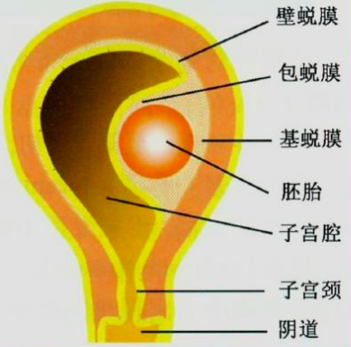
  + 子宫下段形成
+ 循环系统
  + 心脏
    + 向左、上、前方移位
    + 心尖区I—II级收缩期杂音、第一心音分裂、第三杂音
    + 电轴左偏
    + 容量增加10%
    + 心率增加10-15次/分
  + 血压
    + 收缩压无变化，舒张压轻度↓
    + 仰卧位低血压综合征Supine hypotensive syndrome：仰卧位低血压综合征是指**妊娠晚期孕妇**仰卧位时，出现头晕、恶心、呕吐、胸闷、面色苍白、出冷汗、心跳加快及不同程度血压下降，当转为侧卧位后，上述症状即减轻或消失的一组综合征。
  + 血液
    + 6-8周起血容量增加40-50%

### 生理正常值

项目|值
---|---
WBC|11.3×10<sup>9</sup>/L
N|97.8%
RBC|3.43×10<sup>12</sup>/L
HGB血红蛋白|108g/L
HCT红细胞比容|32.2%

## 妊娠诊断
### 要求
牢固掌握：早、中、晚期妊娠的诊断；胎姿势、胎产式、胎先露、胎方位的定义及种类 
### 概念
+ **黑加征(Hegar’s sign)**: 妊娠6－7周，双合诊感宫颈峡部极软，宫颈与宫体似不相连。
+ **胎姿势（fetal attitude)**：胎儿在子宫内的姿势
+ **胎产式(Fetal lie)**：胎儿身体纵轴与母体纵轴的关系。
+ **胎先露（fetal presentation）**： 最先进入骨盆入口的胎儿部分
+ **胎方位（fetal position）**：胎儿先露部指示点与母体骨盆的关系
### 早期妊娠诊断
> 早孕，单胎/多胎
+ 病史
  + 停经
  + 早孕反应
  + 尿频
  + 子宫不适、腹胀便秘
+ 体征
  + 乳房变大
  + 阴道宫颈充血着色（紫蓝色）            
  + 黑加征(Hegar’s sign): 妊娠6－7周，双合诊感宫颈峡部极软，宫颈与宫体似不相连。
  + 子宫增大，变软
  + 雌激素增多的表现
+ 辅助检查
  + HCG
  + B超
  + 体温升高

### 中、晚期妊娠诊断
> 中期妊娠：妊娠X周 ，单胎/多胎
> 
> 晚期妊娠：G1P0(G：怀孕史，P：分娩史)，宫内妊娠 X周，LOA，单活胎
+ 病史
  + 早期妊娠
  + 腹部增大
  + 胎动：20周出现，3-5次/h
+ 体征
  + 子宫增大
  + 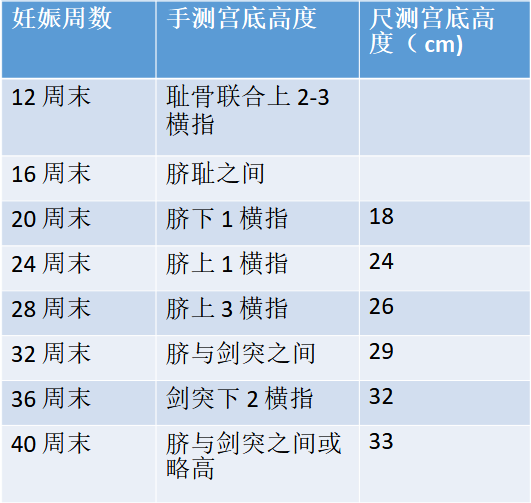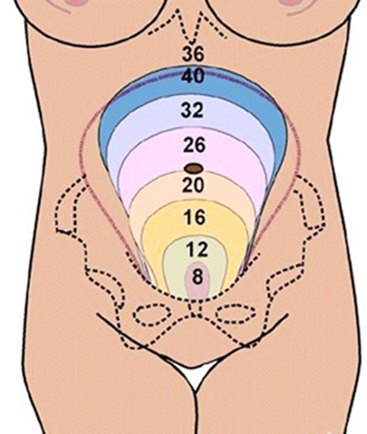
  + 胎动
  + 胎体
    + 20周 经腹能触到
    + 24周 能区分胎头，胎肢
    + 四部触诊法 检查胎儿宫内位置
  + 胎心

### 胎姿势、胎产式、胎先露、胎方位
+ 胎产式：纵产式、横产式及斜产式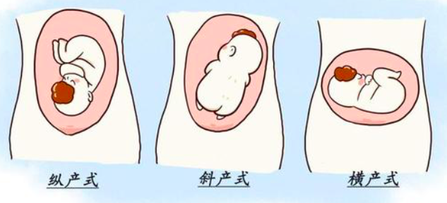
+ 胎先露：头先露、臀先露、肩先露、复合先露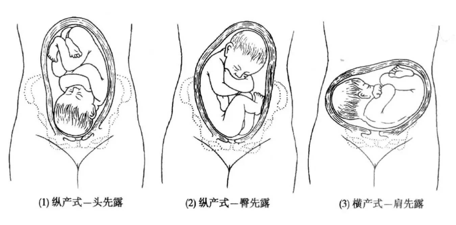
+ 胎方位：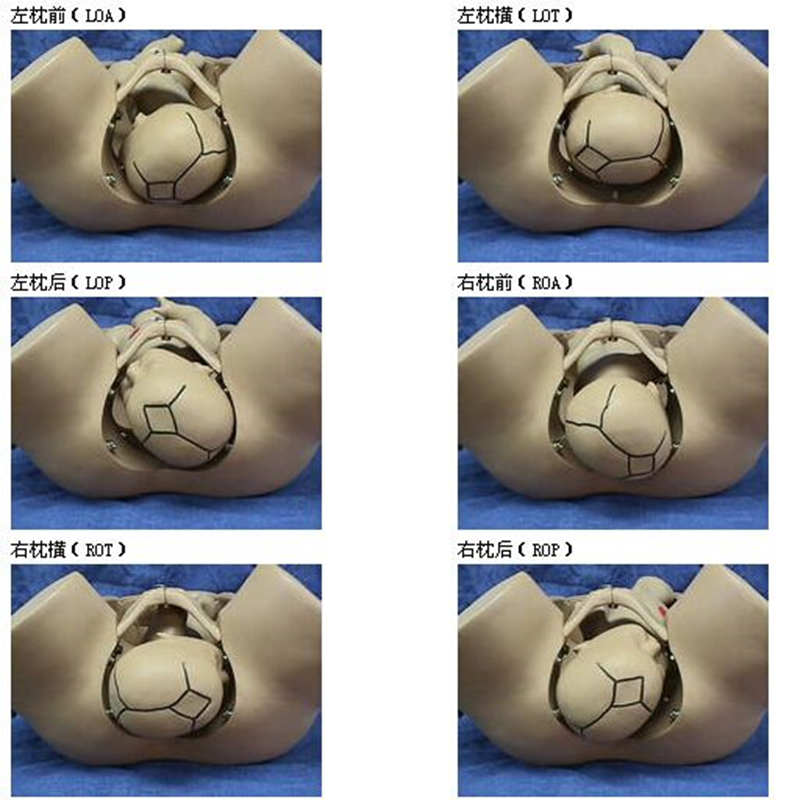

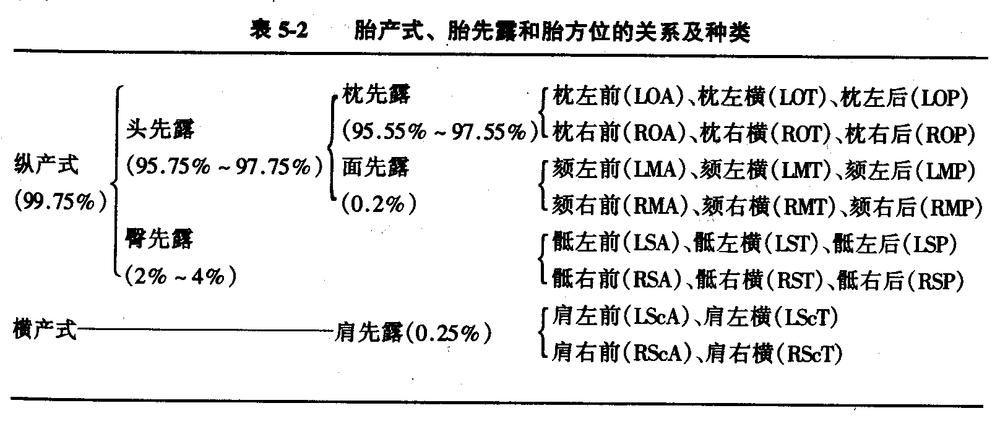
## 妊娠合并糖尿病
牢固掌握妊娠期糖尿病的诊断及处理
### 妊娠期糖尿病
+ 妊娠期存在的不同程度的糖代谢异常
#### 诊断
+ 孕前糖尿病(PGDM)的诊断
  + 妊娠前已确诊为糖尿病的患者
  + 妊娠前未进行过血糖检查的孕妇，尤其存在糖尿病高危因素者,如肥胖(尤其重度肥胖)、一级亲属患II型糖尿病、GDM史或大于胎龄儿分娩史、多囊卵巢综合征患者及妊娠早期空腹尿糖反复阳性，首次产前检查时应明确是否存在妊娠前糖尿病，达到以下任何一项标准应诊断为PGDM
    + 空腹血糖≥7. 0mmol/L
    + 75g口服葡萄糖耐量试验服糖后2小时血糖≥11.1mmol/L伴有典型的高血糖或高血糖危象症状，同时任意血糖≥11.1mmol/L 
    + 糖化血红蛋白≥6. 5%
+ 妊娠期糖尿病(GDM)的诊断
  + 对所有尚未被诊断为PGDM的孕妇，在妊娠24〜28周行75gOGTT
  + <table><caption><b>75g葡萄糖粉耐量试验</b></caption><tr><th>空腹</th><th>5.1 mmol/L</th></tr><tr><th>1h</th><th>10.0mmol/L</th></tr><tr><th>2h</th><th>8.5 mmol/L</th></tr></table>

+ 孕妇具有GDM高危因素或者医疗资源缺乏地区，建议妊娠24-28周首先检查空腹血糖检测，如≥5.1mmol/L,可以直接诊断为GDM,不必行75g 0GTT

#### 分类
<i>

+ A级:妊娠期诊断的糖尿病
  + A1级:经控制饮食，空腹血糖＜5.3mmol/L,餐后2小时血糖＜6.7mmol/L
  + A2级:经控制饮食，空腹血糖≥ 5.3mmol/L,餐后2小时血糖≥ 6.7mmol/L
+ B级:显性糖尿病,20岁以后发病，病程<10年
+ G级:发病年龄10-19岁，或病程达10〜19年
+ D级：10岁前发病,或病程≥ 20年，或合并单纯性视网膜病
+ F级:糖尿病性肾病
+ R级:眼底有增生性视网膜病变或玻璃体积血
+ H级:冠状动脉粥样硬化性心脏病
+ T级:有肾移植史

</i>

#### 处理
+ 血糖监测
  + 空腹和餐后2h血糖
  + 睡前、夜间
  + 低血糖时
  + 运动前后
+ 饮食
  + 目标
    + 满足孕妇及胎儿能量的需要
    + 严格限制碳水化合物的摄入
    + 维持血糖在正常值范围
    + 不发生饥饿性酮症
    + <table border="1" align="center" width="100%" cellpadding="20" cellspacing="0"><tr><th></th><th>GDM</th><th>PGDM</th></tr><tr><th>空腹</th><th>3.3-5.3mmol/L</th><th>3.3-5.6mmol/L</th></tr><tr><th>餐后1小时</th><th colspan="2">4.4-7.8mmol/L</th></tr><tr><th>餐后2小时</th><th>4.4-6.7mmol/L</th><th>5.6-7.1mmol/L</th></tr><tr><th>夜间</th><th  colspan="2">3.3-6.7mmol/L</th></tr><tr><th>HbA1C</th><th><5.5%</th><th><6%</th></tr></table>
  + 方案
    + |每日总热量|30-35kcal/kg/|
      |---|---|
      |碳水化合物|50~60%|
      |蛋白质|15~20%|
      |脂肪|25~30%|

+ 运动
  + 运动疗法可降低妊娠期基础胰岛素抵抗，每餐30分钟后进行中等强度的运动对母儿无不良影响

+ 药物
  + 胰岛素
    + 适应症
      + 饮食控制及运动疗法未能使血糖达标
      + 饮食控制后出现饥饿性酮症 、增加热量摄入后血糖又超标
      + GDM患者治疗较晚，如孕32周，胎儿已属于大于胎龄儿
    + 原则
      + 有适应症者及早使用
      + 尽可能模拟生理状态
      + 在饮食治疗的基础上
      + 稳定运动量
      + 剂量个体化
+ 终止妊娠
  + 时机:39周

## 妊娠期高血压

妊娠和高血压并存

### 要求
+ 掌握妊娠期高血压疾病的分类及临床表现、诊断、鉴别诊断、处理原则。
### *分类*
+ 妊娠期高血压
+ 子痫前期
+ 子痫

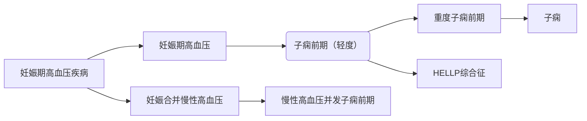

### 临床表现
+ 妊娠期高血压
  + 20w后出现
  + 高血压
  + 产后12周内恢复
  + 尿蛋白-
+ 子痫前期：早发型、晚发型
  + 妊娠20周后出现
  + 高血压
  + 尿蛋白>=0.3g/24h或随机尿蛋白+
+ 重度子痫前期**II级高血压，血小板减少，肝肾中枢损害**
  + 收缩压≥160mmHg，或舒张压≥ 110mmHg（卧床休息，两次测量间隔至少4小时）
  + 血小板减少（血小板＜100x109/L）
  + 肝功能损害（血清转氨酶水平为正常值2倍以上），严重持续性右上腹或上腹疼痛
  + 肾功能损害（血肌酐≥ 1.1mg/dl或肌酐浓度为正常值2倍以上）
  + 肺水肿
  + 新发生的中枢神经系统异常或视觉障碍
+ 子痫
  + 子痫前期基础上发生的不能用其他原因解释的抽搐
  + ```mermaid
    graph LR
    a("抽搐、面部充血、口吐白沫、深昏迷") --> 深部肌肉僵硬 --> b("典型的全身高张阵挛惊厥、有节律的肌肉收缩和紧张，持续约1〜1.5分钟，其间患者无呼吸动作") --> c("此后抽搐停止，呼吸恢复") --> d("但患者仍昏迷，最后意识恢复，但易激惹、烦躁")
    ```

### 诊断

+ 病史
  + 询问妊娠前有无高血压、肾病、糖尿病、系统性红斑狼疮、血栓性疾病等病史
  + 有无妊娠期高血压疾病家族史
  + 此次妊娠后高血压、蛋白尿、头痛、视力模糊、上腹疼痛、少尿、抽搐等症状出现的时间和严重程度
+ 高血压
+ 尿蛋白
+ 辅助检查
### 子痫前期治疗
+ 评估和监测
+ 一般处理
  + 妊娠期高血压和子痫前期患者可门诊治疗，重度子痫前期患者应住院治疗
  + 注意适当休息，保证充足的蛋白质和热量，不建议限制食盐摄入
  + 保证充足睡眠，必要时可睡前口服地西泮2.5-5mg
+ 降压
  + |收缩压|舒张压|降压治疗|
    |---|---|---|
    |≥ 160mmHg|≥110mmHg|必须|
    |≥ 15OmmHg|≥100mmHg|建议|
    |140-150mmHg|90-100mmHg|不建议|
  + 妊娠前已用降压药治疗的孕妇应继续降压治疗
  + 目标
    + 未并发脏器功能损伤者，收缩压应控制在130-155mmHg,舒张压应控制在80-105mmHg
    + 并发脏器功能损伤者，则收缩压应控制在130-139mmHg,舒张压应控制在80-89mmHg
    + 降压过程力求下降平稳，不可波动过大
    + 血压不建议低于 130/80mmHg
  + 不推荐使用阿替洛尔和哌唑嗪、禁止使用血管紧张素转换酶抑制剂(ACEI)和血管紧张素II受体拮抗剂(ARB)
+ 解痉：硫酸镁
+ 镇静
+ 利尿：仅在患者全身水肿、肺水肿、脑水肿等时
+ 促胎肺成熟
+ 分娩

### 子痫治疗
+ 一般急诊处理
  + *子痫发作时需保持气道通畅，维持呼吸、循环功能稳定,密切观察生命体征， 留置导尿管监测尿量等。避免声、光等刺激。预防坠地外伤、唇舌咬伤*
+ 控制抽搐
  + *硫酸镁是治疗子痫及预防复发的首选药物。当患者存在硫酸镁应用禁忌或硫酸镁治疗无效时，可考虑应用地西泮、苯妥英钠或冬眠合剂控制抽搐。子痫患者产后需继续应用硫酸镁 24〜48小时*
+ 降低颅压 
  + *可以20%甘露醇250ml快速静脉滴注降低颅压*
+ 控制血压 
  + *脑血管意外是子痫患者死亡的最常见原因。当收缩压持续≥160mmHg,舒张压 ≥110mmHg时要积极降压以预防脑血管并发症*
+ 纠正缺氧和酸中毒 
  + *面罩和气囊吸氧,根据动脉血气pH、二氧化碳分压、碳酸氢根浓度等，给予适量4%碳酸氢钠纠正酸中毒*
+ 终止妊娠
## 妊娠合并内外科疾病
### 心脏病
要求：掌握
+ 心脏功能分级，心力衰竭的早期诊断
+ 心脏病在妊娠期、分娩期、产褥期的管理，妊娠合并心力衰竭的处理
#### 心功能分级
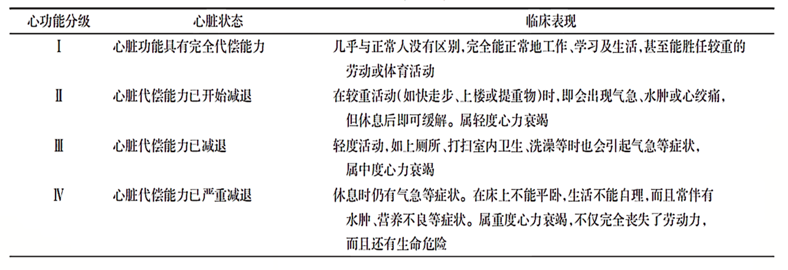
#### 心脏病的妊娠风险评估
+ 不宜妊娠
  + 心脏病变**复杂或较重**
  + 心功能**III〜IV级**、有极高孕产妇死亡和严重母儿并发症风险者。
  + 心脏病WHO妊娠风险分级**IV～V级者**，要求其终止妊娠。
  + 年龄在35岁以上，心脏病病程较长者，发生心力衰竭的可能性极大,对于有可能行矫治手术的心脏病患者，应建议在孕前行心脏手术治疗，术后再由心脏科、产科医师共同行妊娠风险评估，患者在充分了解病情及妊娠风险的情况下再妊娠。
#### 孕期监测
+ 母体
  + 孕早期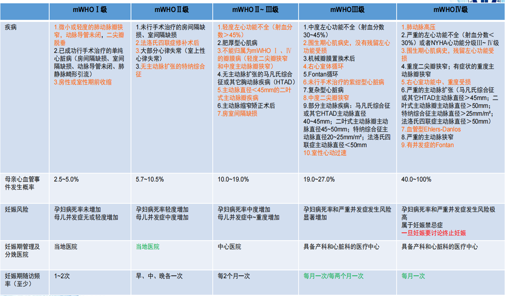
  + 围分娩期：终止妊娠
    + 心脏病妊娠风险低且心功能I级者可以妊娠至足月，必要时视病情提前终止妊娠。
    + 妊娠风险较高但心功能I级，可以32-36周终止妊娠，必要时可提前终止妊娠。
    + 属妊娠禁忌的严重心脏病患者，一旦诊断需尽快终止妊娠。
  + 分娩期
    + 第一产程:鼓励无分娩镇痛，产程开始后即应给予抗生素预防感染。
    + 第二产程:要避免用力屏气加腹压，应行会阴切开术、胎头吸引术或产钳助产术，尽可能缩短第二产程。
    + 第三产程:胎儿娩出后，产妇腹部放置沙袋，减少回心血量。防治产后出血 ，禁用麦角新碱。
  + 产褥期
    + 3日内危险
    + 心脏病妊娠风险低且心功能 I 级者建议哺乳。
    + 口服避孕药避孕法可能导致水钠潴留和血栓性疾病，心脏病妇女慎用。
#### 心衰治疗
+ 急性左心衰
  + 呋塞米
  + 伴有高血压或收缩压>90mmHg的可以使用血管扩张药
  + 正性肌力药物：低血压/组织器官低灌注
  + 血管收缩药
  + 洋地黄类药物
  + 抗凝

### 妊娠合并肝炎
#### 要求
+ 了解妊娠对病毒性肝炎的影响及病毒性肝炎对孕妇和胎儿的影响
+ 了解妊娠合并病毒性肝炎的诊断、鉴别诊断
+ 了解妊娠合并病毒性肝炎的治疗
+ 了解乙型肝炎病毒母婴传播阻断的治疗
#### 妊娠期及产后肝脏生理变化
+ 低糖耐受降低
+ 血脂升高
+ 肝脏负担加重
+ 肝脏抗病能力下降
+ 加重肝脏负担
#### 病毒性肝炎对母儿的影响
|对母亲影响|围生儿的影响|
|---|---|
加重早孕反应|流产
子痫前期发病率上升|早产
产后出血|死胎、新生儿死亡
易发展为重型肝炎|慢性病毒携带状态
#### 肝炎病毒垂直传播
+ 甲肝：消化道传播，分娩过程中可导致感染
+ 乙肝：胎盘、产时、产后传播
+ 丙肝：同乙肝，大部分生后一月自然转阴
+ 丁肝：少见
+ 戊肝：与甲肝相似
#### 诊断
1. 消化道症状严重
2. 血清总胆红素＞171umom/L（10mg/dl），或黄疸迅速加深，每日上升17.1umom/L
3. 凝血功能障碍，全身出血倾向，PTA＜40%
4. 肝脏缩小，出现肝臭气味，肝功能明显异常
5. 肝性脑病
6. 肝肾综合征
#### 处理
+ 保肝治疗：防止肝细胞坏死，促进肝细胞再生，消退黄疸
+ 防治肝性脑病：去除诱因，减少肠道氨等毒性产物，控制血氨。蛋白质摄入量＜0.5g/kg，增加碳水化合物；保持大便通畅；抑制肠道细菌繁殖等
+ 防治凝血功能障碍：输注新鲜冰冻血浆及冷沉淀等
+ 防治肾功能衰竭：严格控制入量，利尿、扩张肾血管，纠正水电解质紊乱，必要时血液透析
+ 预防感染：无菌操作，注意卫生，广谱抗生素使用
+ 产科处理：病情稳定尽快终止妊娠。选择剖宫产，必要时行子宫切除术

### 妊娠合并性传播疾病
#### 要求
+ 掌握梅毒、获得性免疫缺陷综合征传播途径，临床表现，诊断及处理
+ 熟悉尖锐湿疣传播途径，临床表现及处理，梅毒、尖锐湿疣、获得性免疫缺陷综合征、淋病对孕妇、胎儿和新生儿的影响
+ 了解淋病生殖器疱疹、沙眼衣原体感染、支原体感染的传播途径，临床表现及治疗
#### 梅毒
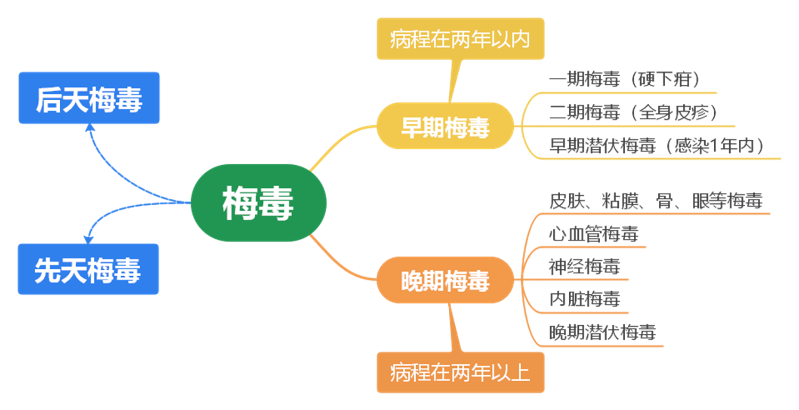
+ 传播途径
  + 性传播为主
  + 间接感染：新生儿经过产道、产后哺乳
  + 垂直传播：先天梅毒
+ 临床表现
  + 胎儿流产、早产、死胎、死产、低出生体重儿
  + 早期：皮肤大疱、皮疹、鼻炎及鼻塞、肝脾肿大、淋巴结肿大
  + 晚期（多在2岁以后）：楔状齿、鞍鼻、间质性角膜炎、骨膜炎、神经性耳聋
+ 实验室检查
  + 非梅毒螺旋体实验：敏感高特异低
    + 性病研究实验室试验VDRL
    + 快速血浆反应素试验RPR：判断疗效
  + 梅毒螺旋体试验：抗体终身阳性
  + 脑脊液检查：神经性梅毒
+ 先天梅毒诊断：
  + 临床表现
  + 找到梅毒螺旋体
  + 抗梅毒螺旋体IgM抗体（+）
  + 抗体滴度较母血增高4倍以上
  + 检查
+ 治疗
  + 青霉素
  + 产科处理
    + 排除先天梅毒：24-26周超声检查注意胎儿有无肝脾大、胃肠道梗阻、腹腔积液、胎儿水肿、FGR及胎盘增大变厚
    + 治疗过程中注意监测和预防吉-海反应：发热、子宫收缩、胎动减少、胎心监护提示一过性晚期减速
    + 分娩方式选择：根据产科情况决定
    + 母乳喂养：分娩前已接受规范治疗且效果良好者，排除胎儿感染后
#### 艾滋病
+ 传播途径
  + 垂直传播：经胎盘
  + 经产道
  + **经母乳**
+ 高危人群
  + 静脉毒瘾者
  + 性伴侣已证实感染HIV
  + 有多个性伴侣
  + 来自HIV高发区
  + 患有多种STD，尤其有溃疡型病灶
  + 使用过不规范的血制品
  + HIV抗体阳性患者所生子女
+ 治疗
  + 抗逆转录病毒治疗ART
    + 从未接受过ART的HIV感染者：尽早开始高效联合抗逆转录病毒治疗
    + 妊娠早期治疗中断，停用所有药物，待妊娠中期重新开始治疗
  + 产科处理
    + 建议在孕**38周时选择性剖宫产**以降低HIV母婴传播
    + 尽可能**缩短破膜距分娩时间**
    + 尽量**避免进行有创操作**
      + *会阴切开术、人工破膜、胎头吸引器或产钳助产术、胎儿头皮血检测等，减少胎儿暴露风险*
      + 不推荐HIV感染者母乳喂养
        + 建议**人工喂养**，杜绝混合喂养
      + 治疗产后出血：建议用催产素和前列腺素类药物，不用麦角生物碱类药物
### 胎儿窘迫
胎儿在宫内因急性或慢性缺氧危及健康和生命的综合症状
#### 要求
+ 掌握胎儿窘迫的诊断及治疗原则
+ 了解胎儿窘迫的概念、原因、病理生理
#### 诊断
+ 急性
  + 胎心异常
  + 羊水污染
  + 胎动异常：初期频繁，后期减少
  + 酸中毒：头皮血正常7.25-7.35，PO<sub>2</sub>15-30mmHg,PCO<sub>3</sub>35-55mmHg
+ 慢性
  + 胎动减少
  + 胎心监护异常
  + 生物物理评分低
  + 血流异常
#### 处理
+ 宫内复苏
+ 排查病因
+ 终止妊娠
+ 慢性窘迫
  + 针对妊娠合并症或并发症特点及其严重程度，根据孕周、胎儿成熟度及胎儿缺氧程度综合判断，拟定处理方案

### 胎儿附属物异常
+ 胎儿附属物
  + 胎膜
  + 羊水
  + 胎盘
  + 脐带

#### 胎盘异常
##### 前置胎盘
+ 定义
  + 妊娠28周后，胎盘低于胎儿先露部，附着在子宫下段、下缘达到或覆盖宫颈内口
+ 分类
  + 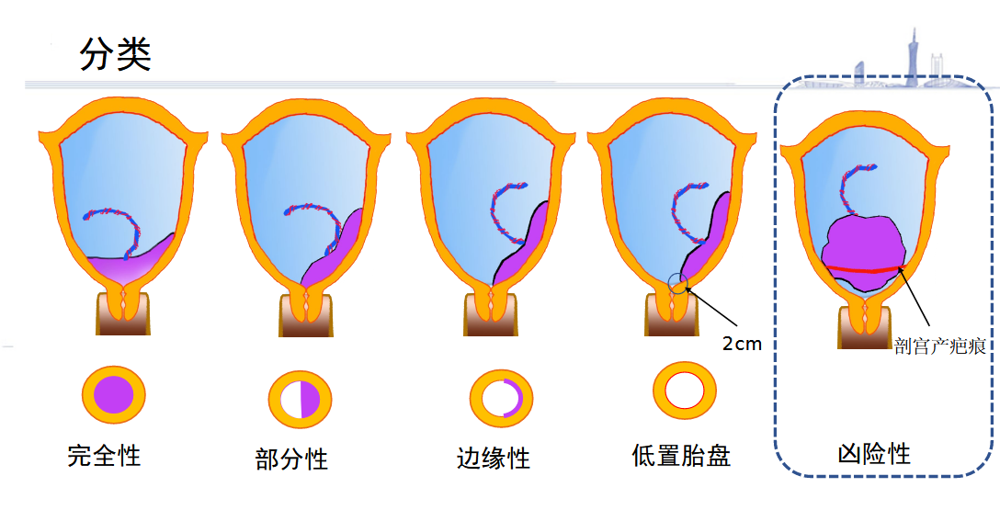
+ 诊断
  + 病史
    + 多孕多产
    + 多次流产
    + 宫腔操作史
    + 子宫手术
    + 超声提示胎盘低位置
  + 表现
    + 无痛性阴道流血出血性休克
    + 子宫软/轮廓清宫体无压痛先露高浮
    + 宫口扪及海绵样组织**阴检慎行**
  + 辅助检查
    + 超声
    + MRI
+ 治疗
  + 原则
    + 抑制宫缩
    + 纠正贫血
    + 预防感染
    + 终止妊娠
  + 期待
    + 宫缩抑制剂
    + 纠正贫血：补铁、必要时输血
    + 一般处理：休息、监测、禁肛查
    + 促胎肺成熟+胎儿脑保护：地塞米松+硫酸
  + 终止妊娠
    + 指征
      + 出血危及孕妇安
      + 胎儿宫内窘迫
      + 临产后诊断，出血多，短时不能分娩
      + 无症状者根据分类决定分娩时机
    + 手术管理：预防产后出血
    + 阴道分娩：评估、备血、严密监测
##### 胎盘早剥
+ 妊娠20周后、正常位置的胎盘、胎儿娩出前，部分或全部从宫壁剥离
+ 诊断
  + 病史
  + 临床表现
    + 症状：腹痛、阴道流血、头晕、恶心、呕吐
    + 体征：子宫张力高、宫缩过强过频、宫体压痛、胎心下降或消失
    + 阴检：血性羊水！！！
  + 鉴别
    + 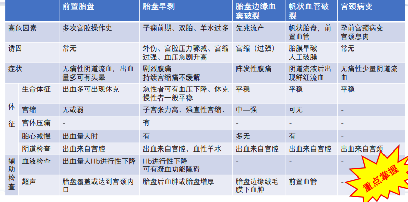
  + 分级
    + ||0|Ⅰ|Ⅱ|Ⅲ|
      |---|---|---|---|---|
      |标准|分娩后回顾性诊断|外出血，子宫软，无胎窘|胎窘或死胎|产妇休克，伴或不伴DIC|
      |临床所见|胎盘母面见血块或压迹|血性羊水、宫腔积血|胎心慢、胎盘早剥面积超过50%、子宫-胎盘卒中|持续阴道不凝出血|
+ 治疗
  + 早期识别
    + 高危因素
    + 治疗原发病
    + 胎儿监测
  + 积极处理休克
    + 监测生命体征
    + 输血
    + 补充凝血因子
  + 及时终止妊娠
    + 剖宫产
      + Ⅰ级+胎窘
      + Ⅱ级短时不能分娩
      + Ⅲ级+死胎不能立即分娩
      + 人工破膜无进展
      + 危及产妇生命
  + 控制DIC、减少并发症
##### 胎盘植入
略
#### 胎膜异常
##### 胎膜早破
+ 临产前胎膜自然破裂
+ 未足月胎膜早破：妊娠未达37周
+ 诊断
  + 病史
    + 生殖道感染
    + 胎位异常
    + 双胎
    + 羊水过多
    + 外伤
    + 可能不明显
  + 临床表现
    + 症状
      + 阴道流液、阴道分泌物增多
    + 体征：窥检见羊水从宫颈管流出、阴检无前羊水囊、上推胎头见羊水流出
  + **影响**
    + ||母亲|胎儿|
      |---|---|---|
      |感染|败血症<br>盆腹腔感染|新生儿感染<br>颅内感染<br>败血症
      |羊水急速流出|胎盘早剥|脐带脱垂<br>胎儿窘迫<br>肺发育不良<br>畸形
+ 治疗
  + 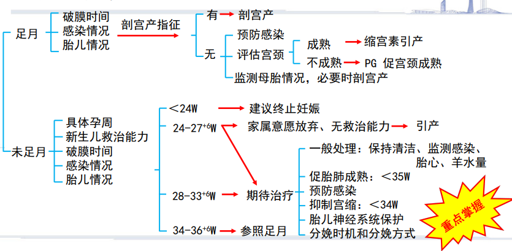
## 遗传咨询、产前筛查、产前诊断与胎儿手术
### 要求
+ 掌握遗传咨询的定义
+ 掌握遗传咨询应遵循的伦理和道德原则
+ 掌握唐氏综合征的筛查方法

+ 熟悉遗传咨询的类型、对象、步骤
+ 熟悉产前诊断的对象及方法
+ 熟悉胎儿手术的分类

+ 了解几种常见的遗传病
+ 了解宫内治疗方法
### 遗传咨询
+ 定义：解答咨询对象提出的遗传性疾病的相关问题，并提出医学建议
+ 遵循伦理和道德原则
  + 自主
  + 知情同意
  + 无倾向性
  + 守密和尊重隐私
  + 公平
+ 唐氏综合征筛查方法
  + 早期（11-13周）血清学筛查PPAP-A、HCG+超声（NT检测）
  + 中期（15-20周）血清学筛查
  + 无创筛查（NIPT）
  + 超声筛查（20-24周）：结构畸形系统筛查
+ 类型
  + 婚前
  + 孕前
  + 产前
  + 儿童遗传病
  + 肿瘤、神经、血液遗传病
+ 对象
  + 家族：遗传病、出生缺陷、癫痫、智力低下、肿瘤等病患者
  + 生育史：遗传病或出生缺陷儿、反复流产、死胎、死产等
  + 罹患智力低下或出生缺陷
  + 产前检查或筛查发现异常
  + 孕期不良环境接触、患某些慢性病
  + 其他：不育的夫妇，高龄孕妇
  + 近亲婚配
+ 步骤：理解普及提供咨询

### 产前诊断
+ 对象
  + 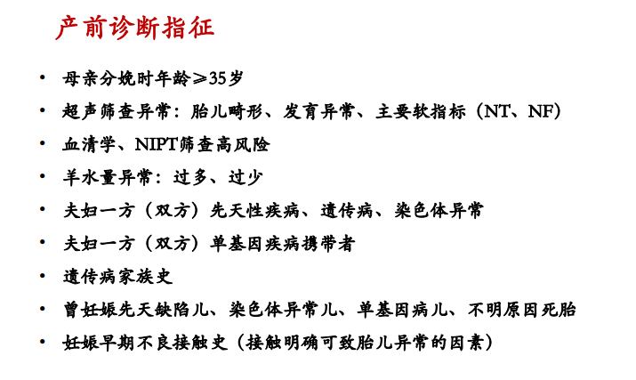
+ 方法
  + 绒毛活检
  + 羊膜腔穿刺
  + 脐带穿刺

## 异常分娩
### 要求
+ 掌握：宫缩乏力的原因
+ 一般掌握：宫缩乏力的临床表现及诊断、宫缩乏力对母儿的影响及处理原则
+ 一般了解：协调性/不协调性子宫收缩过强的原因、临床表现及处理
### 定义
因产力、产道、胎儿及精神心理因素中任何一个或一个以上的因素发生异常及四个因素相互不能适应，而使分娩进程收到阻碍，称异常分娩
### 产程异常
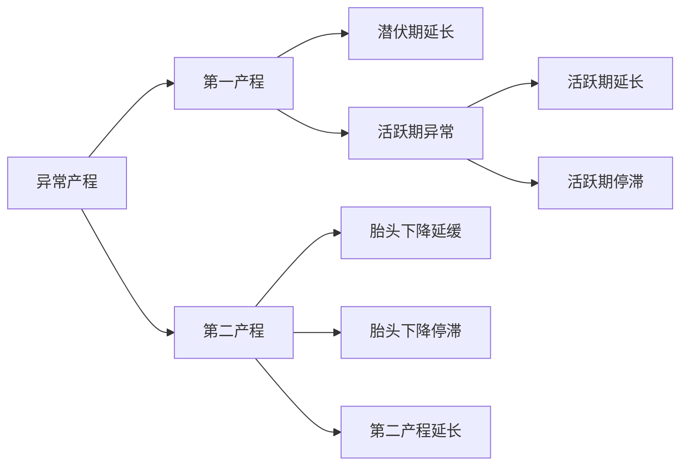
+ 潜伏期延长
  + 潜伏期：临产规律宫缩开始到活跃期起点
  + 延长：初产妇>20h；经产妇>14h
+ 活跃期异常
  + 活跃期：活跃期起点（4-6cm）至宫口开全
  + 活跃期延长(protracted active phase)：宫颈口扩张速度＜0.5cm/h 
  + 活跃期停滞(arrested active phase)：当破膜且宫口扩张≥6cm
    + 若宫缩正常，宫口停止扩张≥4小时
    + 若宫缩欠佳，宫颈口停止扩张≥6小时
+ 第二产程异常
  + 胎头下降延缓(protraced descent)：
    + 初产妇胎头先露下降速度＜1cm/h
    + 经产妇胎头先露下降速度＜2cm/h
  + 胎头下降停滞(arrested descent)：胎头先露停留在原处不下降＞1小时
  + 第二产程延长(protracted second stage)：
    + 没有无痛分娩时：初产妇＞3小时，经产妇＞2小时
    + 有无痛分娩时：初产妇＞4小时，经产妇＞3小时

#### 处理
+ 潜伏期延长
  + 哌替啶100mg肌肉注射；
  + 人工破膜
  + 缩宫素静滴
+ 活跃期异常
  + 详细阴道检查
  + 人工破膜
  + 缩宫素静滴
  + 矫正胎位
+ 第二产程延长
  + 仔细评估
  + 缩宫素加强产力
  + 指导孕妇屏用力
  + 徒手旋转胎方位
  + 产钳或胎头吸引器助产术
### 产力异常
#### 子宫收缩乏力
+ **原因**
  + 子宫肌源性因素：影响子宫肌纤维正常收缩
  + 头盆不称或胎位异常：影响先露对子宫下段和宫颈压迫
  + 内分泌失调：乙酰胆碱、缩宫素及前列腺素合成减少；缩宫素受体量少、硫酸脱氢表雄酮量少使宫颈成熟度欠佳
  + 精神源性因素：精神紧张、恐惧使大脑皮质功能紊乱
  + 其他：如宫缩抑制药物、镇静镇痛药物的使用
+ 诊断
  + 低张性
    + 宫缩＜2次/10分钟，持续时间短，间隙期长。
    + 宫缩高峰时子宫压力不大，按压时有凹陷
  + 高张性
    + 无效宫缩
    + 表现持续性腹痛，腹部拒按，烦躁不安等
    + 多为原发性宫缩乏力
+ 影响
  + 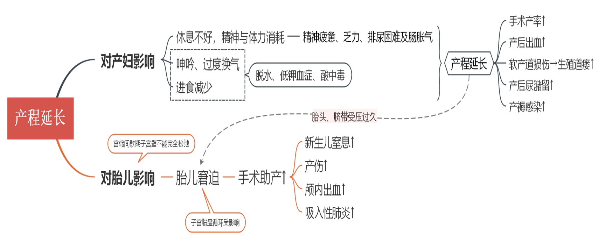
+ 处理
  + 第一产程
    + 缓解焦虑，潜伏期间可镇静休息
    + 加强宫缩：
      + 人工破膜
      + 缩宫素静脉滴注
    + 指导屏气用力
  + 第二产程
    + 加强宫缩
    + 阴道分娩或助产
    + 无法阴道分娩者行剖宫产
  + 第三产程
    + 预防产后出血
    + 预防感染

#### 子宫收缩过强
略
## 产褥期与产褥期疾病
产褥期：从胎盘娩出至产妇全身各器官除乳腺外恢复至正常未孕  状态所需的一段时期，通常为6周。
### 正常产褥
+ 子宫复旧
  + 胎盘娩出后：宫底多在脐部±1cm
  + 产后第一日：宫底多平脐
  + 之后每日下降1～2cm
  + 产后10日降入骨盆腔，腹部触诊未及
  + 产后六周恢复至未孕状态 
+ 体温变化
  + 产后24h母体体温稍高，一般不＞38℃；
  + 泌乳热：产后3-4天乳房血管，淋巴管极度充盈，乳房涨大，可出现体温升高达37.8～39℃，多持续4-16h。非病态。
+ 恶露
  + 产后子宫蜕膜脱落，含有血液、坏死蜕膜等组织经阴道排出，称为恶露。总量约为250-500ml。
  + 分类：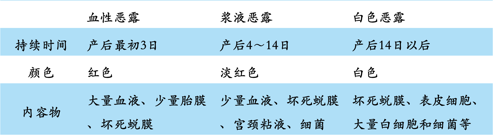
### 产褥期疾病
+ 掌握产褥感染及其病因，感染途径；临床表现、诊断及治疗原则。
+ 掌握晚期产后出血定义，病因，临床表现、诊断及治疗原则。
#### 产褥感染
+ 产褥感染（puerperal infection）:分娩及产褥期生殖道受病原体侵袭，发生局部或全身感染
+ 感染诱因
  + 营养不良、孕期贫血、孕期卫生不良、胎膜早破、羊膜腔感染、慢性疾病、产科手术、产程延长、产前产后出血过多、多次宫颈检查等，均可成为产褥感染的诱因。
+ 感染途径
  + 外源性
    + $\beta$-溶血性链球
    + 金葡
  + 内源性
    + 消化链球菌
    + 大肠埃希菌
    + 克雷伯菌
    + 变形杆菌
    + 支原体
+ 表现
  + 发热
  + 疼痛
  + 异常恶露
+ 诊断
  + 感染类型：产后发热者，首先考虑产褥感染
  + 确定感染部位和严重程度
  + 确定病原体
+ 治疗原则
  + 尽快开始抗感染治疗，应给予广谱、足量、有效抗生素（经验性用药）
  + 根据感染的病原体调整抗生素治疗方案
  + 对脓肿形成或宫内残留感染组织者，积极进行感染灶的处理
#### 晚期产后出血
||产后出血|晚期产后出血
|---|---|---|
定义|胎儿娩出后24h内：阴道分娩者 出血量≥500 ml、剖宫产分娩者 出血量≥1000 ml。|产后 24h 至产后6周内发生的生殖道大量出血，发生率为0.5%~2%。
病因|子宫收缩乏力、胎盘胎膜残留、软产道裂伤、凝血功能障碍|胎盘、胎膜、蜕膜残留、子宫胎盘附着面复旧不良、感染、剖宫产术后子宫切口愈合不良、其他原因

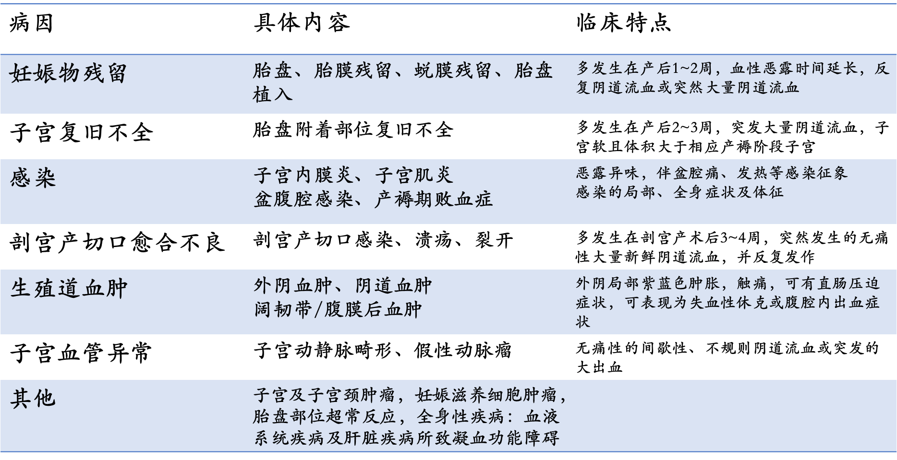

+ 诊断
  + 病史：阴道分娩：应了解产程情况及产后恶露变化，有无反复或突然阴道流血病史；剖宫产：应了解手术指征、术式及术后恢复情况。
  + 症状：阴道流血； 腹痛和发热；常伴感染所致恶露增加，恶臭。可有继发性贫血，严重者因失血性休克危及生命。
  + 体征：妇检可扪及子宫增大、变软，宫口松弛，有时可触及残留组织和血块，伴有感染者子宫明显压痛。
  + 辅助检查：判断出血严重程度；寻找出血原因

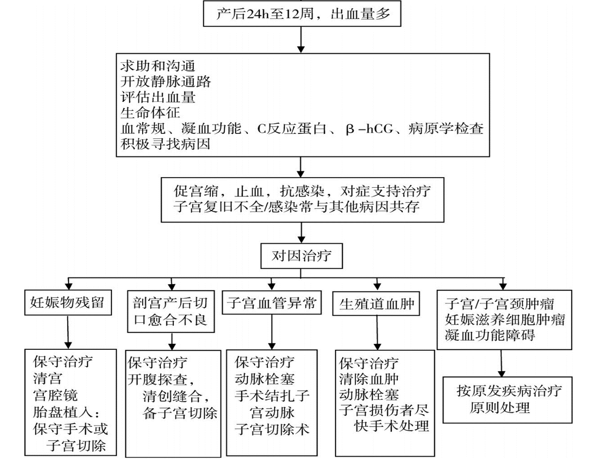
# 妇科
## 外阴及阴道炎症
### 要求
+ 了解女性生殖系统的自然防御机制及病原体感染途径。
+ 了解前庭大腺炎及前庭大腺囊肿的临床表现及治疗原则。
+ 掌握外阴阴道假丝酵母菌病的临床表现、诊断及治疗。
+ 掌握细菌性阴道病的临床表现及诊治。
+ 熟悉萎缩性阴道炎及婴幼儿外阴阴道炎的临床表现、诊断及治疗。
+ 熟悉滴虫阴道炎的临床表现、诊断及治疗原则。

### 外阴阴道假丝酵母菌病
+ 最常见的妇女外阴阴道炎症之一
+ 最重要：白念珠菌
#### 临床表现
+ 症状
	+ 外阴**瘙痒**、灼痛
	+ 阴道分泌物增多：白色稠厚，凝乳或豆腐渣样
+ 体征
	+ 外阴红斑、水肿、皮肤皲裂表皮脱落
	+ 可见糜烂和浅表溃疡
#### 诊断
+ 找到孢子或者菌丝
+ 检测方法：10%氢氧化钾溶液湿片法
	+ 革兰染色
	+ 培养
#### 分级
+ 评分标准：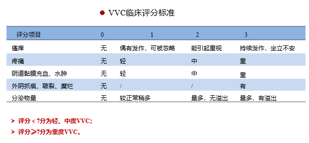
+ 分类：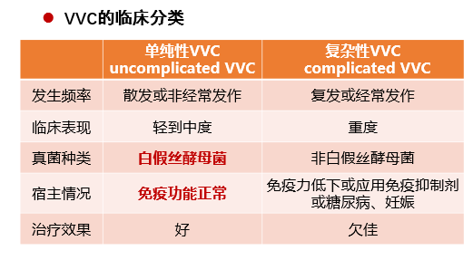
#### 治疗
+ 原则：消除诱因，局部或者全身抗真菌用药，局部为主
+ 消除诱因：
	+ 治疗糖尿病
	+ 停用广谱抗生素、雌激素和糖皮质激素
	+ 勤换内裤
+ 单纯VVC
	+ 克霉唑
	+ 全身：氟康唑
+ 复杂性VVC
	+ 重度VVC：延长一个疗程
		+ 一日疗法在72h后加一次
	+ 妊娠
		+ 禁用口服唑类，局部治疗
	+ 复发性外阴阴道假丝酵母菌病
		+ 强化+巩固
### 细菌性阴道病
#### 临床表现
+ 多发生在性活跃期妇女，10%～40%患者无临床症状。
+ 症状：带有鱼腥臭味的稀薄阴道分泌物增多，可伴有轻度外阴瘙痒或烧灼感，性交后症状加重。
+ 体征：分泌物呈灰白色，均匀一致，稀薄，常粘附于阴道壁，容易将分泌物从阴道壁拭去，阴道黏膜无充血的炎症表现。
#### 诊断
+ 匀质、稀薄、灰白色的阴道分泌物，粘附于阴道壁
+ 胺实验：取阴道分泌物少许放在玻片上，加入10%氢氧化钾溶液1～2滴，产生烂鱼肉样腥臭气味，系因胺遇碱释放氨所致。
+ 线索细胞阳性
+ pH>4.5

#### 治疗
+ 抗厌氧菌：甲硝唑可抑制厌氧菌生长而不影响乳杆菌生长。
## 宫颈炎症
### 教学基本要求
掌握宫颈炎的临床表现、诊断及治疗。
### 急性子宫颈炎
#### 临床表现
+ 部分无症状
+ 主要症状：
	+ 阴道分泌物增多，脓性
	+ 经间期、性交后出血
	+ （泌尿系统感染）尿频尿急尿痛
+ 体征
	+ 子宫颈充血、水肿、粘膜外翻
	+ 黏液脓性分泌物流出
	+ 子宫触痛、质脆、易出血
#### 诊断
+ 两个特征性的体征，可具备一个或两个同时具备
	+ 于宫颈管或子宫颈管棉拭子标本，肉眼见到脓性或黏液脓性分泌物 
	+ 用棉拭子擦拭子宫颈管时，容易诱发子宫颈管内出血
+ 脓性分泌物白细胞>30/高倍镜视野
+ 阴道分泌物湿片检查>10/高倍镜视野，排除阴道炎症
#### 治疗
+ 抗生素，常用阿奇霉素、多西环素
+ 经验性抗生素治疗
	+ 年龄小于25岁
	+ 多性伴
	+ 新性伴
	+ 性伴侣患STD
+ 针对病原体的
	+ 淋病奈瑟菌：头孢、大观霉素
	+ 沙眼衣原体：四环素、大环内酯、氟喹诺酮
+ 合并细菌性阴道病需同时治疗
+ 性伴侣的处理：性伴侣也要相应的检查和治疗
## 盆腔炎症
### 要求
+ 掌握
	+ 盆腔炎性疾病的发病机制、临床表现
	+ 盆腔炎性疾病的诊断标准、治疗原则
+ 熟悉：盆腔炎性疾病的病原体及致病特点
### 临床表现
+ 轻
	+ 症状：轻微，发热、腹痛、阴道分泌物
	+ 体征：子宫举痛或附件区压痛
+ 重
	+ 发热寒战、头痛、急性病容、体温高、下腹部压痛
	+ 脓性臭味分泌物，脓性分泌物流出，子宫举痛、压痛触痛


<!--stackedit_data:
eyJoaXN0b3J5IjpbMTcxNDgyMDc4OCwtMTA1NDQ4NjQ4NSwtMT
U4NjI0NjE0MSwxOTczMDIxMzY1LDE1MjA0MTg1MjksMjcyMDQz
MDU5LC0xOTcxNzczMDkwXX0=
-->