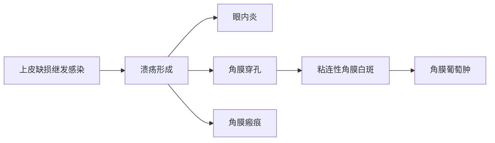
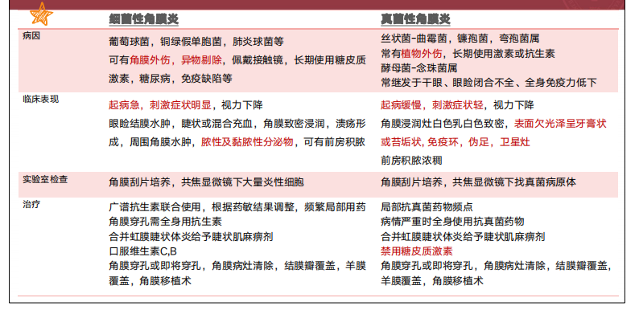
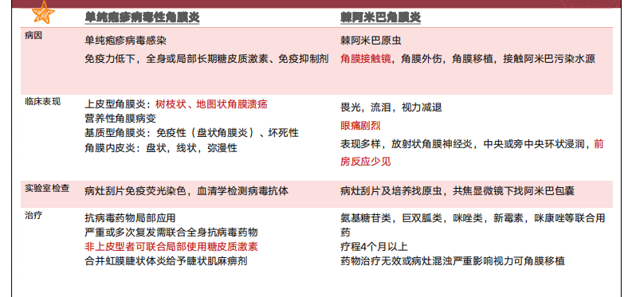
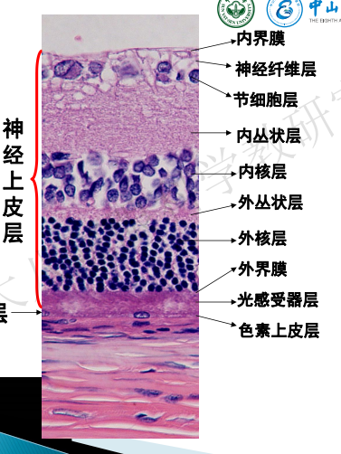

# 眼表疾病，眼睑、泪道疾病
## 要求
+ 掌握
  + 常见眼表疾病（干眼、角膜缘干细胞功能衰竭）的病因、临床表现和治疗。干眼的诊断和治疗原则
  + 睑腺炎、眼睑位置异常的诊断及治疗方法，睑闭合不全时保护角膜的措施及其重要性泪道病的检查法，泪道冲洗
+ 熟悉
  + 角膜缘干细胞的基本理论，眼表疾病的概念及诊断
  + 慢性泪囊炎对眼球尤其内眼手术的潜在危险，掌握诊断方法及处理原则
## 眼表疾病
眼表（ocular surface）：位于上下睑缘灰线之间的眼球表面全部黏膜上皮，包括角膜上皮，角膜缘上皮和结膜上皮。广义的眼表还包括眼睑、泪器及泪道。

眼表疾病：损害角结膜眼表正常结构与功能的疾病。包括所有浅层角膜病、结膜病及外眼疾病，也包括影响泪膜的泪腺及泪道疾病。

+ 酸碱烧伤
+ 热烧伤
+ 慢性炎症
+ 免疫性炎症
+ 医源性损伤
+ 角膜接触镜
+ 眼表肿瘤
### 维持正常眼表的主要因素
+ 眼睑和神经反射
+ 泪液和泪膜
+ 角膜上皮和角膜缘干细胞
+ 结膜上皮
### 临床表现
+ 角膜上皮结膜化
+ 角膜新生血管长入
+ 角膜上皮反复糜烂，持续性角膜溃疡
+ 眼表面干燥
+ 周边部纤维血管组织长入角膜，假性胬肉
### 干眼
+ 任何原因引起的泪液质或量异常，或动力学异常导致的泪膜稳定性下降并伴有眼部不适，和（或）眼表组织损害为特征的多种疾病的总称。
#### 分类
1. 泪液生成不足型
	1. Sjögren syndrome所致干眼
	2. 非SS-ATD
2. 蒸发过强型：睑板腺功能障碍
#### 诊断
干燥感、异物感、烧灼感、疲劳感、不适感、视力波动等主观症状之一 ***AND*** (BUT（泪膜 破裂时间）≤5s ***OR*** Schirmer I试验（泪液分泌实验）(无表面麻醉) ≤5 mm/5min)

有以上主观症状之一 ***AND*** (5＜BUT≤10s ***OR*** 5 mm/5 min＜SchirmerI试验结果(无表面麻醉) ≤10 mm/5
 min) ***AND*** 角结膜荧光素染色阳性

**症状+强检查或症状+弱检查+染色**

#### 治疗
+ 治疗原则：消除病因、缓解症状、保护视功能
+ 水液缺乏型
	+ 去除病因
	+ 非药物治疗：患者指导、湿房镜及硅胶眼罩、软性角膜接触镜、泪小点栓塞、 物理疗法、心理干预
	+ 药物治疗：人工泪液、促进分泌、抗炎、免疫抑制
	+ 手术治疗
+ 脂质异常型干眼

### 睑板腺功能障碍
#### 临床表现
+ 主要症状：干眼的一系列主观症状
+ 体征：睑缘增厚、过度角化，睑缘血管扩张，睑板腺开口有白色角质蛋白堵塞而凸起变形，挤压后分泌物呈泡沫样、颗粒样或牙膏样
  + 其他常见的伴随体征：霰粒肿、结膜结石、结膜充血、乳头增生、角膜点状着色等，严重者出现角膜血管翳、角膜溃疡与睑外翻
#### 治疗
+ 眼睑清洁，热敷，睑板腺按摩
+ 局部药物治疗（人工泪液，糖皮质激素）
+ 新的治疗方式强脉冲激光

## 眼睑疾病
+ 病毒性睑皮炎：眼睑红肿，水疱，可能合并角结膜炎，带状疱疹不过中线，愈合后色素沉着**带状疱疹神经痛，深达真皮，留瘢痕，单纯疱疹无瘢痕，有色素，可复发**

+ 接触性眼睑皮炎：致敏原，眼睑瘙痒烧灼感，红肿、丘疹水疱、脱屑、长期-眼睑肥厚粗糙脱屑、苔藓状

### 睑腺炎
#### 诊断
+ 临床表现
  + 红肿热痛
    + 外睑腺炎：睫毛根部，触诊压痛，肿胀弥散，淋巴压痛
    + 内睑腺炎：睑板腺内，疼痛明显，肿胀局限
  + 可有脓点和破溃
#### 治疗
1. 热敷、抗生素
2. 脓肿形成：切开排脓
3. 脓肿未形成：不宜切开
4. 感染扩散：全身足量抗生素

<table><tr><td></td><td>睑腺炎</td><td>睑板腺囊肿</td></tr><tr><td>病因</td><td>化脓性细菌急性感染</td><td>睑板腺口阻塞，慢性炎症包裹</td></tr>
<tr><td>发生部位</td><td>睫毛毛囊或其附属皮脂腺（Zeis）汗腺（Moll）-外睑腺炎 睑板腺-内睑腺炎</td><td>睑板腺</td></tr><tr><td>临床表现</td><td>早期红肿热痛，外睑腺炎范围较弥散，内睑腺炎范围较局限 后期炎症局限可形成脓点，外睑腺炎脓点-皮肤面，内睑腺炎脓点-结膜面</td><td>无痛性眼睑皮下类圆形包块，边界清楚，活动性好，相应结膜面暗红色</td></tr><tr><td>治疗</td><td>早期热敷，抗生素眼水眼膏,后期炎症局限，脓点形成切开排脓</td><td>小囊肿热敷,大囊肿切开刮除（老年人及反复复发者加病检）</td></tr></table>

### 眼睑位置异常
#### 乱睫和倒睫
倒睫：睫毛向后生长

乱睫：睫毛不规则生长
##### 治疗
拔出、破坏毛囊、手术
#### 睑内翻
+ 先天性睑内翻：多见婴幼儿，内眦赘皮、睑缘部轮匝肌过度发育、睑板发育不全
+ 退行性睑内翻：老年人，下睑缩肌无力，皮肤松弛，脂肪减少
+ 瘢痕性睑内翻

##### 临床表现

+ 症状：畏光流泪、异物感刺痛、摩擦感
+ 体征：睑缘向眼球弯曲，摩擦角膜

##### 治疗
+ 先天性睑内翻：不必急于手术，但内翻严重引起角膜损伤除外
+ 老年性睑内翻：大多手术
+ 瘢痕性睑内翻：必须手术
#### 睑外翻
1. 退行性脸外翻（degenerative ectropion）仅限于下睑。由于老年人眼轮匝肌功能减弱，眼睑皮肤及外眦韧带松弛，使睑缘不能紧贴眼球，并因下睑重量使之下坠而引起
2. 搬痕性睑外翻（cicatricial ectropion) 眼睑皮肤面搬痕性收缩所致，可由创伤、烧伤、化学伤、眼睑溃疡或脸部手术等引起。
3.麻痹性外翻（paralytic ectropion) 也仅限于下脸。由于面神经麻痹，眼轮匝肌收缩功能丧失，因下睑重量使之下坠而发生。
##### 临床表现
+ 轻度，仅有睑缘离开眼球，但由于破坏了眼睑与眼球之间的虹吸作用而导致泪溢；
+ 重度，睑缘外翻，部分或全部睑结膜暴露在外，使睑结膜失去泪液的湿润，最初局部充血，分泌物增加，久之干燥粗糙，高度肥厚，呈现角化。睑外翻常有眼睑闭合不全，使角膜失去保护，角膜上皮干燥脱落，易引起暴露性角膜炎或溃疡。
##### 治疗
+ 退行性睑外翻和搬痕性睑外翻：手术治疗。
+ 麻痹性睑外翻：治疗面瘫
#### 上睑下垂
+ 先天性：常为双侧，但两侧不一定对称，有时为单侧。可伴有眼球上转运动障碍。如瞳孔被遮盖，患者为克服视力障碍，额肌紧缩，形成较深的横行皮肤皱纹，牵拉造成眉毛上抬或仰头视物。
+ 获得性：多有相关病史或伴有其他症状，如动眼神经麻痹伴有其他眼外肌麻痹；交感神经损害有Horner综合征；重症肌无力所致上脸下垂具有晨轻夜重的特点，注射新斯的明后明显减轻。
#### 眼睑闭合不全
治疗：病因治疗、保护角膜**结膜囊内涂抗生素眼膏、湿房、睑缘融合**
## 泪道疾病
### 泪道检查方法
1. 染料试验：双眼结膜囊内滴入2%荧光素钠溶液
	1. 看5min后荧光素钠消退情况：消退少的表明可能出现阻塞
	2. 5min后下鼻道出现荧光素钠说明未（完全）阻塞
2.  泪道冲洗
	1. 无阻力：通畅
	2. 原路反流：：”阻塞
	3. 从另一泪小管反流：泪总管泪囊、鼻泪管阻塞
	4. 冲洗有阻力+反流：鼻泪管下载、粘性脓性分泌物
# 结膜角膜病
## 要求
+ 掌握
  + 掌握常见结膜炎，诊断方法及防治原则。
  + 掌握春季卡他性结膜炎的诊断和治疗原则。
  + 掌握角膜炎的病变发展规律及临床表现、后遗症的治疗原则及预防措施。
  + 掌握细菌性、真菌性、单疱病毒性角膜炎的鉴别诊断和治疗原则。
+ 熟悉
  + 熟悉免疫性结膜炎的种类和临床特点。
  + 熟悉蚕蚀性角膜溃疡诊断要点和治疗原则
## 结膜病
### 治疗原则
针对病因治疗，局部用药为主，必要时全身用药，急性期忌包扎患眼
### 感染性结膜炎
<table><tr><td></td><td>细菌性结膜炎</td><td>病毒性结膜炎</td><td>沙眼</td></tr><tr><td>临床表现</td><td>急性乳头状结膜炎伴有卡他性或黏脓性渗出物</td><td>急性滤泡性结膜炎，水样分泌物，耳前淋巴结肿大，结膜下出血，伪膜（偶有真膜），角膜上皮下浸润</td><td>急性期：眼睑红肿，结膜充血，乳头增生，上下穹窿部满布滤泡 慢性期：结膜污秽肥厚，滤泡乳头增生，角膜血管翳，结膜瘢痕</td></tr><tr><td>病原体</td><td>超急性：淋球菌，脑膜炎奈瑟菌 急性：金葡菌，肺炎双球菌，流感,嗜血杆菌，白喉杆菌 慢性：金葡菌，摩拉克菌</td><td>腺病毒（流行性角结膜炎，咽结膜热）70型肠道病毒/A24型柯萨奇病毒（流行性
出血性结膜炎）</td><td>沙眼衣原体A,B,C,Ba 直接/间接接触传播</td></tr><tr><td>治疗</td><td>结膜囊冲洗 局部用药（广谱抗生素滴眼液、眼膏，根据药敏试验调整用药） 强调个人卫生预防交叉感染</td><td>避免人群接触，强调个人卫生预防交叉感染 抗病毒药物 出现角膜上皮下浸润可适当局部使用糖皮质激素</td><td>0.1%利福平眼药水，0.5%新霉素眼药水，红霉素，四环素类眼膏 急性期或严重沙眼，口服多西环素或红霉素，晚期手术矫正并发症</td></tr></table>

### 春季角结膜炎
+ 特点：反复发作的双侧慢性过敏性结膜炎，主要影响儿童和青少年，20岁以下男性多见
+ 病因：不明，体液免疫和细胞免疫均有参与，Ⅰ型超敏反应和Ⅳ型超敏反应共同作用
+ 症状：眼部奇痒，夜间加重，刺痛、畏光、异物感、烧灼感、流泪、黏性分泌物等
+ 分类：睑结膜型，角结膜缘型，混合型
+ 治疗：
  + 物理治疗：冰敷，降低室温
  + 局部用药：糖皮质激素，非甾体类消炎药，肥大细胞稳定剂，抗组胺药物免疫抑制剂，人工泪液

## 角膜病
### 角膜炎病理过程

### 临床表现、诊断
+ 症状：刺激症状-眼痛、畏光、流泪、眼睑痉挛、视力下降
+ 体征：睫状充血、角膜浸润、溃疡形成（角膜荧光染色可见溃疡角膜上皮缺损区域着染)，虹膜睫状体炎（轻者房水闪辉，重者房水混浊，前房积脓，瞳孔缩小后粘连)
+ 实验室检查：溃疡组织刮片检查，细菌真菌培养，角膜共焦显微镜检查

### 治疗原则
+ 控制感染，减轻炎症反应，促进溃疡愈合，减轻瘢痕形成

*使用敏感抗菌药物 酌情使用糖皮质激素药物（细菌性角膜炎急性期一般不用，愈合后酌情使用，真菌性角膜炎禁用，病毒性角膜炎非溃疡型角膜基质炎可用） 并发虹膜睫状体炎，可使用睫状肌麻痹剂 保守治疗控制不良，角膜穿孔或即将穿孔，角膜病灶清除，结膜瓣覆盖，羊膜覆盖，角膜移植术，术后继续药物治疗*
### 鉴别

# 晶状体病
## 目的与要求：
1. 掌握白内障的分类、临床表现、诊断和常用的治疗方法。
2. 掌握白内障的检查方法。
## 分类
|病因|时间|形态|部位|程度|
|:---:|:---:|:---:|:---:|:---:|
|年龄相关性|先天性|点状|皮质性|初发期|
|外伤性|后天获得性|斑状|核性|未成熟期|
|并发性||绕核性|囊膜下|成熟期|
|代谢及中毒性|||混合型|过熟期|
|辐射性|||||
|发育性
|后发性
## 临床表现
+ 症状
	+ 视力下降
	+ 对比敏感度下降
	+ 屈光改变
	+ 复视
	+ 炫光
	+ 色觉改变
	+ 视野缺损
+ 体征：晶状体浑浊
### 年龄相关性白内障
+ 中老年人常见
+ 分类
	+ 皮质性
		+ 初发：皮质空泡水裂、晶状体周边楔形浑浊，羽毛状指向中央，发展缓慢，不影响视力
		+ 未成熟期：大部浑浊，膨胀，虹膜半月形影，诱发青光眼，视力明显下降
		+ 成熟期：水分溢出，体积变小、实力进一步下降，眼底窥不入
		+ 过熟期：Morgagnian白内障：皮质溶解囊膜皱缩核下沉，虹膜震颤、过敏性葡萄膜炎和晶状体溶解性青光眼，视力回升
	+ 核性
		+ 发病早，进展慢
		+ 核浑浊，颜色加深
		+ 屈光状态改变
		+ 见于高度近视人
	+ 后囊下
		+ 混浊位于视轴，早期视力下降
		+ 见于代谢性疾病
## 诊断
+ 无痛视力下降
+ 晶状体浑浊
+ 诱发因素
## 治疗
主要为手术
# 葡萄膜炎
葡萄膜：虹膜、睫状体、脉络膜
## 要求
1. 认识葡萄膜炎是常见致盲眼病、早期诊断、及时合理治疗的意义。
2. 掌握常见类型葡萄膜炎的基本症状、体征、治疗原则和鉴别诊断。
3. 了解几种常见特殊类型葡萄膜炎的临床特点和治疗原则。
## 急性前葡萄膜炎
+ 症状
	+ 眼痛、畏光、流泪、视物模糊
+ 体征
	+ 睫状充血、尘状角膜后沉着物
	+ 前房闪辉
	+ 前房细胞
	+ 纤维素渗出
	+ 瞳孔缩小
	+ 虹膜后粘连
+ 并发症
	+ 并发性白内障
	+ 继发性青光眼
	+ 低眼压及眼球萎缩
### 治疗原则
+ 扩瞳，抗炎
	+ 睫状肌麻痹，后马托品常用
	+ 糖皮质激素
	+ NSAIDS
	+ 免疫抑制
	+ 并发症
## 其他类型葡萄膜炎
+ 慢性前葡萄膜炎：病程>3月
+ 中间葡萄膜炎：雪球样混浊
+ 后葡萄膜炎：累及脉络膜、视网膜
+ 全葡萄膜炎：整个葡萄膜

## 特殊葡萄膜炎
+ 强直性脊柱炎：HLA-B27+、X线可见骶髂关节改变
+ vogt-小柳原田病：黑色素自身免疫、白癜风、毛发变白或脱落
	+ 晚霞状眼底改变、Dalen-Fuchs结节
+ Bechet病：前房积脓、与细菌、疱疹病毒感染有关
	+ 口腔溃疡、皮肤多形性损害
	+ 反复发作：葡萄膜炎、口腔溃疡
+ 交感型眼炎
	+ 发生于一眼穿透伤/内眼手术后
	+ 病因：免疫豁免打破，自身免疫
+ Fuchs综合征：轻度前葡萄膜炎、特征性KP、虹膜脱色素、无粘连
+ 急性视网膜坏死综合征：眼红、眼痛、眼周痛、视物模糊
+ 伪装综合症：一类引起葡萄膜炎表现又非炎症性疾病
	+ 前房积脓、虹膜结节、玻璃体浑浊、视网膜或下病灶
# 视网膜病

## 重点
+ 视网膜血管性疾病
+ 黄斑疾病
+ 视网膜剥离
## 视网膜病症状
+ 视力下降、眼前黑影、视野缩小、视物变形、中心暗点、夜盲、色觉改变、对比敏感度下降、闪光感
+ 体征
  + 血管改变：管径、硬化、白鞘或白线状、异常血管
  + 视网膜水肿：细胞内水肿：急性供血不足，缺氧
    + 细胞外水肿：血视网膜屏障
  + 视网膜渗出
    + 软性渗出：毛细血管前小动脉受阻，神经损伤
    + 硬性渗出：长期水肿、脂质沉着
  + 出血
    + 玻璃体腔积雪：玻璃体腔出血
    + 视网膜前出血：玻璃体后界膜于视网膜内界膜直接
    + 视网膜深层出血：神经纤维层
    + 视网膜深层出血：外从状层和内核层
    + 视网膜下出血：神经上皮和色素上皮
    + 色素上皮下
## 视网膜血管病变
+ 视网膜中央栓塞
  + 临床表现：一眼突发无痛性完全失明
    + 瞳孔光反射直接消失，间接存在
    + 眼底：视网膜水肿，樱桃红
  + 治疗
    + 扩管：栓子行至远端
    + 降眼压
    + 吸氧
    + 抗凝和溶栓
    + 效果难定，预后差
+ 视网膜分支动脉阻塞
  + 临床表现
    + 视网膜受累动脉供应区水肿
    + 相应视野缺损
  + 治疗
    + 同CRAO
+ 视网膜静脉阻塞
  + 临床表现
    + 视力明显下降
    + 眼底：各象限视网膜静脉迂曲、扩张，网膜出血水肿、视盘水肿、CME
  + 治疗
    + 病因治疗
    + 预防和治疗并发症
      + 黄斑水肿：抗血管内皮生长因子，强的松
      + 缺血型：视网膜光凝
+ 糖尿病性视网膜病变
  + 症状
    + 早期无任何症状
    + 闪光感
    + 视力减退
  + 诊断
    + DM病史
    + 症状
    + 眼底检查
    + 眼底荧光血管造影
    + 诊断标准  <table align=center><tr><td>分型</td><td>眼底表现</td></tr><tr><td colspan=2 align=center>单纯型BDR</td></tr><tr><td>I</td><td style="color:red;">有微血管瘤和小出血点</td></tr><tr><td>II</td><td style="color:yellow;">有黄白色硬性渗出或并有出血点</td></tr><tr><td>III</td><td style="color:white;">有白色棉绒斑或并有出血斑</td></tr><tr><td colspan=2 align=center>增殖型BDR</td></tr><tr><td>IV</td><td>新生血管+玻璃体出血</td></tr><tr><td>V</td><td>新生血管+纤维增殖</td></tr><tr><td>VI</td><td>新生血管+纤维增殖+视网膜脱离</td></tr></table>
  
  + 治疗
    + 单纯型：定期眼科检查、局部或广泛视网膜光凝
    + 增殖性：广泛视网膜光凝、积血严重：手术
+ 糖尿病黄斑病变
  + 糖尿病患者黄斑区内毛细血管渗漏致黄斑中心2DA内视网膜增厚
  + 严重程度
    + 无黄斑水肿
    + 轻度：水肿硬渗远离黄斑中心
    + 中度：靠近
    + 重度：累及中心
  + 治疗
    + 光凝
    + 药物治疗
      + 抗VEGF
      + 糖皮质激素
      + 玻璃体切除
+ 高血压视网膜病变
  + K-w分类
    + I：动脉变细
    + II：动静脉交叉压迹
    + III：压迹+水肿、出血、渗出
    + IV：压迹+水肿+视盘水肿
## 黄斑疾病
+ 中心性浆液性脉络膜视网膜病变
  + 临床表现：眼前暗影，食物变形、视力下降但常不低于0.5
    + 眼底可见黄斑有一圆形反光轮，中心凹暗红，光反射消失，可有灰白色视网膜下纤维蛋白沉着
  + 治疗
    + 无特效疗法，多数自愈
    + 糖皮质激素禁用
    + 可激光封闭
    + 休息，少用病眼，避免过度劳累、精神紧张、戒烟酒
+ 年龄相关性黄斑变性
  + 治疗
    + 对症治疗：抗氧化剂、促进血液吸收
    + 抗VEGF、激光
    + 手术
+ 黄斑裂孔
  + 分期
    + 1期：中心凹脱离
    + 2期：裂孔形成，全层，直径<400
    + 3期：裂孔变大，直径>400
    + 4期：玻璃体后脱离（weiss环），伴较大全层裂孔
  + 治疗：玻璃体手术
 # 青光眼

<!--stackedit_data:
eyJoaXN0b3J5IjpbMjExMTI0NDEzLDI4NTEzOTEyMiwtMTEzNz
g3MDMxOSwtMTUyNDA2MjcxNyw4MjI5NjQ4MzEsMTkwMjc1MzYx
NywxNjkzNjQ4MzcwLC0xODM4OTY1MDE1LC0xMDcwNjAyMTE3LC
0xMjM1MTk3ODcwLC0xMTA1MjEwMjU1XX0=
-->