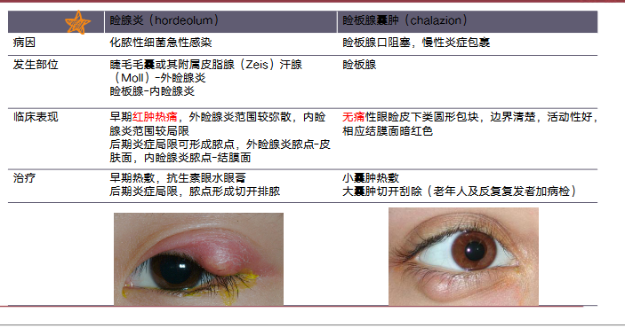

# 眼表疾病，眼睑、泪道疾病
## 要求
+ 掌握
  + 常见眼表疾病（干眼、角膜缘干细胞功能衰竭）的病因、临床表现和治疗。干眼的诊断和治疗原则
  + 睑腺炎、眼睑位置异常的诊断及治疗方法，睑闭合不全时保护角膜的措施及其重要性泪道病的检查法，泪道冲洗
+ 熟悉
  + 角膜缘干细胞的基本理论，眼表疾病的概念及诊断
  + 慢性泪囊炎对眼球尤其内眼手术的潜在危险，掌握诊断方法及处理原则
## 眼表疾病
眼表疾病：损害角结膜眼表正常结构与功能的疾病。包括所有浅层角膜病、结膜病及外眼疾病，也包括影响泪膜的泪腺及泪道疾病。

+ 酸碱烧伤
+ 热烧伤
+ 慢性炎症
+ 免疫性炎症
+ 医源性损伤
+ 角膜接触镜
+ 眼表肿瘤
### 眼表
眼表（ocular surface）：位于上下睑缘灰线之间的眼球表面全部黏膜上皮，包括角膜上皮，角膜缘上皮和结膜上皮。广义的眼表还包括眼睑、泪器及泪道。
#### 维持正常眼表的主要因素
+ 眼睑和神经反射
+ 泪液和泪膜
+ 角膜上皮和角膜缘干细胞
+ 结膜上皮
## 临床表现
+ 角膜上皮结膜化
+ 角膜新生血管长入
+ 角膜上皮反复糜烂，持续性角膜溃疡
+ 眼表面干燥
+ 周边部纤维血管组织长入角膜，假性胬肉
### 干眼
+ 任何原因引起的泪液质或量异常，或动力学异常导致的泪膜稳定性下降并伴有眼部不适，和（或）眼表组织损害为特征的多种疾病的总称。
#### 分类
1. 泪液生成不足型
	1. Sjögren syndrome所致干眼
	2. 非SS-ATD
2. 蒸发过强型：睑板腺功能障碍
#### 诊断
干燥感、异物感、烧灼感、疲劳感、不适感、视力波动等主观症状之一 ***AND*** (BUT（泪膜 破裂时间）≤5s ***OR*** Schirmer I试验（泪液分泌实验）(无表面麻醉) ≤5 mm/5min)

有以上主观症状之一 ***AND*** (5＜BUT≤10s ***OR*** 5 mm/5 min＜SchirmerI试验结果(无表面麻醉) ≤10 mm/5
 min) ***AND*** 角结膜荧光素染色阳性

**症状+强检查或症状+弱检查+染色**

#### 治疗
+ 治疗原则：消除病因、缓解症状、保护视功能
+ 水液缺乏型
	+ 去除病因
	+ 非药物治疗：患者指导、湿房镜及硅胶眼罩、软性角膜接触镜、泪小点栓塞、 物理疗法、心理干预
	+ 药物治疗：人工泪液、促进分泌、抗炎、免疫抑制
	+ 手术治疗
+ 脂质异常型干眼

### 睑板腺功能障碍
#### 临床表现
+ 主要症状：干眼的一系列主观症状
+ 体征：睑缘增厚、过度角化，睑缘血管扩张，睑板腺开口有白色角质蛋白堵塞而凸起变形，挤压后分泌物呈泡沫样、颗粒样或牙膏样
  + 其他常见的伴随体征：霰粒肿、结膜结石、结膜充血、乳头增生、角膜点状着色等，严重者出现角膜血管翳、角膜溃疡与睑外翻
#### 治疗
+ 眼睑清洁，热敷，睑板腺按摩
+ 局部药物治疗（人工泪液，糖皮质激素）
+ 新的治疗方式强脉冲激光

## 眼睑疾病
+ 病毒性睑皮炎：眼睑红肿，水疱，可能合并角结膜炎，带状疱疹不过中线，愈合后色素沉着**带状疱疹神经痛，深达真皮，留瘢痕，单纯疱疹无瘢痕，有色素，可复发**

+ 接触性眼睑皮炎：致敏原，眼睑瘙痒烧灼感，红肿、丘疹水疱、脱屑、长期-眼睑肥厚粗糙脱屑、苔藓状

### 睑腺炎
#### 诊断
+ 临床表现
  + 红肿热痛
    + 外睑腺炎：睫毛根部，触诊压痛，肿胀弥散，淋巴压痛
    + 内睑腺炎：睑板腺内，疼痛明显，肿胀局限
  + 可有脓点和破溃
#### 治疗
1. 热敷、抗生素
2. 脓肿形成：切开排脓
3. 脓肿未形成：不宜切开
4. 感染扩散：全身足量抗生素

### 眼睑位置异常
#### 乱睫和倒睫
倒睫：睫毛向后生长

乱睫：睫毛不规则生长
##### 治疗
拔出、破坏毛囊、手术
#### 睑内翻
+ 先天性睑内翻：多见婴幼儿，内眦赘皮、睑缘部轮匝肌过度发育、睑板发育不全
+ 退行性睑内翻：老年人，下睑缩肌无力，皮肤松弛，脂肪减少
+ 瘢痕性睑内翻

##### 临床表现

+ 症状：畏光流泪、异物感刺痛、摩擦感
+ 体征：睑缘向眼球弯曲，摩擦角膜

##### 治疗
+ 先天性睑内翻：不必急于手术，但内翻严重引起角膜损伤除外
+ 老年性睑内翻：大多手术
+ 瘢痕性睑内翻：必须手术
#### 睑外翻
1. 退行性脸外翻（degenerative ectropion）仅限于下睑。由于老年人眼轮匝肌功能减弱，眼睑皮肤及外眦韧带松弛，使睑缘不能紧贴眼球，并因下睑重量使之下坠而引起
2. 搬痕性睑外翻（cicatricial ectropion) 眼睑皮肤面搬痕性收缩所致，可由创伤、烧伤、化学伤、眼睑溃疡或脸部手术等引起。
3.麻痹性外翻（paralytic ectropion) 也仅限于下脸。由于面神经麻痹，眼轮匝肌收缩功能丧失，因下睑重量使之下坠而发生。
##### 临床表现
+ 轻度，仅有睑缘离开眼球，但由于破坏了眼睑与眼球之间的虹吸作用而导致泪溢；
+ 重度，睑缘外翻，部分或全部睑结膜暴露在外，使睑结膜失去泪液的湿润，最初局部充血，分泌物增加，久之干燥粗糙，高度肥厚，呈现角化。睑外翻常有眼睑闭合不全，使角膜失去保护，角膜上皮干燥脱落，易引起暴露性角膜炎或溃疡。
##### 治疗
+ 退行性睑外翻和搬痕性睑外翻：手术治疗。
+ 麻痹性睑外翻：治疗面瘫
#### 上睑下垂
+ 先天性：常为双侧，但两侧不一定对称，有时为单侧。可伴有眼球上转运动障碍。如瞳孔被遮盖，患者为克服视力障碍，额肌紧缩，形成较深的横行皮肤皱纹，牵拉造成眉毛上抬或仰头视物。
+ 获得性：多有相关病史或伴有其他症状，如动眼神经麻痹伴有其他眼外肌麻痹；交感神经损害有Horner综合征；重症肌无力所致上脸下垂具有晨轻夜重的特点，注射新斯的明后明显减轻。
#### 眼睑闭合不全
治疗：病因治疗、保护角膜**结膜囊内涂抗生素眼膏、湿房、睑缘融合**
### 泪道疾病
#### 泪道检查方法
1. 染料试验：双眼结膜囊内滴入2%荧光素钠溶液
	1. 看5min后荧光素钠消退情况：消退少的表明可能出现阻塞
	2. 5min后下鼻道出现荧光素钠说明未（完全）阻塞
2.  泪道冲洗
	3. 

<!--stackedit_data:
eyJoaXN0b3J5IjpbMjA1NTIyMTQ2OSwtMTA3MDYwMjExNywtMT
IzNTE5Nzg3MCwtMTEwNTIxMDI1NV19
-->