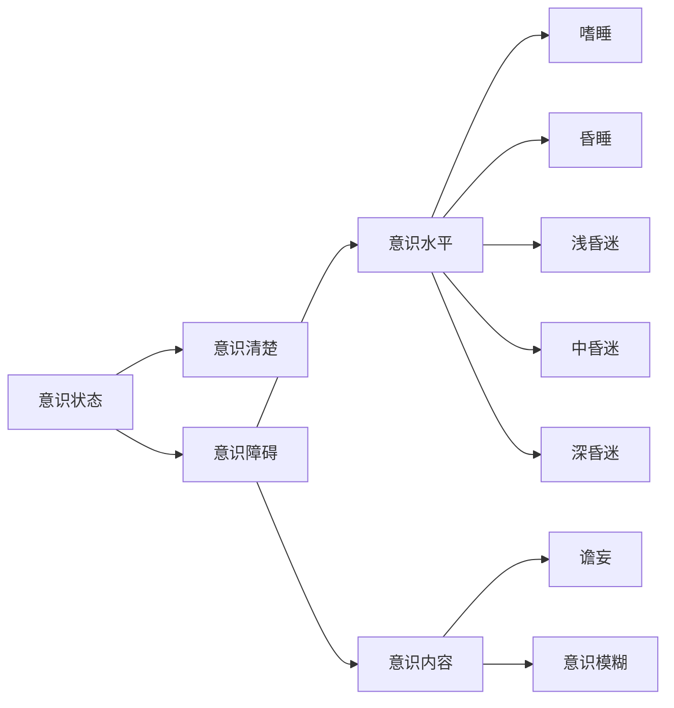
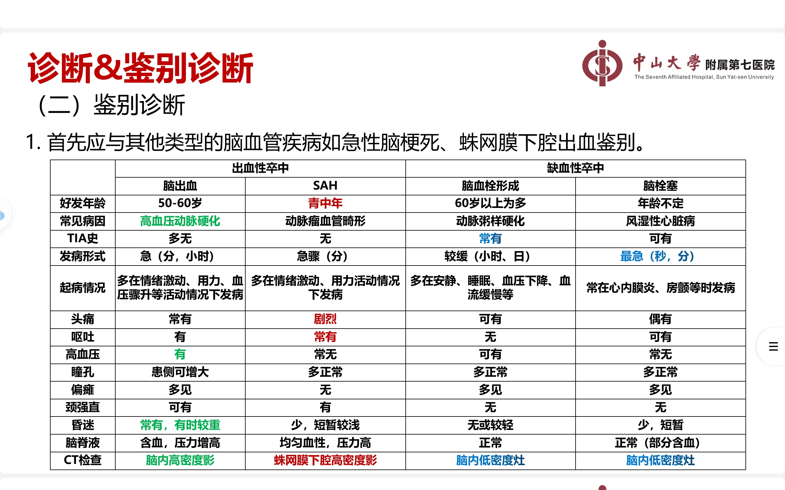

# 总论
## 症状
### 头痛
+ 问诊方式
	+ 部位
	+ 形式
	+ 性质
	+ 加重因素
	+ 程度
	+ 伴随
	+ 先兆
+ 产生部位
	+ 颅外病变：与病灶一致
	+ 颅内病变：与病变部位不精确
		+ 小脑幕以上的病变同侧痛
		+ 以下肿瘤位于后枕部痛
		+ 感染呈全头痛
### 眩晕
+ 眩晕：自身或周围物体旋转、漂浮或翻滚
	+ 性质
		+ 真性眩晕：自身对外界空间位置错觉
		+ 假性眩晕：仅有晕动感
	+ 部位
		+ 系统性眩晕：周围性眩晕、中枢性眩晕，前庭神经系统
		+ 非系统性眩晕：眼部、心血管、内分泌疾病、中毒感染贫血 
+ 头晕：头重脚轻，眼花和站立不稳
+ 头昏：脑子昏昏沉沉
### 感觉异常
+ 抑制性症状
	+ 完全性感觉障碍：一个部位各种感觉缺失
	+ 分离性感觉障碍：意识清醒、某部位某种感觉障碍而其他保存
	+ 皮质感觉缺失：深浅感觉正常，无视觉不能辨别形状重量
+ 刺激性或激惹性：
	+ 感觉过敏
	+ 感觉过度：潜伏期长、感受性降低，兴奋阈值增高、不愉快、扩散性、延时性
+ 感觉倒错：错误感觉
+ 感觉异常：没有刺激情况下有蚁行感、麻木等，但客观检查无感觉障碍
+ 疼痛
### 瘫痪
+ 病因分类
	+ 神经元性
	+ 肌源性
	+ 神经肌接头
+ 瘫痪的分类
	+ 偏瘫
	+ 截瘫
	+ 四肢瘫
	+ 交叉瘫
	+ 单瘫
+ 运动传导
	+ 上运动神经元（痉挛性）
	+ 下运动神经元（迟缓性）
### 抽搐
### 视力障碍
### 睡眠障碍
## 检查
### 意识状态

+ 嗜睡：意识障碍早期表现，睡眠时间过度延长，能被叫醒，醒后可以配合检查和回答问题，停止刺激后继续入睡
+ 昏睡：正常刺激无法使其觉醒，比嗜睡重，可作含糊简单不完全的答话，停止刺激后入睡
+ 昏迷
	+ 浅昏迷：意识丧失、声光无反应、对强疼痛有回避，无生命体征改变
	+ 中昏迷：意识丧失，对强疼痛反应减弱，瞳孔对光反射减弱，生命体征有改变
	+ 深昏迷：任何刺激无反应，反射消失，生命体征改变
+ 意识模糊：注意力减退、情感反应淡漠、定向力障碍，活动减少、语言缺乏连贯性、对外界刺激可有反应，但低于正常水平
### 意识障碍检查
1. 眼征：
	1. 瞳孔
		2. 一侧瞳孔散大固定：钩回疝
		3. 双侧，光反射消失：中脑受损、阿托品中毒
		4. 双瞳孔针尖样缩小：吗啡有机磷中毒、脑桥被盖损害
		5. 一侧瞳孔缩小：Horner
	2. 眼底：视乳头水肿：颅高压
	3. 眼球位置
		1. 突出：甲亢、肿瘤、动眼神经麻痹
		2. 凹陷：Horner、颈髓病变、瘢痕收缩
	4. 眼球运动
2. 疼痛反应
3. 瘫痪体征
4. 脑干反射
	1. 睫脊反射：捏脊柱导致瞳孔扩大
	2. 角膜反射
	3. 头眼反射：头转向一侧，眼向对侧转动
5. 呼吸形式（由上到下分别为间脑、中脑被盖部、中脑下部脑桥上部、脑桥下部、延髓上部）
	1. 潮式呼吸
	2. 中枢神经源性过度呼吸
	3. 长吸式呼吸
	4. 丛集式呼吸
	5. 共济失调式呼吸
6. 脑膜刺激征
### 精神状态和高级皮质功能检查
+ 记忆力
+ 计算力
+ 定向力
	+ 时间定向力
	+ 地点定向力
	+ 人物定向力
+ 失语、失用、失认
### 脑神经
1. 嗅神经
2. 视神经
	1. 视觉通路损害
		+ 视乳头：中央视野缺损
		+ 视神经：同侧全盲
		+ 视交叉中部：双眼颞侧偏盲
		+ 一侧视交叉外部：同侧鼻侧盲
		+ 视束、视辐射、视皮质：对侧同向偏盲
		+ 视辐射上部：对侧下象限偏盲
		+ 视辐射下部：对侧上象限偏盲
		+ 黄斑回避：黄斑由两侧皮质共同感受
	2. 视乳头水肿：眼底视乳头边缘模糊、生理凹陷消失、静脉淤血
3. 动眼神经、滑车神经、展神经
	1. 动眼神经：瞳孔对光反射（正常3-4mm）
		+ 支配：上睑提肌（提上睑）、上直肌（内上方）、内直肌（内）、下斜肌（上外方）、下直肌（内下方）、瞳孔括约肌
	2. 滑车神经：上斜肌（下外方）
	3. 展神经：外直肌（外方）
	4. 光反射通路：

4. 三叉神经
	+ 咀嚼肌
	+ 感觉	

# 脑血管疾病
## 脑梗死
### 要求
+ 掌握诊断和治疗原则
+ 熟悉不同脑血管闭塞临床特点,特殊类型脑梗死
+ 了解CT MRI诊断意义

### 病理及病理生理
脑缺血区=坏死区+缺血半暗帯
### 临床表现
+ 一般特点：
  + 突然发病
  + 局灶性神经功能缺损症状和体征：偏瘫、失语
  + 不同脑血管闭塞临床特点
    + 颈内动脉
	  + 急性闭塞：三偏失语
	  + 慢性闭塞：可无症状体征
	+ 前动脉
	  + 分出前交通动脉前主干闭塞：旁中央小叶
	  + 皮质支：对侧中枢性下肢瘫、感觉障碍、对侧肢体共济失调、强握反射及精神症状
	  + 深穿支：中枢性面舌瘫，上肢近端轻瘫
	+ 中动脉
	  + 主干：三偏，病侧凝视，失语
	  + 皮质支
	    + 上部分：凝视、Broca失语/忽视
		+ 下部分：Wernicke失语/急性意识模糊
		+ 豆纹动脉：三偏
	+ 后动脉
	  + 主干闭塞：
	    + 对侧同向偏盲：优势半球受累可出现失读、命名性失语、失认
	    + 双侧皮质支闭塞：完全型皮质盲，视幻觉、记忆受损、面容失认
	  + 大脑后动脉起始段脚间支：中脑中央和下丘脑综合征；旁正中动脉综合征（Ｗeber综合征），Ｃlaude综合征，Benedikt综合征
    + 大脑后动脉深穿支闭塞：红核丘脑综合征
  + 椎基底动脉
    + 闭锁综合征：脑桥支闭塞，意识清醒，语言理解无障碍，双侧中枢性瘫痪
    + 脑桥腹外侧综合征：短旋支闭塞，同侧面神经展神经麻痹对侧偏瘫
    + 脑桥腹内侧综合征：旁中央支闭塞，同侧周围性面瘫，对侧偏瘫，双眼向病变同侧同向运动不能
    + 基底动脉尖综合征：小脑上动脉、大脑后动脉，眼球运动障碍瞳孔异常、觉醒行为障碍、记忆力丧失、对侧偏盲或皮质盲
    + 延髓背外侧综合征：由小脑后下动脉或椎动脉,构音障碍、Honer综合征、交叉性感觉障碍

### 诊断步骤
+ 是不是卒中：通过急性起病、脑损害特征
+ 卒中类型：缺血和出血：通过MRI
+ 是否静脉溶栓
+ 是否机械取栓

||脑梗死|脑出血|
|---|---|---|
|发病年龄|>60|<60
|起病状态|安静或睡眠中|动态起病
|起病速度|慢，>10h|分钟到数小时
|全脑症状|轻或无|头痛、呕吐、嗜睡、打哈欠颅高压
|意识障碍|无/较轻|多/较重
|神经体征|多为非均等性偏瘫|多为均等性偏瘫
|CT检查|脑实质内低密度病灶|脑实质内高密度病灶
#### 大动脉粥样硬化型脑梗死的TOAST分型诊断
+ 影像学检查：神经对应大动脉狭窄>50%或闭塞，血管病变符合动脉粥样硬化改变或存在大动脉狭窄>50%间接证据
+ 至少一个动脉粥样硬化卒中危险因素
+ 排除心源性栓塞所致脑梗死
### 治疗
+ 目标：挽救缺血半暗带，再通复流脑保护，分期分型个体化治疗，核心是恢复脑的血流动力学
+ 最佳途径：卒中单元：*一个Team（一组人）负责医院内主要是急性期脑血管病人的治疗。这一组人由急诊室医师、神经科医师、康复医师、各种康复师（语言、心理及肢体康复等）、理疗师、专业护士及社会工作者等组成。*

+ 一般处理
  + 吸氧
  + 心脏监测
  + 体温控制
  + 血压控制
  + 血糖
  + 营养支持
+ 特异性治疗
  + 3h内rtPA静脉溶栓

|适应症|禁忌症|
|---|---|
|有脑梗死导致的神经功能缺损症状|出血：既往颅内出血史 可疑蛛网膜下腔出血 急性出血倾向 活动性内出血 近一周动脉穿刺/近期颅内椎管内手术 近三月卒中史/重大头颅外伤史 血压高
|症状出现<3h|低血糖
|年龄&ge;18|颅内肿瘤、动静脉畸形、动脉瘤
|知情同意|多叶梗死
  
  + 3-4.5h：相对禁忌症：年龄>80，严重卒中，口服抗凝药、有糖尿病和缺血性卒中病史
  + 介入
  + 抗板
  	+ 48h内尽早服用，48h后不建议服用
    + 阿司匹林过敏或不能使用使用氯吡格雷
    + 不联合长期应用
    + 24h内，NIHSS&le;3短期合用
  + 抗凝
  + 脑保护
  + 扩容
  + 其他药物
  + 原发病治疗

## 脑出血
非外伤脑实质内出血
### 要求
+ 掌握：临床表现、诊断、鉴别诊断
+ 熟悉：防治原则
+ 了解：病因、因素、发病机理

### 临床表现
+ 定位特征
  + 基底核
    + 壳核出血常见：三偏征：豆纹动脉
    + 丘脑出血：丘脑膝状体、丘脑穿通动脉
    + 尾状核：头痛、呕吐、颈强直、精神症状：高血压动脉硬化、血管畸形破裂
  + 脑叶出血：顶叶常见
    + 额叶：偏瘫、尿便障碍、Broca失语、摸索、强握反射
    + 颞叶、Wernicke失语、精神症状、对侧上象限盲、癫痫
    + 枕叶：视野缺损
    + 顶叶：偏身感觉障碍、轻偏瘫、对侧下象限盲、构像障碍（非优势半球）
  + 脑干出血：基底动脉脑桥支多见
    + 迅速昏迷、双眼针尖样瞳孔、呕吐咖啡样内容物、中枢性高热、呼吸障碍、眼球浮动、四肢瘫痪、去大脑强直
    + 小量：交叉性瘫痪和共济失调性偏瘫
  + 中脑出血：头痛、意识障碍、双侧动眼神经不全麻痹、眼球不同轴、同侧肢体共济失调、Weber、Benedikt综合征
  + 延髓：意识障碍、影响生命体征
  + 小脑：头痛呕吐、眩晕、共济失调
  + 脑室
### 诊断

+ 患者特征
  + \>50男性
  + 寒冷季节
  + 情绪激动、活动
  + 进展快
  + 不同程度的意识障碍
+ 鉴别诊断

  + 与中毒、代谢性疾病鉴别
  + 有头部外伤史者与外伤性颅内血肿鉴别

### 治疗
+ 原则：安静卧床、脱水降压、调整血压、防治继续出血、防治并发症以挽救生命，降低死亡率、残疾率和复发

# 癫痫
## 要求
+ 一般了解：癫痫的病因和发病机理，防治方法。
+ 牢固掌握：癫痫的临床表现、诊断和鉴别诊断，抗癫痫治疗的用药原则。

## 概念
+ 癫痫(epilepsy)：是多种原因导致的脑部神经元高度同步化异常放电的临床综合征，是以反复癫痫发作为共同特征的慢性脑部疾病状态。
  + 特点：发作性、短暂性、重复性和刻板性
+ 癫痫发作（seizure）：临床上每次发作或每种发作的过程称为痫性发作
  + 特点：突发突止、短暂一过性、自限性，脑电图存在异常过度同步化放电
+ 癫痫综合征（epilepsy syndromes）：在癫痫发作中，由具有特定症状体征所组成的特定癫痫现象
  + 特点：有特定的起病年龄和病程，具有特征性的发作症状、脑电图和影像学特征，但同一癫痫综合征在病因上可以有较大的异质性
  + 自动症（automatisms）：是指在癫痫发作过程中或发作后意识模糊状态下出现的具有一定协调性和适应性的无意识活动，均在意识障碍的基础上发生，伴有遗忘。口消化道自动症、手足自动症、言语自动症
+ 药物难治性癫痫：合适的抗癫痫药物正规治疗2年以上，血药浓度在有效范围内，每次仍有4次以上发作，并影响日常生活，除外进行性中枢神经系统或颅内占位性病变者
## 发病机制
+ 癫痫病灶 神经病理学概念，是导致癫痫发作的脑组织形态或结构的异常，CT/mRI或显微镜下可显示
+ 致痫灶 神经生理学概念，是EEG出现的一个或数个最明显的痫性放电部位
## 分类
+ 单纯部分性发作
  + 部分运动性发作
    + Jackson发作 异常运动从局部开始，沿大脑皮质运动区移动，表现为抽搐自手指->腕部->前臂->肘->肩->口角->面部逐渐发展，严重者可留下短暂性肢体瘫痪（0.5h-36h内消除），称为Todd麻痹
    + 旋转性发作 表现为双眼突然向一侧偏斜，继之头部不自主同向转动，伴有身体的扭转，但很少超过180o，部分患者出现继发性全身性发作
    + 姿势性发作 表现为发作性一侧上肢外展、肘部屈曲、头向同侧扭转、眼睛注视着同侧
    + 语言性发作 不自主重复发作前的单音或单词，偶可有语言抑制
  + 部分感觉性发作
    + 躯体感觉性发作 表现为一侧肢体麻木感和针刺感，多发生在口角、舌、手或足趾，病灶多在中央后回躯体感觉区
    + 特殊感觉性发作 表现为视觉性（如闪光或黑朦等）、听觉性、嗅觉性和味觉性
    + 眩晕性发作 表现为坠落感、飘动感或水平/垂直运动感等
  + 自主神经性发作
    + 表现为苍白、面部及全身潮红、多汗、立毛、瞳孔散大、呕吐、腹痛、肠鸣、烦渴和欲排尿感等
    + 病灶多位于岛叶、丘脑及周围（边缘系统）
    + 易扩散出现意识障碍，成为复杂部分性发作的一部分
  + 精神性发作
    + 记忆障碍：如似曾相识、似不相识、强迫思维、快速回顾往事
    + 情感障碍：无名恐惧、忧郁、欣快、愤怒
    + 错觉（视物变形、变大、变小，声音变强或变弱）、复杂幻觉等
    + 常为复杂部分性发作的先兆，也可继发全面性强直－阵挛发作
+ 复杂部分性发作
  + 仅表现为意识障碍
  + 意识障碍和自动症
  + 意识障碍和运动症状
+ 部分性发作继发全面性发作
  + 发展为复杂部分性发作
  + 泛化为全面性强直阵挛发作
+ 全面性发作
  + 全面性强直阵挛发作
    + 早期出现意识丧失、跌倒，随后的发作分为强直期、阵挛期、发作后期
    + 强直期：全身骨骼肌持续性收缩（眼睑上翻或凝视，咬伤舌尖，呼吸停止、颈和躯干先屈曲后反张，持续1-20s）
    + 阵挛期：肌肉交替性收缩与松弛，呈一张一弛交替性抽动，持续30-60s或更长，可出现呼吸停止、血压升高、心率加快、瞳孔散大、光反射消失、唾液分泌增多，Barbinski
    + 发作后期：全身肌肉松弛，括约肌松弛，尿失禁，呼吸首先恢复，随后瞳孔、血压、心率恢复正常
  + 强直性
  + 阵挛性发作
  + 失神发作
  + 肌阵挛发作
  + 失张力发作
+ 不分类
  + 痴笑发作
  + 持续性先兆
## 诊断
+ 原则
  + 是否为癫痫发作
  + 哪种类型的癫痫/癫痫综合征
  + 发作病因
+ 病史
  + 现病史：起病年龄、发作过程、诱因、先兆、病情发展、发作频率、治疗
  + 既往史：高热惊厥、脑外伤、脑炎、脑肿瘤、手术
  + 个人史：妊娠史、围生期异常
  + 家族史
+ 体格检查：神经系统检查、全身一般检查
+ 脑电图检查：最重要的检查方法
+ 神经影像检查
## 鉴别诊断
||癫痫发作|假性癫痫发作
|:---:|:---:|:---:|
|场合|任何情况下|有精神诱因及有人在场
|发作特点|突然刻板发作|多种多样
|眼位|同一侧或向上|眼睑紧闭、眼球乱动
|面色|发绀|苍白/发红
|对抗被动运动|不能|可以
|摔伤、舌咬伤、尿失禁|可有|无
|Barbinski征|+|-
|持续时间及终止方式|1-2min，自行终止|长，需要安慰和暗示
|发作后嗜睡或意识模糊|常见|无
|激惹性性格|少|多
|EEG|多有异常|无

+ 晕厥：脑血流灌注不足导致，有明显诱因，有先兆，时间少超过15s
+ 发作性睡眠：不可抑制的睡眠、睡眠瘫痪、入睡前幻觉、猝倒四联征
+ 低血糖症：血糖监测<2mmol/L
+ 基底动脉型偏头痛：意识障碍较轻，脑电图可有枕区棘波
+ 短暂性脑缺血发作：见于老年人，有危险因素，脑电图无明显痫性放电

## 治疗
+ 治疗目的
  + 控制发作或最大限度减少发作次数
  + 长期治疗无明显不良反应
  + 使患者保持或恢复其原有的生理、心理或社会功能状态
+ 用药原则
  + 确定是否用药:半年发作两次以上,诊断明确即用药
  + 正确选择用药：初始药物选择非常关键
  + 注意药物用法：小量开始，逐渐加大
  + 增减药物、停药换药原则
    + 增要快，减要慢
    + 长期服药
    + 长期最大量不能控制发作，可加用二线药物到控制或最大后逐渐减掉原有药物，换为单药，**应有5-7天过渡期**
    + 停药：缓慢，逐渐减量
  + 观察不良反应
  + 尽可能单药治疗
  + 合理联合治疗
    + 不宜合用化学结构相同药物
    + 尽量避开副作用相同到药物
    + 注意药物相互作用
+ AEDs种类和适用

|发作类型|A级药物|B级|C级|
|---|---|---|---|
|成人部分|卡马西平、苯妥英钠|丙戊酸钠|加巴喷丁、拉莫三嗪、奥卡西平、苯巴比妥、托吡酯、丙戊酸钠|
|儿童部分|奥卡西平||卡马西平、苯巴比妥、苯妥英钠、托吡酯、丙戊酸钠
|老年部分|加巴喷丁、拉莫三嗪||卡马西平
|成人全面强直-阵挛|||卡马西平、拉莫三嗪、奥卡西平、苯巴比妥、苯妥英钠、托吡酯、丙戊酸钠
|儿童全面强直-阵挛|||卡马西平、苯巴比妥、苯妥英钠、托吡酯、丙戊酸钠
|儿童失神发作|||乙琥胺、拉莫三嗪、丙戊酸钠
|伴中央-颞部棘波的良性儿童癫痫|||卡马西平、丙戊酸钠

+ 手术
  + 指征：长时间正规单药无效/先后两种AEDs到达最大耐受剂量/正规联合治疗无效
  + 癫痫病灶切除术指征：定位明确、病灶局限、术后无严重功能障碍风险
## 癫痫持续状态
+ 一般措施：对症
  + 呼吸道、吸氧、监测、诱因治疗、牙关紧闭：牙套
  + 建立静脉通道
  + 防治并发症
+ 一线药物
  + 地西泮
  + 地西泮+苯妥英钠
  + 10%水合氯醛
+ 发作后
  + 苯巴比妥
+ 难治性
  + 首要任务：终止发作
  + 异戊巴比妥：低血压、呼吸抑制、复苏延迟
  + 咪达唑仑：抑制作用小
  + 丙泊酚：需逐渐减量

# 周围神经病
## 要求
+ 掌握：三叉神经痛、坐骨神经痛、面神经炎、吉兰-巴雷综合征的临床表现、诊断、鉴别诊断或治疗
+ 熟悉：周围神经应用解剖、继发性坐骨神经痛的病因
+ 了解：周围神经病分类病理改变、吉兰-巴雷综合征病因病理
## 三叉神经痛

### 临床表现
+ 中老年多见
+ >40岁起病
+ 三叉神经**1、2个分支**区域**电击、刀割、撕裂样剧痛**
+ 时间短，数秒到1-2分钟，突发停止，间歇正常
+ **扳机点/触发点**：患者口角、鼻翼、颊部、舌部为敏感区，轻触可诱发三叉神经痛
+ **痛性抽搐**：疼痛出现面肌反射性抽搐，口角牵向患侧
+ 病程周期性
### 辅助检查
+ 神经电生理：排除继发性三叉神经痛
+ 影像学：除外继发性三叉神经痛
### 诊断
+ 根据疼痛部位性质**扳机点**
+ 神经系统无阳性体征
+ 影像学检查无异常表现
### 鉴别诊断
+ 继发性三叉神经痛：持续疼痛、感觉减退、角膜反射迟钝，合并其他脑神经麻痹
+ 牙痛：持续钝痛，局限，冷热刺激加剧
+ 舌咽神经痛：位置、诱发因素：吞咽、讲话、哈欠、咳嗽，4%可卡因或丁卡因可阻止
### 治疗
+ **首选卡马西平**，注意部分患者基因原因导致的**皮疹**副作用（Steven-Johnson综合征）
+ 其他药物
  + 苯妥英钠
  + 加巴喷丁
  + 普瑞巴林
+ 封闭治疗：药物无效可考虑，可导致注射区面部感觉消失
+ 经皮半月神经节射频电凝疗法
+ 三叉神经显微血管减压术
## 面神经炎
+ 也称特发性面神经麻痹：茎乳孔内面神经非特异性炎症所致**周围性面瘫**
+ 周围性面瘫或中枢性面瘫鉴别

||中枢性面瘫|周围性面瘫|
|---|---|---|
|神经元|上运动神经元|下运动神经元
|病灶|对侧|同侧
|面瘫范围|眼裂以下面肌|全面肌
|味觉|正常|可有障碍
|伴发症状|有|不一定
|原因|脑血管病、肿瘤|面神经炎
### 临床表现
+ 急性起病、症状数小时或数天到高峰
+ 麻痹侧乳突区、耳内或下颌角疼痛
+ 膝状神经节病变（Hunt综合征）
  + 周围性面瘫
  + 味觉丧失
  + 听觉过敏
  + 耳廓外耳道感觉减退
  + 外耳道、鼓膜疱疹
+ 发出镫骨肌支以上
  + 周围性面瘫
  + 味觉丧失
  + 唾液分泌障碍
  + 听觉过敏
+ 鼓索与面神经分离前
  + 味觉丧失
  + 唾液分泌障碍
+ 周围性面瘫
### 辅助检查
+ 肌电图：恢复和预后判断
+ 影像学检查：排除其他疾病
### 诊断
+ 急性起病
+ 周围性面瘫
+ 无其他神经系统阳性体征
+ 排除性诊断
### 鉴别诊断
+ 吉兰-巴雷综合征：双侧周围性面瘫，对称性四肢迟缓性瘫后感觉障碍；脑脊液蛋白细胞分离
+ 耳源性面神经麻痹：继发于中耳炎、迷路炎、乳突炎
+ 颅后窝肿瘤或脑膜炎：起病缓慢，其他脑神经受损
+ 神经莱姆病：发热，皮肤游走性红斑
### 治疗
+ 原则：改善局部血液循环，减轻水肿，缓解受压，促进功能恢复
+ 药物：
  + 皮质类固醇：尽早使用
  + B族维生素
  + 阿替洛韦：用于Hunt综合征
+ 理疗
+ 护眼：眼罩、左氧氟沙星
+ 康复治疗
## 坐骨神经痛
+ 分类
  + 根性坐骨神经痛
    + 多见，椎管内病变
    + 腰椎间盘突出
    + 肿瘤
    + 腰椎肥大性脊柱炎……
  + 干性坐骨神经痛
    + 腰骶丛及神经干邻近病变所致
### 临床表现
+ 症状
  + 青壮年单侧
  + L5-S1分布区疼痛，放射性疼痛
  + 持续性钝痛，阵发性加剧；电击、刀割或灼烧样疼痛
  + 行走、牵拉坐骨神经加剧
  + 咳嗽、喷嚏、用力时加剧
+ 体征
  + 直腿抬高实验阳性
  + 坐骨神经压痛
  + 运动功能缺损
  + 臀肌松弛，小腿萎缩，踝反射减弱或者消失
  + 小腿外侧和足背外侧感觉减退
### 诊断
+ 临床症状
+ 体征
+ 影像学资料
### 鉴别诊断
+ 腰肌扭伤
+ 腰肌劳损、臀部纤维组织炎、髋关节炎
### 治疗
+ 病因治疗
+ 药物治疗
  + 止痛剂：吲哚美辛、布洛芬、卡马西平
  + 肌肉痉挛：地西泮
  + VB
+ 封闭
+ 理疗
+手术
## 吉兰巴雷综合征
### 临床表现
+ AIDP（急性炎症性脱髓鞘性多发性神经病
  + 前驱症状：急性起病，数日到2周到达高峰
  + 运动障碍：四肢对称性迟缓性瘫痪
  + 感觉障碍：手套袜套样分布
  + 脑神经受累
  + 自主神经功能障碍
  + 脑脊液检查：脑脊液蛋白-细胞分离：蛋白<1g/L,白细胞<107/L
  + 抗神经节苷脂抗体+
  + 腓肠神经发现有髓纤维脱髓鞘、炎性细胞浸润
+ AMAN（急性运动轴索性）
  + 儿童常见
  + 腹泻史
  + 累及呼吸肌
  + 无明显感觉异常
+ AMSAN（急性运动感觉轴索性）
  + 有感觉障碍，部分出现感觉性共济失调
  + 自主神经功能障碍
+ Miller-Fisher综合征
  + 三联征：眼肌麻痹、共济失调、腱反射消失
  + GQ1b抗体阳性
  + 运动传导或肌电图无异常
### 诊断
+ AIDP（急性炎症性脱髓鞘性多发性神经病
  + 前驱感染、2周
  + 四肢对称迟缓性瘫痪
  + 轻度感觉异常、自主神经功能障碍
  + 蛋白细胞分离
  + 电生理检查
  + 自限性
+ AMAN（急性运动轴索性）
  + 抗神经节苷脂GM1、GD1a抗体
+ AMSAN（急性运动感觉轴索性）
  + 电生理：感觉神经动作电位波幅下降或无法引出波形
+ MFS
  + 眼肌麻痹、共济失调、腱反射消失
### 鉴别诊断
+ 脊髓灰质炎：发热、局限一侧下肢、无感觉障碍
+ 急性横贯性脊髓炎：发热史、截瘫、脑神经不受累、尿便障碍、受损平面以下运动障碍传导束性感觉障碍
+ 低价周期性瘫痪：血清K低
+ 重症肌无力：新斯的明实验+
### 治疗
+ 抗感染
+ 呼吸道管理
+ 营养支持
+ 对症治疗防治并发症
+ 免疫治疗
  + 血浆置换
  + 免疫球蛋白，一般不联用
  + 不推荐用GC
+ VB
+ 康复治疗
### 呼吸麻痹
密切观察呼吸情况，血氧饱和度明显降低时，尽早气管插管或气管切开，机械辅助通气、加强气道护理，定时翻身拍背、吸痰，保持呼吸道通畅

# 中枢神经感染性疾病
## 要求
+ 掌握 
<table><tr><td>单纯疱疹病毒</td><td>病因</td><td>临床表现</td><td>辅助检查</td><td>诊断</td><td>鉴别诊断</td><td>治疗</td></tr><tr><td>化脓性脑膜炎</td><td>病因</td><td>临床表现</td><td>辅助检查</td><td>诊断</td><td>鉴别诊断</td><td>治疗</td></tr><tr><td>结核性脑膜炎</td><td></td><td>临床表现</td></tr></table>

## 单纯疱疹病毒性脑炎
+ 病因：单纯疱疹病毒HSV-II感染
### 临床表现
+ 头痛、呕吐、意识障碍
+ 癫痫发作
+ 精神症状
+ 锥体束症
+ 共济失调
+ 自主神经症状
+ 锥体外系症状
+ 自主神经症状
+ 病情迅速进展，重症者因脑疝死亡
### 辅助检查
+ 脑电图；弥漫性高波幅慢波
+ CT：局灶出血
+ 脑脊液：压力正常/增高，白细胞+(50-100)x106/L，淋巴细胞为主，蛋白质增高，糖氯化物正常
+ 脑脊液病原：抗体，DNA
+ 脑活检：细胞核内嗜酸性包涵体，电镜可见病毒颗粒
### 诊断
+ 疱疹史
+ 上感症状
+ 精神行为异常、抽搐、意识障碍、局灶神经吸痰损害
+ 脑脊液
+ EEG以颞、额区损害为主
+ CT
+ 抗病毒有效

+ 确诊
  + HSV抗体有显著变化趋势
  + 脑组织活检发现组织细胞核内包涵体或原位杂交发现HSV核酸
  + CSF对PCR发现DNA
  + 脑组织或CSF标本HSV分离、培养和鉴定
### 鉴别诊断
+ 带状疱疹病毒脑炎：中老年人多见，病情轻预后好，CSF检出抗体
+ 肠道病毒性脑炎：夏秋多见，起初胃肠道症状
+ 巨细胞病毒性脑炎：少见，艾滋病/免疫抑制，体液见巨细胞
+ 急性播散性脑脊髓炎：感染/接种疫苗史，脑脊髓白质受损
### 治疗
+ 抗病毒治疗
  + 阿替洛韦
  + 更昔洛韦
+ 免疫治疗：干扰素、转移因子
+ 糖皮质激素
+ 抗菌治疗
+ 对症支持
## 化脓性脑膜炎
由化脓性细菌感染所致脑脊髓膜炎，常见肺炎链球菌、脑膜炎双球菌、流感嗜血杆菌B
### 临床表现
+ 高热、寒战、上感
+ 脑膜刺激征
+ 颅内压增高
+ 局灶神经功能损害症状
+ 脑膜炎双球菌脑炎菌血症有皮疹
### 辅助检查
+ 血常规：WBC高，10-30x109/L
+ 脑脊液：压力升高，浑浊/脓性，WBC+(1000-10000)x106/L，蛋白质升高，糖氯化物降低
+ 影像学检查：T1加权上显示蛛网膜下腔高信号，可不规则强化，T2加权脑膜高信号
### 诊断
+ 急性起病，发热头痛呕吐、脑膜刺激征
+ 脑脊液
+ 病原学证据
### 鉴别诊断
+ 病毒性脑膜炎
+ 结核性脑膜炎
+ 隐球菌性脑膜炎
### 治疗
+ 抗菌治疗：及早使用抗生素
+ 激素治疗
## 结核性脑膜炎
### 临床表现
+ 起病隐匿，慢性
+ 结核中毒症状
+ 脑膜刺激征、颅内压增高
+ 脑实质损害：精神萎靡、淡漠、谵妄、癫痫发作、昏睡/依山面海
+ 脑神经损害：视神经、动眼神经、展神经、面神经最易受害
## 脑脊液检查鉴别
<table><tr><td></td><td>外观</td><td>压力</td><td>WBC</td><td>RBC</td><td>蛋白质</td><td>糖</td><td>氯化物</td><td>其他</td></tr><tr><td>正常值</td><td>无色透明</td><td>80-180</td><td>0-5</td><td>-</td><td>0.15-0.45</td><td>2.5-4.4</td><td>120-130</td><td>-</td></tr><tr><td>单纯疱疹病毒</td><td>-</td><td>正常/升高</td><td>50-100</td><td>可升高</td><td>轻中度升高</td><td>正常</td><td>正常</td><td>-</td></tr><tr><td>病毒性脑膜炎</td><td>-</td><td>同上</td><td>正常/升高</td><td>-</td><td>轻度升高</td><td>正常</td><td>正常</td><td>-</td></tr><tr><td>化脓性脑膜炎</td><td>浑浊/脓性</td><td>升高</td><td>1000-10000</td><td>-</td><td>升高</td><td>降低</td><td>降低</td><td>涂片/培养可阳性</td></tr><tr><td>结核性脑膜炎</td><td>无色透明/微黄</td><td>升高</td><td>50-500，淋巴细胞为主</td><td>-</td><td>升高</td><td>降低</td><td>降低</td><td>-</td></tr><tr><td>新型隐球菌脑膜炎</td><td>升高</td><td>10-500，淋巴细胞升高</td><td>-</td><td>升高</td><td>降低</td><td>-</td><td>墨汁染色+</td></tr></table>

# 脊髓疾病
## 教学大纲
+ 一般了解：脊髓病变的分类；运动神经元疾病的临床表现及分类，运动神经元疾病的诊断和鉴别诊断。
+ 一般掌握：脊髓的应用解剖及生理；急性脊髓炎的临床表现；脊髓压迫症的临床表现。
+ 牢固掌握：脊髓损害的临床类型，定位；急性脊髓炎的病因、病理，诊断和鉴别诊断，治疗及护理原则；脊髓压迫症的概念，诊断和鉴别诊断及治疗原则。

## 脊髓损害的临床类型

<!--stackedit_data:
eyJoaXN0b3J5IjpbMTI5NjI2MTY1NCw0NjczNDU0MTYsLTIwNj
cwMTA2NSw2NDYwNjcwOTUsLTEwMDIwNjA1NDIsMTgwMTgyNzEx
MSwtMTg4MjQ4NjUyOSwxODI3NjA4NzIsODQyODU5OTYzLDU1NT
k3NzU2NCwtMTYzNjk3NDE5NSw2NjcyMzYzNDUsLTE4MTA3NTgx
NjMsMTY3NTgxMjU4OCwtNTIxNTIzNzgsNzkwMTg1MDEsLTEzMD
Y1Mjk0NTEsMzcwOTY0Mzg3LC0zMTc3MjUzMjAsMTY3MTYwOTM3
Ml19
-->