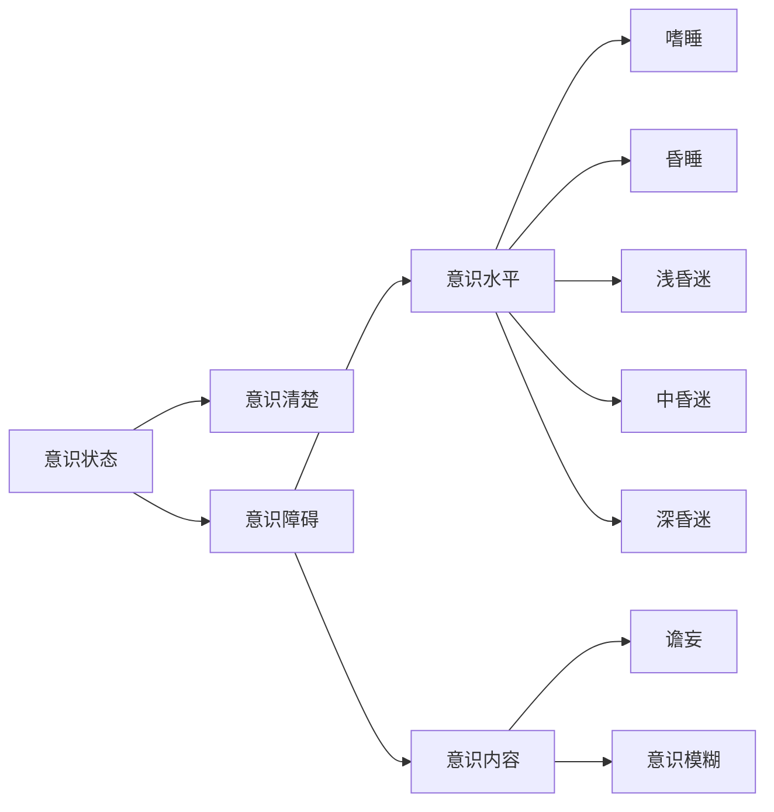

# 总论
## 症状
### 头痛
+ 问诊方式
	+ 部位
	+ 形式
	+ 性质
	+ 加重因素
	+ 程度
	+ 伴随
	+ 先兆
+ 产生部位
	+ 颅外病变：与病灶一致
	+ 颅内病变：与病变部位不精确
		+ 小脑幕以上的病变同侧痛
		+ 以下肿瘤位于后枕部痛
		+ 感染呈全头痛
### 眩晕
+ 眩晕：自身或周围物体旋转、漂浮或翻滚
	+ 性质
		+ 真性眩晕：自身对外界空间位置错觉
		+ 假性眩晕：仅有晕动感
	+ 部位
		+ 系统性眩晕：周围性眩晕、中枢性眩晕，前庭神经系统
		+ 非系统性眩晕：眼部、心血管、内分泌疾病、中毒感染贫血 
+ 头晕：头重脚轻，眼花和站立不稳
+ 头昏：脑子昏昏沉沉
### 感觉异常
+ 抑制性症状
	+ 完全性感觉障碍：一个部位各种感觉缺失
	+ 分离性感觉障碍：意识清醒、某部位某种感觉障碍而其他保存
	+ 皮质感觉缺失：深浅感觉正常，无视觉不能辨别形状重量
+ 刺激性或激惹性：
	+ 感觉过敏
	+ 感觉过度：潜伏期长、感受性降低，兴奋阈值增高、不愉快、扩散性、延时性
+ 感觉倒错：错误感觉
+ 感觉异常：没有刺激情况下有蚁行感、麻木等，但客观检查无感觉障碍
+ 疼痛
### 瘫痪
+ 病因分类
	+ 神经元性
	+ 肌源性
	+ 神经肌接头
+ 瘫痪的分类
	+ 偏瘫
	+ 截瘫
	+ 四肢瘫
	+ 交叉瘫
	+ 单瘫
+ 运动传导
	+ 上运动神经元（痉挛性）
	+ 下运动神经元（迟缓性）
### 抽搐
### 视力障碍
### 睡眠障碍
## 检查
### 意识状态

+ 嗜睡：意识障碍早期表现，睡眠时间过度延长，能被叫醒，醒后可以配合检查和回答问题，停止刺激后继续入睡
+ 昏睡：正常刺激无法使其觉醒，比嗜睡重，可作含糊简单不完全的答话，停止刺激后入睡
+ 昏迷
	+ 浅昏迷：意识丧失、声光无反应、对强疼痛有回避，无生命体征改变
	+ 中昏迷：意识丧失，对强疼痛反应减弱，瞳孔对光反射减弱，生命体征有改变
	+ 深昏迷：任何刺激无反应，反射消失，生命体征改变
+ 意识模糊：注意力减退、情感反应淡漠、定向力障碍，活动减少、语言缺乏连贯性、对外界刺激可有反应，但低于正常水平
### 意识障碍检查
1. 眼征：
	1. 瞳孔
		2. 一侧瞳孔散大固定：钩回疝
		3. 双侧，光反射消失：中脑受损、阿托品中毒
		4. 双瞳孔针尖样缩小：吗啡有机磷中毒、脑桥被盖损害
		5. 一侧瞳孔缩小：Horner
	2. 眼底：视乳头水肿：颅高压
	3. 眼球位置
		1. 突出：甲亢、肿瘤、动眼神经麻痹
		2. 凹陷：Horner、颈髓病变、瘢痕收缩
	4. y
<!--stackedit_data:
eyJoaXN0b3J5IjpbLTI0OTM1NzkyMSwtNTIxNTIzNzgsNzkwMT
g1MDEsLTEzMDY1Mjk0NTEsMzcwOTY0Mzg3LC0zMTc3MjUzMjAs
MTY3MTYwOTM3MiwtMjA4ODc0NjYxMl19
-->