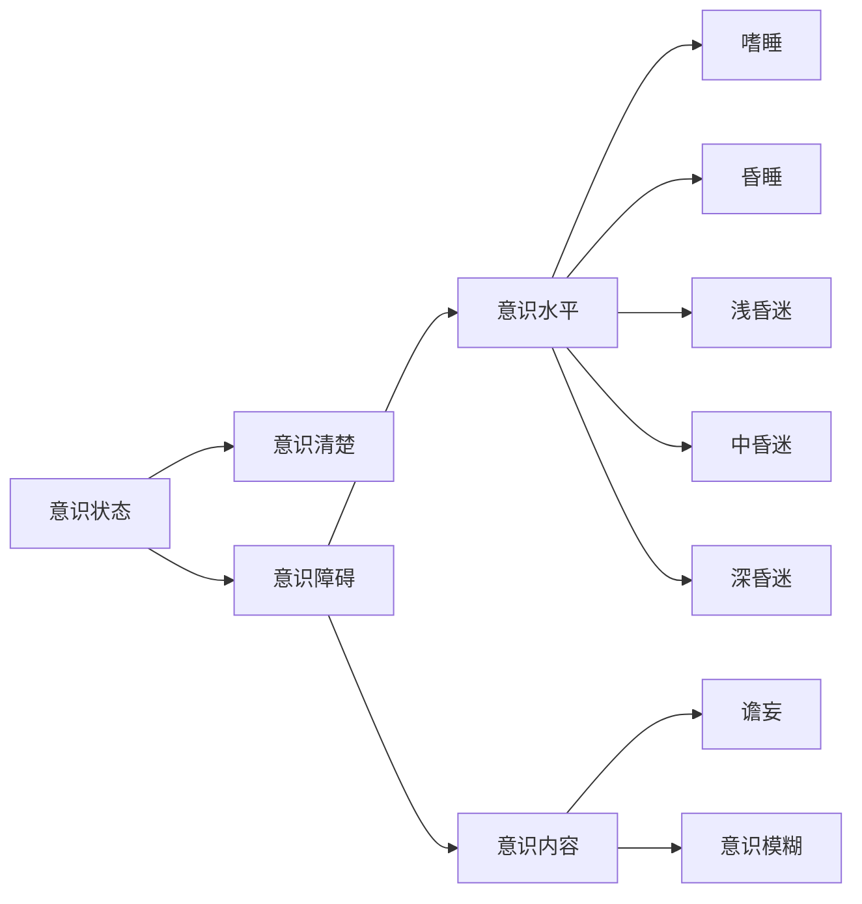

# 总论
## 症状
### 头痛
+ 问诊方式
	+ 部位
	+ 形式
	+ 性质
	+ 加重因素
	+ 程度
	+ 伴随
	+ 先兆
+ 产生部位
	+ 颅外病变：与病灶一致
	+ 颅内病变：与病变部位不精确
		+ 小脑幕以上的病变同侧痛
		+ 以下肿瘤位于后枕部痛
		+ 感染呈全头痛
### 眩晕
+ 眩晕：自身或周围物体旋转、漂浮或翻滚
	+ 性质
		+ 真性眩晕：自身对外界空间位置错觉
		+ 假性眩晕：仅有晕动感
	+ 部位
		+ 系统性眩晕：周围性眩晕、中枢性眩晕，前庭神经系统
		+ 非系统性眩晕：眼部、心血管、内分泌疾病、中毒感染贫血 
+ 头晕：头重脚轻，眼花和站立不稳
+ 头昏：脑子昏昏沉沉
### 感觉异常
+ 抑制性症状
	+ 完全性感觉障碍：一个部位各种感觉缺失
	+ 分离性感觉障碍：意识清醒、某部位某种感觉障碍而其他保存
	+ 皮质感觉缺失：深浅感觉正常，无视觉不能辨别形状重量
+ 刺激性或激惹性：
	+ 感觉过敏
	+ 感觉过度：潜伏期长、感受性降低，兴奋阈值增高、不愉快、扩散性、延时性
+ 感觉倒错：错误感觉
+ 感觉异常：没有刺激情况下有蚁行感、麻木等，但客观检查无感觉障碍
+ 疼痛
### 瘫痪
+ 病因分类
	+ 神经元性
	+ 肌源性
	+ 神经肌接头
+ 瘫痪的分类
	+ 偏瘫
	+ 截瘫
	+ 四肢瘫
	+ 交叉瘫
	+ 单瘫
+ 运动传导
	+ 上运动神经元（痉挛性）
	+ 下运动神经元（迟缓性）
### 抽搐
### 视力障碍
### 睡眠障碍
## 检查
### 意识状态

+ 嗜睡：意识障碍早期表现，睡眠时间过度延长，能被叫醒，醒后可以配合检查和回答问题，停止刺激后继续入睡
+ 昏睡：正常刺激无法使其觉醒，比嗜睡重，可作含糊简单不完全的答话，停止刺激后入睡
+ 昏迷
	+ 浅昏迷：意识丧失、声光无反应、对强疼痛有回避，无生命体征改变
	+ 中昏迷：意识丧失，对强疼痛反应减弱，瞳孔对光反射减弱，生命体征有改变
	+ 深昏迷：任何刺激无反应，反射消失，生命体征改变
+ 意识模糊：注意力减退、情感反应淡漠、定向力障碍，活动减少、语言缺乏连贯性、对外界刺激可有反应，但低于正常水平
### 意识障碍检查
1. 眼征：
	1. 瞳孔
		2. 一侧瞳孔散大固定：钩回疝
		3. 双侧，光反射消失：中脑受损、阿托品中毒
		4. 双瞳孔针尖样缩小：吗啡有机磷中毒、脑桥被盖损害
		5. 一侧瞳孔缩小：Horner
	2. 眼底：视乳头水肿：颅高压
	3. 眼球位置
		1. 突出：甲亢、肿瘤、动眼神经麻痹
		2. 凹陷：Horner、颈髓病变、瘢痕收缩
	4. 眼球运动
2. 疼痛反应
3. 瘫痪体征
4. 脑干反射
	1. 睫脊反射：捏脊柱导致瞳孔扩大
	2. 角膜反射
	3. 头眼反射：头转向一侧，眼向对侧转动
5. 呼吸形式（由上到下分别为间脑、中脑被盖部、中脑下部脑桥上部、脑桥下部、延髓上部）
	1. 潮式呼吸
	2. 中枢神经源性过度呼吸
	3. 长吸式呼吸
	4. 丛集式呼吸
	5. 共济失调式呼吸
6. 脑膜刺激征
### 精神状态和高级皮质功能检查
+ 记忆力
+ 计算力
+ 定向力
	+ 时间定向力
	+ 地点定向力
	+ 人物定向力
+ 失语、失用、失认
### 脑神经
1. 嗅神经
2. 视神经
	1. 视觉通路损害
		+ 视乳头：中央视野缺损
		+ 视神经：同侧全盲
		+ 视交叉中部：双眼颞侧偏盲
		+ 一侧视交叉外部：同侧鼻侧盲
		+ 视束、视辐射、视皮质：对侧同向偏盲
		+ 视辐射上部：对侧下象限偏盲
		+ 视辐射下部：对侧上象限偏盲
		+ 黄斑回避：黄斑由两侧皮质共同感受
	2. 视乳头水肿：眼底视乳头边缘模糊、生理凹陷消失、静脉淤血
3. 动眼神经、滑车神经、展神经
	1. 动眼神经：瞳孔对光反射（正常3-4mm）
		+ 支配：上睑提肌（提上睑）、上直肌（内上方）、内直肌（内）、下斜肌（上外方）、下直肌（内下方）、瞳孔括约肌
	2. 滑车神经：上斜肌（下外方）
	3. 展神经：外直肌（外方）
	4. 光反射通路：

4. 三叉神经
	+ 咀嚼肌
	+ 感觉	

# 脑血管疾病
## 脑梗死
### 要求
+ 掌握诊断和治疗原则
+ 熟悉不同脑血管闭塞临床特点,特殊类型脑梗死
+ 了解CT MRI诊断意义

### 病理及病理生理
脑缺血区=坏死区+缺血半暗帯
### 临床表现
+ 一般特点：
  + 突然发病
  + 局灶性神经功能缺损症状和体征：偏瘫、失语
  + 不同脑血管闭塞临床特点
    + 颈内动脉
	  + 急性闭塞：三偏失语
	  + 慢性闭塞：可无症状体征
	+ 前动脉
	  + 分出前交通动脉前主干闭塞：旁中央小叶
	  + 皮质支：对侧中枢性下肢瘫、感觉障碍、对侧肢体共济失调、强握反射及精神症状
	  + 深穿支：中枢性面舌瘫，上肢近端轻瘫
	+ 中动脉
	  + 主干：三偏，病侧凝视，失语
	  + 皮质支
	    + 上部分：凝视、Broca失语/忽视
		+ 下部分：Wernicke失语/急性意识模糊
		+ 豆纹动脉：三偏
	+ 后动脉
	  + 主干闭塞：
	    + 对侧同向偏盲：优势半球受累可出现失读、命名性失语、失认
	    + 双侧皮质支闭塞：完全型皮质盲，视幻觉、记忆受损、面容失认
	  + 大脑后动脉起始段脚间支：中脑中央和下丘脑综合征；旁正中动脉综合征（Ｗeber综合征），Ｃlaude综合征，Benedikt综合征
    + 大脑后动脉深穿支闭塞：红核丘脑综合征
  + 椎基底动脉
    + 闭锁综合征：脑桥支闭塞，意识清醒，语言理解无障碍，双侧中枢性瘫痪
    + 脑桥腹外侧综合征：短旋支闭塞，同侧面神经展神经麻痹对侧偏瘫
    + 脑桥腹内侧综合征：旁中央支闭塞，同侧周围性面瘫，对侧偏瘫，双眼向病变同侧同向运动不能
    + 基底动脉尖综合征：小脑上动脉、大脑后动脉，眼球运动障碍瞳孔异常、觉醒行为障碍、记忆力丧失、对侧偏盲或皮质盲
    + 延髓背外侧综合征：由小脑后下动脉或椎动脉,构音障碍、Honer综合征、交叉性感觉障碍

### 诊断步骤
+ 是不是卒中：通过急性起病、脑损害特征
+ 卒中类型：缺血和出血：通过MRI
+ 是否静脉溶栓
+ 是否机械取栓

||脑梗死|脑出血|
|---|---|---|
|发病年龄|>60|<60
|起病状态|安静或睡眠中|动态起病
|起病速度|慢，>10h|分钟到数小时
|全脑症状|轻或无|头痛、呕吐、嗜睡、打哈欠颅高压
|意识障碍|无/较轻|多/较重
|神经体征|多为非均等性偏瘫|多为均等性偏瘫
|CT检查|脑实质内低密度病灶|脑实质内高密度病灶
#### 大动脉粥样硬化型脑梗死的TOAST分型诊断
+ 影像学检查：神经对应大动脉狭窄>50%或闭塞，血管病变符合动脉粥样硬化改变或存在大动脉狭窄>50%间接证据
+ 至少一个动脉粥样硬化卒中危险因素
+ 排除心源性栓塞所致脑梗死
### 治疗
+ 目标：挽救缺血半暗带，再通复流脑保护，分期分型个体化治疗，核心是恢复脑的血流动力学
+ 最佳途径：卒中单元：*一个Team（一组人）负责医院内主要是急性期脑血管病人的治疗。这一组人由急诊室医师、神经科医师、康复医师、各种康复师（语言、心理及肢体康复等）、理疗师、专业护士及社会工作者等组成。*

+ 一般处理
  + 吸氧
  + 心脏监测
  + 体温控制
  + 血压控制
  + 血糖
  + 营养支持
+ 特异性治疗
  + 3h内rtPA静脉溶栓

|适应症|禁忌症|
|---|---|
|有脑梗死导致的神经功能缺损症状|出血：既往颅内出血史 可疑蛛网膜下腔出血 急性出血倾向 活动性内出血 近一周动脉穿刺/近期颅内椎管内手术 近三月卒中史/重大头颅外伤史 血压高
|症状出现<3h|低血糖
|年龄>=18|颅内肿瘤、动静脉畸形、动脉瘤
|知情同意|多叶梗死
  
  + 3-4.5h：相对禁忌症：年龄>80，严重卒中，口服抗凝药、有糖尿病和缺血性卒中病史
  + 介入
  + 抗板
  	+ 48h内尽早服用，48h后不建议服用
    + 阿司匹林过敏或不能使用使用氯吡格雷
    + 不联合长期应用
    + 24h内，NIHSS<=3短期合用
  + 抗凝
  + 脑保护
  + 扩容
  + 其他药物
  + 原发病治疗

## 脑出血
非外伤脑实质内出血
### 要求
+ 掌握：临床表现、诊断、鉴别诊断
+ 熟悉：防治原则
+ 了解：病因、因素、发病机理

### 临床表现
+ 定位特征
  + 基底核
    + 壳核出血常见：三偏征：豆纹动脉
    + 丘脑出血：丘脑膝状体、丘脑穿通动脉
    + 尾状核：头痛、呕吐、颈强直、精神症状：高血压动脉硬化、血管畸形破裂
  + 脑叶出血：顶叶常见
    + 额叶：偏瘫、尿便障碍、Broca失语、摸索、强握反射
    + 颞叶、Wernicke失语、精神症状、对侧上象限盲、癫痫
    + 枕叶：视野缺损
    + 顶叶：偏身感觉障碍、轻偏瘫、对侧下象限盲、构像障碍（非优势半球）
  + 脑干出血：基底动脉脑桥支多见
    + 迅速昏迷、双眼针尖样瞳孔、呕吐咖啡样内容物、中枢性高热、呼吸障碍、眼球浮动、四肢瘫痪、去大脑强直
    + 小量：交叉性瘫痪和共济失调性偏瘫
  + 中脑出血：头痛、意识障碍、双侧动眼神经不全麻痹、眼球不同轴、同侧肢体共济失调、Weber、Benedikt综合征
  + 延髓：意识障碍、影响生命体征
  + 小脑：头痛呕吐、眩晕、共济失调
  + 脑室
### 诊断

+ 患者特征
  + \>50男性
  + 寒冷季节
  + 情绪激动、活动
  + 进展快
  + 不同程度的意识障碍
+ 鉴别诊断

  + 与中毒、代谢性疾病鉴别
  + 有头部外伤史者与外伤性颅内血肿鉴别

### 治疗
+ 原则：安静卧床、脱水降压、调整血压、防治继续出血、防治并发症以挽救生命，降低死亡率、残疾率和复发

# 癫痫
## 要求
+ 一般了解：癫痫的病因和发病机理，防治方法。
+ 牢固掌握：癫痫的临床表现、诊断和鉴别诊断，抗癫痫治疗的用药原则。

## 概念
+ 癫痫(epilepsy)：是多种原因导致的脑部神经元高度同步化异常放电的临床综合征，是以反复癫痫发作为共同特征的慢性脑部疾病状态。
  + 特点：发作性、短暂性、重复性和刻板性
+ 癫痫发作（seizure）：临床上每次发作或每种发作的过程称为痫性发作
  + 特点：突发突止、短暂一过性、自限性，脑电图存在异常过度同步化放电
+ 癫痫综合征（epilepsy syndromes）：在癫痫发作中，由具有特定症状体征所组成的特定癫痫现象
  + 特点：有特定的起病年龄和病程，具有特征性的发作症状、脑电图和影像学特征，但同一癫痫综合征在病因上可以有较大的异质性
## 发病机制
+ 癫痫病灶 神经病理学概念，是导致癫痫发作的脑组织形态或结构的异常，CT/mRI或显微镜下可显示
+ 致痫灶 神经生理学概念，是EEG出现的一个或数个最明显的痫性放电部位
## 分类
+ 单纯部分性发作
  + 部分运动性发作
  + 部分感觉性发作
  + 自主神经性发作
  + 精神性发作
+ 复杂部分性发作
  + 仅表现为意识障碍
  + 意识障碍和

<!--stackedit_data:
eyJoaXN0b3J5IjpbLTUzNDg1MTk0NywtMjA2NzAxMDY1LDY0Nj
A2NzA5NSwtMTAwMjA2MDU0MiwxODAxODI3MTExLC0xODgyNDg2
NTI5LDE4Mjc2MDg3Miw4NDI4NTk5NjMsNTU1OTc3NTY0LC0xNj
M2OTc0MTk1LDY2NzIzNjM0NSwtMTgxMDc1ODE2MywxNjc1ODEy
NTg4LC01MjE1MjM3OCw3OTAxODUwMSwtMTMwNjUyOTQ1MSwzNz
A5NjQzODcsLTMxNzcyNTMyMCwxNjcxNjA5MzcyLC0yMDg4NzQ2
NjEyXX0=
-->