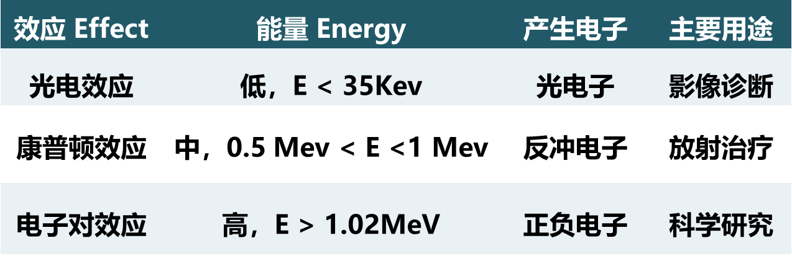
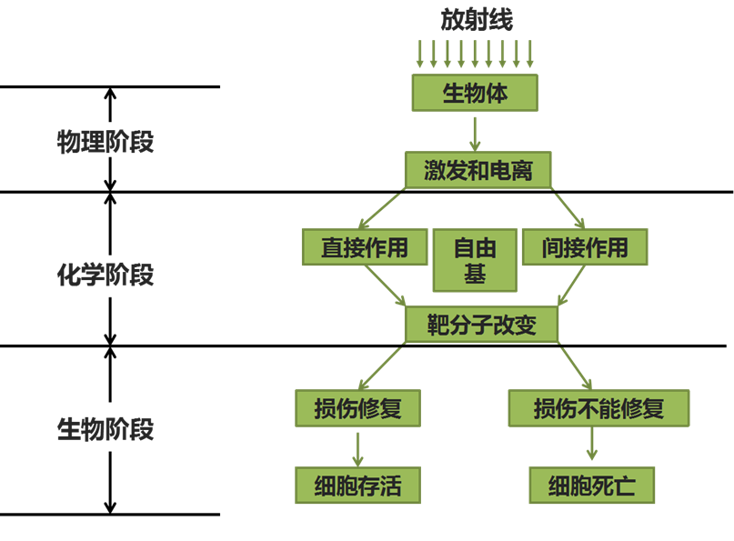
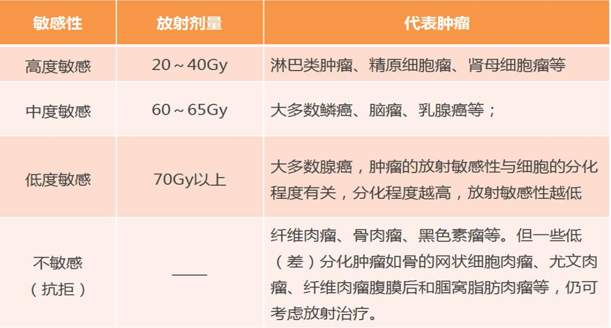
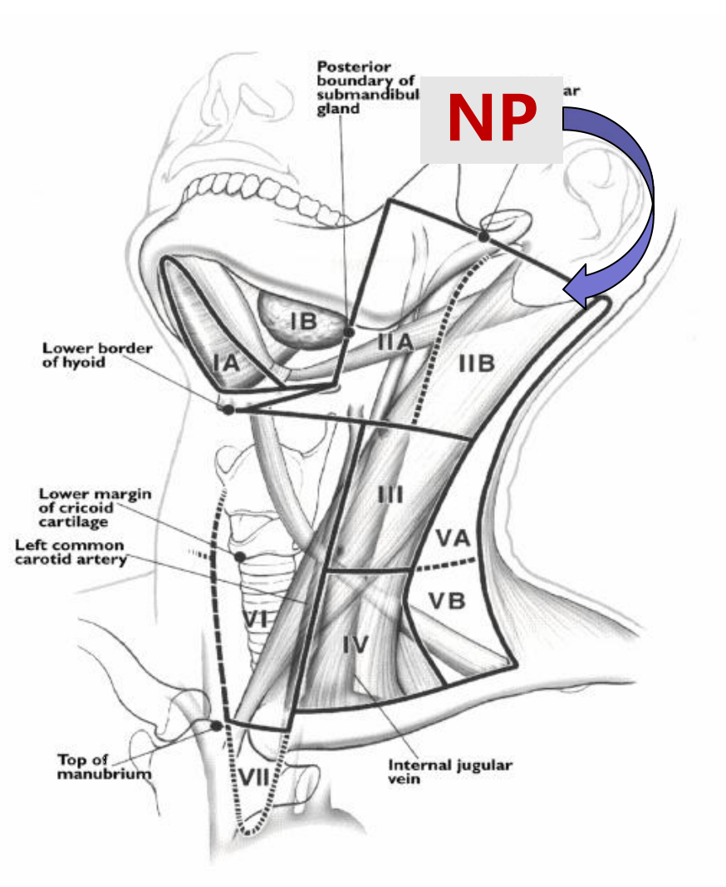

## 癌症发病概况和防治策略
### 教学基本要求
+ 牢固掌握：常见恶性肿瘤防治原则；
+ 一般掌握：恶性肿瘤常见致病因素；
+ 一般了解：常见恶性肿瘤流行规律。
### 肿瘤常见致病因素
+ 环境因素        
  + 化学因素
  + 物理因素
  + 生物因素
  + 医源性因素
+ 内在因素：
  + 遗传因素
  + 免疫因素 
  + 性别与内分泌因素

### 肿瘤防治原则

预防为主、防治并重

+ 三级预防措施：
  + 一级预防（即**病因学预防**）：是指对一般人群消除或降低致癌因素，促进健康，防患于未然的预防措施
  + 二级预防（即**发病学预防**） ：是指对特定高风险人群筛检癌前病变或早期肿瘤病例，从而实现**早期发现，早期预防和早期治疗**（三早）。
  + 三级预防：指对**现患肿瘤病人**进行治疗，主要目标是提高肿瘤的治愈率、生存率和生存质量；还要注意康复、姑息和止痛治疗

## 肿瘤诊断
+ 一般了解：肿瘤的临床分期，肿瘤标记物检测方法；  
+ 一般掌握：肿瘤临床诊断方法中的所包含的具体内容、树立提高癌症警惕性的观念，随时注意癌症存在的可能性；  
+ 牢固掌握：癌症的临床表现、肿瘤临床诊断的常用方法和诊断原则

### 临床表现
+ 局部表现
  + 肿块：常见主诉
  + 阻塞症状
    + 喉癌、舌根癌──呼吸困难
    + 肺癌──各种呼吸道症状
    + 食管癌──吞咽梗噎感、吞咽困难
    + 胃癌──恶心、呕吐、胃部膨胀、胃痛
    + 小肠、大肠肿瘤──肠梗阻症状
  + 压迫症状
    + 纵隔恶性淋巴瘤 、恶性胸腺瘤 、畸胎瘤 、纵隔转移癌 ——上腔静脉压迫 （头、面、颈、上胸壁肿 胀、胸壁静脉怒张，呼吸困难，发绀）
    + 甲状腺癌──呼吸、吞咽困难，声嘶
    + 腹膜后肿瘤—尿少，无尿
    + 前列腺癌──尿频、尿痛、小便困难，尿潴留
  + 破坏器官本身
    + 骨肿瘤──邻近关节功能障碍，病理性骨折、跛行、患肢功能丧失
    + 脑肿瘤──引起相应的定位症状，颅内压升高引起抽搐、偏瘫、失语、头痛、呕吐、视力障碍等
    + 肺癌──咯血 、呼吸困难
    + 胃癌──呕血
    + 肠癌──便血
    + 膀胱癌──血尿
  + 疼痛
    + 肿瘤发生于神经干
    + 肿瘤压迫邻近神经
    + 实质器官内肿瘤生长过速 引起包膜或骨膜膨胀紧张
    + 肿瘤引起胃肠道、泌尿道梗阻或胃肠穿孔
    + 肺癌累及纵隔胸膜、膈肌、胸壁
    + 胃肠道、胰腺癌浸润腹膜后神经丛及体壁神经
    + 直肠癌、宫颈癌浸润到骶神经丛
    + 原发骨肿瘤，骨转移癌
  + 病理性分泌物
    + 肿瘤向腔内溃破或合并感染，常有血性、脓性、黏液性或腐臭性分泌物自腔道排出
  + 溃疡
    + 皮肤癌、唇癌、舌癌、口腔癌、鼻咽癌、乳腺癌、食管癌、胃肠癌、宫颈癌、阴道癌、外阴癌
+ 全身表现
  + 发热
  + 消瘦、贫血、乏力
  + 黄疸
+ 肿瘤伴随综合症
  + 皮肤与结缔组织方面表现
  + 肺原性骨关节增生
  + 神经系统方面表现
  + 心血管方面表现
  + 内分泌与代谢方面表现
  + 血液方面表现
+ 十大警告信号
  + 乳腺、皮肤、舌部或者身体任何部位有可能触及的或不消的肿块
  + 疣(赘瘤)或黑痣明显变化(如颜色加深、 迅速增大、瘙痒、脱毛、渗液、溃疡、出血)
  + 持续性消化不良
  + 吞咽食物时梗噎感、疼痛、胸骨后闷胀不适，食管内异物感或上腹部疼痛
  + 耳鸣、听力减退、鼻塞、鼻衄、抽吸咳出的鼻咽分泌物带血、头痛、颈部肿块
  + 月经期不正常的大出血，月经期外或绝经 后不规则阴道出血，接触性出血
  + 持续性嘶哑、干咳、痰中带血
  + 原因不明的大便带血及粘液或腹泻、便秘 交替，原因不明的血尿
  + 久治不愈的伤口、溃疡
  +  原因不明的较长时间体重减轻
### 肿瘤临床诊断的常用方法

### 诊断原则
+ 以临床诊断为基础
+ 借助一系列的辅助检查手段
+ 获得病理组织学的恶性证据：病理有怀疑时要会诊、追踪、治疗前应确定诊断。罕见病例、疑难病例通过会诊获得第二次鉴定。
+ 个体化分析病情，根据患者的分期、亚型分类，分子生物学、遗传学特点制定个体化精准治疗

## 肿瘤的生物治疗
肿瘤生物治疗：通过机体的防御机制、应用生物大分子（细胞、核酸、蛋白质和肽）或小分子化合物调节机体生物反应,从而抑制或消除肿瘤生长的治疗方法 
### 教学基本要求
+ 牢固掌握：肿瘤生物治疗的常用方案，各自的优点和目前存在的主要问题
+ 一般掌握：肿瘤生物治疗（包括基因治疗）作为新型肿瘤治疗模式的现状
+ 一般了解：肿瘤免疫治疗的策略和关键限制因素

### 肿瘤生物治疗的常用方案
+ 肿瘤免疫治疗
  + 肿瘤疫苗
    + 利用肿瘤抗原，通过主动免疫方式诱导机体产生特异性抗肿瘤效应,激发机体自身的免疫保护机制,达到治疗肿瘤或预防复发的作用
    + 优点：预防性疫苗已广泛应用于临床，治疗性疫苗临床试验阶段效果好
    + 缺点：每个病人体内的肿瘤所携带的新生抗原都不一样，必须“私人订制”，贵。肿瘤异质性、肿瘤抗原性弱、很难找到一个仅存在肿瘤中而正常组织不表达的抗原
  + 免疫调节剂
    + 一类具有增强和调节免疫功能的非特异生物制剂
    + 作用机制：干扰细胞生长、转化或转移的直接抗瘤作用，或激活免疫系统的效应细胞及其所分泌的因子
    + 免疫调节剂临床主要用于体腔内灌注；胸腺肽主要用于免疫功能受损后重建
    + 干扰素和白介素在肿瘤治疗方面，适应症有限，临床应用越来越少
  + 过继免疫
    + 通过分离技术获取患者自身免疫细胞，在细胞因子的诱导下或通过基因改造，体外大量扩增出具有高度抗肿瘤活性的免疫细胞，再回输到患者体内，达到增强肿瘤患者的免疫功能和抗肿瘤的目的
    + CIK治疗
      + 人外周血单个核细胞在体外用多种CK（如抗CD3-McAb,  IL-2,IFN-γ,IL-1α等）共同培养一段时间后获得的一群异质细胞
      + 优点：兼具T淋巴细胞强大的抗肿瘤活性和NK细胞的非MHC限制性杀瘤优点，增殖速度快，杀瘤活性高，杀瘤谱广，对多种耐药肿瘤细胞同样敏感
      + 缺点：无法解决普通T细胞难于识别肿瘤细胞、个体化制备，难以产业化，缺乏投入、现阶段难以获得高级别的循证医学证据
    + CART
      + CAR-T细胞治疗:全称是Chimeric Antigen Receptor T-Cell Immunotherapy，指的是嵌合抗原受体T细胞免疫疗法，利用基因工程修饰外周血T细胞，使其表达嵌合抗原受体来特异性的识别肿瘤相关性抗原的方法。
      + 优点：血液肿瘤治疗中有很好的效果
      + 缺点：很难找到一个只表达于肿瘤而正常组织不表达的抗原、CAR-T细胞归巢到肿瘤部位需要趋化因子的参与，但是不同肿瘤产生何种趋化因子来吸引T细胞还是未知的
  + 单克隆抗体
    + 只识别单一抗原表位(抗原决定簇)的特异性抗体，来自单个Ｂ淋巴细胞的克隆或一个杂交瘤细胞的克隆 
    + 靶向治疗抗体
    + 免疫检查点抑制剂 
      + 免疫检查点：T细胞的抗肿瘤反应受到复杂的共刺激信号和共抑制信号（”检查点”）的平衡调控。这些信号受体是免疫治疗的重要潜在靶点。阻断抑制受体是目前的研究热点。
      + 优点：对肺癌等癌症有较高的5年生存率
      + 缺点：超进展、有效率不高、耐药
+ 肿瘤基因治疗
+ 单抗
+ 小分子TKI

## 放射治疗
### 要求
+ 掌握：放射治疗的基本原理和临床应用
+ 熟悉：常用放疗设备和放射治疗的质量控制和质量保证
+ 了解：现代放射治疗新技术及进展
### 相关概念
+ 光电效应：光子与原子的轨道电子发生相互作用，把全部能量传递给对方，光子消失，获得能量的电子挣脱原子的束缚成为自由电子（光电子）*当射线能量＜35KeV时，该效应为主要效应；骨、肌肉、脂肪对这类射线能量吸收有明显差别，主要用于影像诊断*
+ 康普顿效应：入射光子和原子内一个轨道电子发生相互作用，光子损失一部分能量，并改变运动方向，电子获得能量而脱离原子，获得能量的电子称为反冲电子，损失能量的光子称为散射光子*当光子线能量为0.5~1MeV时该效应明显骨、肌肉、脂肪的吸收大致相同，是放射治疗的主要吸收方式*
+ 电子对效应：当光子从原子核旁经过，在原子核库仑场的作用下形成一对正负电子，*光子能量＞1.02MeV时，尤其＞10MeV时为主要效应*

+ 氧增强比（oxygen enhancement ratio，OER）：在乏氧、有氧情况下达到相等生物效应所需的照射剂量之比，乏氧剂量/有氧剂量
+ 线性能量传递（liner energy transfer，LET）：表示沿次级粒子径迹单位长度上的能量转换
+ 最小耐受量-TD5/5：指标准治疗条件下，照射后5年内放射相关并发症发生率不超过5%所对应的放射剂量
+ 最大耐受量-TD50/5：指标准治疗条件下，5年内放射相关并发症发生率不超过50%所对应的剂量

### 放射治疗原理

+ 放射线照射生物体
+ 物理阶段
  + 放射线产生次级电子，次级电子产生电离
+ 化学阶段
  + 电离产生有机自由基
  + 有机自由基使细胞核DNA损伤，酶失活（直接作用）
  + 有机自由基产生羟自由基（间接作用）
+ 生物反应阶段
  + 损伤修复，继续存活
  + 间期死亡：有丝分裂间期细胞直接死亡
  + 增殖期死亡：正在分裂细胞分裂一次/几次后死亡
  + PLD潜在致死性损伤：若环境适宜可以修复，否则损伤不可逆
  + SLD亚致死性损伤：一定时间可以修复
  + LD致死性损伤：不可修复损伤

+ 分次放疗4R（4再）原理
  + 肿瘤细胞放射损伤再修复Repair
  + 肿瘤细胞再增殖Regenaration 
  + 细胞周期再分布Redistribution
  + 乏氧细胞再氧合Reoxygenation 

### 基于放射敏感性的肿瘤组织分类

### 临床应用
+ 治疗原则
	+ 病理诊断明确
	+ 优化放疗计划：符合临床剂量学原则
	+ 重视首程治疗：首程放疗失败后再程放疗效果不佳，后遗症明显增加
	+ 适当辅助治疗
+ 剂量学四原则
	+ 肿瘤剂量要求准确
	+ 肿瘤区域内剂量分布均匀，变化控制在目标剂量5%内
	+ 尽量提高治疗区域内剂量，降低正常组织照射剂量
	+ 保护肿瘤周围重要器官免受2照射，至少不能使它们接受超过允许耐受量的范围

## 化疗
### 要求
+ 掌握：化学治疗和分子靶向药物的作用原理、合理用药的原则、化疗的临床应用
+ 熟悉：抗肿瘤药物的分类及其代表药物、作用机制及毒性反应
+ 了解：抗肿瘤药物的发展史、细胞周期动力学、分子靶向药物的特点和临床应用

### 作用机制
+ 烷化剂
	+ 含有烷化基团、亲电子基团，与大分子形成共价键导致大分子活性改变或丧失
+ 抗代谢药
	+ 与正常代谢物相似，竞争抑制核酸代谢主要酶，取代DNA、RNA合成前体物质，影响合成
+ 抗生素类
	+ 蒽环类：嵌入DNA附近碱基对、引起DNA双链解离、干扰DNA转录和mRNA合成
	+ 博来霉素引起DNA断裂
	+ 丝裂霉素和DNA形成交联
+ 微管蛋白抑制剂
	+ 紫杉类：促进微管蛋白二聚体装配并抑制其去多聚化
	+ 长春花类：阻止微管聚合形成
+ 拓扑异构酶抑制剂
	+ I类：阻止DNA复制时解旋后重新结合、造成DNA双链断裂
	+ II类：干扰DNA合成和复制                        
+ 激素类

### 化疗基本原则
+ 病理学或细胞学检查确诊为癌症
+ 肿瘤内科训练合格的医生执行 
+ 医生在全面了解病人的全身情况、主要脏器的功能和病变范围后制定合理的化疗方案
+ 化疗多采用联合用药方案，应尽量使用 “标准” 联合化疗方案，方案中的每一种药物可用至接近人体能耐受的最大剂量，尤其是对于根治性化疗的病人 
+ 化疗前必须把治疗目的、疗效、费用估计、毒性、和风险告诉病人或其家属并要求签署同意书 

## 肿瘤病理
+ 肿瘤病理学在肿瘤诊断中的重要地位（熟悉）
+ 肿瘤病理学的基本理论和重要概念（掌握）
+ 肿瘤病理学的诊断方法（掌握）
+ 病理新技术在病理肿瘤诊治中的新进展（了解）
### 名词解释
1. 原位癌：指粘膜上皮层内异型细胞累及上皮的全层，但尚未突破基底膜、未发生间质浸润生长者。
2. 上皮内瘤变：粘膜上皮层出现的细胞非典型增生或异型增生，常常按照累及上皮层次分级
3. 交界性肿瘤：是指在形态学及生物学行为上介乎于良恶性之间的肿瘤，这些肿瘤更倾向于发生恶性变
4. 瘤样病变：非肿瘤性细胞增生所形成的瘤样肿块称为瘤样病变，往往与炎性刺激相关，为自限性生长，但切除不彻底亦可复发，少数可发生恶变
5. 错构瘤： 指某一器官内原有组织或细胞局灶性增生并紊乱组合构成的良性肿瘤。
6. 化生： 指一种已分化组织转变为另一种分化组织的过程。
7. 单纯性增生： 指上皮细胞增生，无异型性。
8. 不典型增生（异型增生）：指上皮细胞异常增生，表现为细胞大小不等，形态多样，排列紊乱，极向丧失。
9. 癌前病变(precancerous lesions)
  + 概念:癌前病变是指某些具有癌变潜在可能性的病变, 长期存在有可能转变为癌
  . 
	+ 分类：遗传性、获得性 
10. 浸润癌：上皮细胞异型增生累及上皮全层，突破基底膜而向下浸润生长

+ 肿瘤分类编码：
  + /0：良性
  + /1：交接性
  + /2：原位癌
  + /3：恶性

- 良恶性肿瘤区别

||良性肿瘤|恶性肿瘤|
|:---:|:---:|:---:|
|分化|好|差
|核分裂|无/少|有，病理性核分裂
|生长方式|外生性、膨胀性|浸润性
|与周围组织关系|推开或压迫|破坏
|包膜|有|无
边界|清晰|不清晰
生长速度|慢|快
继发改变|少有出血坏死、可钙化囊性变|出血坏死溃烂
复发与转移|无|常见
对机体影响|较少|较大

### 诊断方法

||石蜡切片|冰冻切片|
|---|---|---|
|样本|固定后的组织|新鲜组织
|制片耗时|24-48h|10-20min
|保存时间|长期|数月
镜下组织|清晰|模糊
适用范围|术前术后病理诊断|术中诊断
优缺点|耗时长，准确率高，适用范围广，易于保存|相反

# 各论
## 鼻咽癌
掌握内容：流行病学特点、临床表现、诊断和鉴别诊断、分层综合治疗原则
### 流行病学特点
+ 明显的地区聚集性
  + 国内：广东、广西、湖南、江西、福建、海南
+ 种族和部分人群易感现象
  + 黄>黑>白
  + 男>女
+ 家族聚集
+ 发病率相对稳定
+ 高发区和低发区差异
  + 年龄差异：高发区：30后升高，50-59到高峰；低发区平均双峰：16-19、50-59
  + 高发区I型<低发区
    + 角化性：I型
    + 分化型：II型
    + 未分化型：III型

### 临床表现
+ 症状
  + 鼻部
    + 涕血：鼻出血、回吸性血涕
    + 鼻塞：单侧、加重
  + 耳部
    + 耳鸣+听力下降：单侧
  + 头痛
  + 眼部症状
  + 颈部肿块
  + 远处转移
    + 常见骨、肺、肝
+ 体征
  + 鼻咽部肿物：结节型、菜花型、粘膜下型、浸润型、溃疡型、混合型
  + 颈部淋巴结肿大
    + 寰椎旁的咽后淋巴结：Rouviere淋巴结，引流第一站
    + 颈深淋巴结、锁骨上淋巴结
    + 
    + 咽后、II>III、IV、V>Ib>Ia、VI
  + 颅神经损害：V、VI受损最易
    + 动眼神经
    + 外展神经
    + 面神经
    + 舌下神经
    + **眶上裂综合征**：侵犯III、IV、V、VI颅神经：海绵窦区、眶上裂、破裂孔、岩尖；上睑下垂、眼肌麻痹、三叉神经痛或脑膜刺激征
    + **Hotner综合征**：侵犯IX、X、XI、XII颅神经及颈交感神经节：侵犯茎突后间隙、咽旁转移性淋巴结；睑裂狭窄、眼球内陷、瞳孔缩小

### 诊断和鉴别诊断
+ 诊断要点
  + 了解病史
  + 体格检查
    + 间接鼻咽镜：方便经济
    + 直接经鼻电子鼻咽镜检查
  + **活组织病理：金标准**
    + 只有鼻咽肿瘤活检经病理检查后才可确诊
    + 只在鼻咽活检不能明确情况下才进行颈部淋巴结检查
  + 影像：CT、MRI（首选）、PET/CT、核医学
    + **协助诊断**
    + **确定分期**
    + **协助放疗靶区制定**
    + **评价治疗结果**
    + **随访**
  + 实验室常规
    + 血常规、生化常规、**EB血清学、EB-DNA定量：监测肿瘤转移、疗效预测重要指标**
      + VCA/IgA>=1：80
      + EA/IgA阳性
+ 鉴别诊断
  + 鼻咽部病变
    + 增生性病变
    + 结核
    + T淋巴细胞熘
    + 血管纤维瘤
  + 颈部淋巴结肿大
    + 颈部淋巴结炎
    + 颈部淋巴结结核
    + 恶性淋巴瘤
    + 其他转移癌

### 治疗
+ **分层治疗原则**
  + 早期：T1，N0，M0：单纯放疗
  + 局部晚期：T1，N1-3；T2-4，N0-3；M0：放疗为主综合治疗
  + 初治转移性鼻咽癌M1：姑息治疗：全身治疗、局部治疗、对症支持治疗
  + 总五年生存率80%
+ 治疗手段
  + 放疗：根治性手段
  + 化疗：辅助
  + 手术：补充
  + 分子靶向：辅助
  + 免疫：辅助
  + 其他
<!--stackedit_data:
eyJoaXN0b3J5IjpbLTE0MzAwMjA5MjMsLTQ5MjMwMTc3OCwxNT
kwMjEwNDgsNTI1ODg1NDM4LC0xMzk2MjU4ODE4LC02MDA4OTYx
MTMsMjAyNDEzNTQ0MCwtMjUwNTQ2NzQsLTEzMzk0NjI0NjBdfQ
==
-->